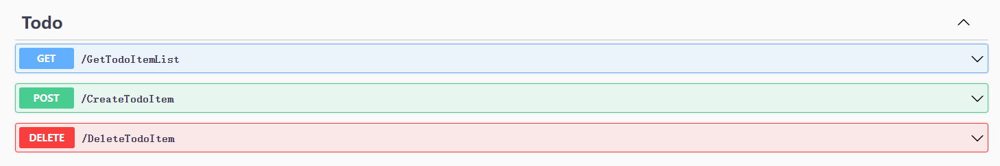

# EF /MongoDB 

- 创建项目

~~~shell
abp new TodoApp
~~~


~~~sh
abp new TodoApp -d Mongodb
~~~

 ## 领域层

- 添加Entity 继承  BasicAggregateRoot<Guid>；`BasicAggregateRoot` 是创建根实体的最简单的基础类. `Guid` 是这里实体的主键 (`Id`).

## 数据库集成

> EF
>
> - EF上下文
>
>   ```csharp
>   //添加属性
>   public DbSet<TodoItem> TodoItems { get; set; }
>   //配置
>       protected override void OnModelCreating(ModelBuilder builder)
>       {
>           base.OnModelCreating(builder);
>           builder.Entity<TodoItem>(b =>
>           {
>               b.ToTable("TodoItems");
>   
>           });
>       }
>   ```
>
>   
>
>   ```bash
>   //迁移
>   dotnet ef migrations add Added_TodoItem
>   ```
>
>   
>
>   ```bash
>   //更新数据
>   dotnet ef database update
>   ```

> MongoDB
>
> - Mongodb 上下文
>
>   ```csharp
>   //添加属性
>   public IMongoCollection<TodoItem> TodoItems => Collection<TodoItem>();
>   
>   //配置
>    protected override void CreateModel(IMongoModelBuilder modelBuilder)
>   {
>        base.CreateModel(modelBuilder);
>   
>        //builder.Entity<YourEntity>(b =>
>        //{
>        //    //...
>        //});
>        modelBuilder.Entity<TodoItem>(b =>
>        {
>               b.CollectionName = "TodoItems";
>        });
>   }
>   ```

## 应用层

- 接口：继承 IApplicationService

```csharp
    public interface ITodoAppService : IApplicationService//继承
    {
        Task<List<TodoItemDto>> GetListAsync();
        Task<TodoItemDto> CreateAsync(string text);
        Task DeleteAsync(Guid id);
    }
```

- DTO：常获取并返回 DTO([数据传输对象](https://docs.abp.io/zh-Hans/abp/latest/Data-Transfer-Objects)) 而不是实体

```csharp
    public class TodoItemDto
    {
        public Guid Id { get; set; }
        public string Text { get; set; }
    }
```

- 实现层：继承 ApplicationService 和服务接口

```csharp
    public class TodoAppService : ApplicationService, ITodoAppService
    {
        private readonly IRepository<TodoItem, Guid> _todoItemRepository;

        public TodoAppService(IRepository<TodoItem, Guid> todoItemRepository)
        {
            _todoItemRepository = todoItemRepository;
        }

        // TODO: Implement the methods here...
    }
```

- 实现

  - GetList

    ```csharp
    [HttpGet("GetTodoItemList")]
    public async Task<List<TodoItemDto>> GetListAsync()
    {
        var items = await _todoItemRepository.GetListAsync();
        return items
            .Select(item => new TodoItemDto
            {
                Id = item.Id,
                Text = item.Text
            }).ToList();
    }
    ```

  - Create

    ```csharp
    [HttpPost("Cteate")]
    public async Task<TodoItemDto> CreateAsync(string text)
    {
        var todoItem = await _todoItemRepository.InsertAsync(
            new TodoItem {Text = text}
        );
    
        return new TodoItemDto
        {
            Id = todoItem.Id,
            Text = todoItem.Text
        };
    }
    ```

  - Delete

    ```csharp
    [HttpDelete("Delete")]
    public async Task DeleteAsync(Guid id)
    {
        await _todoItemRepository.DeleteAsync(id);
    }
    ```

## web

- http://ip:port/swagger/index.html

