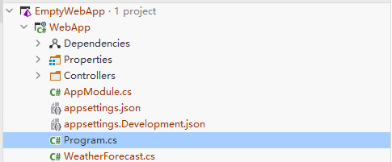

# 在ASP.NET Core MVC Web 应用程序中使用ABP

## 创建一个新项目

- 使用Visual Studio 2022 (17.0.0+)创建一个新的ASP.NET Core Web应用程序:

  

## 安装 Volo.Abp.AspNetCore.Mvc 包

- Volo.Abp.AspNetCore.Mvc是ABP集成ASP.NET Core MVC的包,请安装它到你项目中:

  ```
  Install-Package Volo.Abp.AspNetCore.Mvc
  ```

  ```
  dotnet add  Package Volo.Abp.AspNetCore.Mvc
  ```

## 创建ABP模块

- ABP是一个模块化框架,它需要一个**启动(根)模块**继承自 `AbpModule`

  ```C#
  #region << 文 件 说 明 >>
  
  /*----------------------------------------------------------------
  // 文件名称：AppModule
  // 创 建 者：zhang xian cheng
  // 创建时间：2022年05月02日 星期一 12:21
  // 文件版本：V1.0.0
  //===============================================================
  // 功能描述：
  //    
  //
  //----------------------------------------------------------------*/
  
  #endregion
  
  using Volo.Abp;
  using Volo.Abp.AspNetCore.Mvc;
  using Volo.Abp.Autofac;
  using Volo.Abp.Modularity;
  
  namespace WebApp;
  
  [DependsOn(typeof(AbpAspNetCoreMvcModule))]
  [DependsOn(typeof(AbpAutofacModule))]
  public class AppModule : AbpModule
  {
      //覆盖应用程序初始化
      public override void OnApplicationInitialization(ApplicationInitializationContext context)
      {
          var app = context.GetApplicationBuilder();
          var env = context.GetEnvironment();
  
          // Configure the HTTP request pipeline.
          if (env.IsDevelopment())
          {
              app.UseExceptionHandler("/Error");
              // The default HSTS value is 30 days. You may want to change this for production scenarios, see https://aka.ms/aspnetcore-hsts.
              app.UseHsts();
              app.UseSwagger();
              app.UseSwaggerUI();
          }
  
          app.UseHttpsRedirection();
          app.UseStaticFiles();
          app.UseRouting();
          app.UseConfiguredEndpoints();
      }
  
      public override void ConfigureServices(ServiceConfigurationContext context)
      {
          context.Services.AddControllers();
          context.Services.AddEndpointsApiExplorer();
          context.Services.AddSwaggerGen();
      }
  }
  ```

### 启动类

- 修改启动类集成到ABP模块系统:

```csharp
var builder = WebApplication.CreateBuilder(args);

builder.Services.ReplaceConfiguration(builder.Configuration);

builder.Services.AddApplication<AppModule>();

var app = builder.Build();

app.InitializeApplication();

app.Run();
```

- `services.AddApplication<AppModule>()`添加了从`AppModule`中启动的所有模块中定义的所有服务.
- `app.InitializeApplication()` 初始化并启动应用程序.

## 使用 Autofac 依赖注入框架

- 安装 [Volo.Abp.Autofac](https://www.nuget.org/packages/Volo.Abp.Autofac) 包

```
Install-Package Volo.Abp.Autofac
```

```
dotnet add Package Volo.Abp.Autofac
```

- 添加 `AbpAutofacModule` 依赖

```csharp
[DependsOn(typeof(AbpAspNetCoreMvcModule))]
[DependsOn(typeof(AbpAutofacModule))] // 在模块上添加依赖AbpAutofacModule
public class AppModule : AbpModule
{
    ...
}
```

- 修改`Program.cs`以使用Autofac:

```csharp
var builder = WebApplication.CreateBuilder(args);

builder.Host.UseAutofac();  //Add this line

builder.Services.ReplaceConfiguration(builder.Configuration);

builder.Services.AddApplication<AppModule>();

var app = builder.Build();

app.InitializeApplication();

app.Run();
```