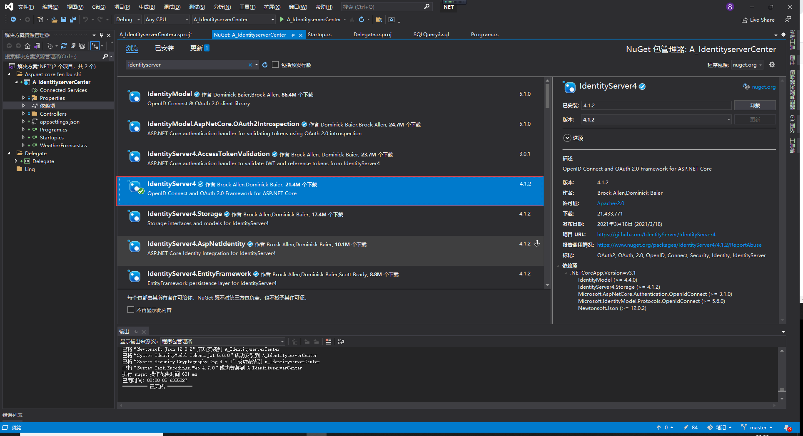

[TOC]

# 最小可行化产品MVp

## 产品mvp概念

> 是一种避免开发出客户并不是正真需要的产品的开发策略。快速地构建出符合产品预期功能的最小功能集合，通过迭代来完善，是让开发团队用最小的代价实现一个产品，以此最大程度上了解和验证对用户问题的解决程度。


## 两种开发模式

### 瀑布


### 瀑布VS敏捷


### Scrum


# 第一章计划

## 敏捷产品开发流程

## 原型预览与业务介绍

## 整体架构设计


## API 接口设计

### OAuth2

#### 什么是oauth

> OAuth 就是一种授权机制。数据的所有者告诉系统，同意授权第三方应用进入系统，获取这些数据。系统从而产生一个短期的进入令牌（token），用来代替密码，供第三方应用使用。

#### oauth 四种方式

- 授权码（authorization-code）

  ```
  
  ```

- 隐藏式（implicit）

  ```
  
  ```

- 密码式（password）

  ```
  
  ```

- 客户端凭证（client credentials）

  ```
  
  ```

## Id4 搭建登录

- 添加Nuget ：Identityserver4

  

- 添加配置类Config

  ```c#
  using System;
  using System.Collections.Generic;
  using System.Linq;
  using System.Threading.Tasks;
  
  namespace A_IdentityserverCenter
  {
      public class Config
      {
          /// <summary>
          /// 定义api
          /// </summary>
          /// <returns></returns>
          public static IEnumerable<IdentityServer4.Models.ApiResource> GetApiResources()
          {
              return new List<IdentityServer4.Models.ApiResource>
              {
                  new IdentityServer4.Models.ApiResource("api","my api")
              };
          }
          /// <summary>
          /// 定义客户端
          /// </summary>
          /// <returns></returns>
          public static IEnumerable<IdentityServer4.Models.Client> GetClients()
          {
              return new List<IdentityServer4.Models.Client>
              {
                  new IdentityServer4.Models.Client
                  {
                      ClientId = "client",
                       // 没有交互性用户，使用 clientid/secret 实现认证。
                      AllowedGrantTypes =IdentityServer4.Models. GrantTypes.ClientCredentials,
                      ClientSecrets = // 用于认证的密码
                      {
                        new IdentityServer4.Models. Secret( IdentityServer4.Models.HashExtensions.Sha256("secret"))
                      },
                       AllowedScopes = { "api1" } // 客户端有权访问的范围（Scopes）
                  }
              };
          }
  
      }
  }
  
  
  
  ```

  

- 添加startup配置

  ```c#
          public void ConfigureServices(IServiceCollection services)
          {
              // 使用内存存储，密钥，客户端和资源来配置身份服务器。
              services.AddIdentityServer()
                  .AddDeveloperSigningCredential()
                  .AddInMemoryApiResources(Config.GetApiResources())
                  .AddInMemoryClients(Config.GetClients());
          }
  ```

  ```c#
   public void Configure(IApplicationBuilder app, IWebHostEnvironment env)
          {
              if (env.IsDevelopment())
              {
                  app.UseDeveloperExceptionPage();
              }
  			//使用
              app.UseIdentityServer();
          }
  ```

  

- 测试(http://localhost:5000/.well-known/openid-configuration)

```json
{
issuer: "http://localhost:5000",
authorization_endpoint: "http://localhost:5000/connect/authorize",
token_endpoint: "http://localhost:5000/connect/token",
userinfo_endpoint: "http://localhost:5000/connect/userinfo",
end_session_endpoint: "http://localhost:5000/connect/endsession",
check_session_iframe: "http://localhost:5000/connect/checksession",
revocation_endpoint: "http://localhost:5000/connect/revocation",
introspection_endpoint: "http://localhost:5000/connect/introspect",
device_authorization_endpoint: "http://localhost:5000/connect/deviceauthorization",
frontchannel_logout_supported: true,
frontchannel_logout_session_supported: true,
backchannel_logout_supported: true,
backchannel_logout_session_supported: true,
scopes_supported: [
"offline_access"
],
claims_supported: [ ],
grant_types_supported: [
"authorization_code",
"client_credentials",
"refresh_token",
"implicit",
"urn:ietf:params:oauth:grant-type:device_code"
],
response_types_supported: [
"code",
"token",
"id_token",
"id_token token",
"code id_token",
"code token",
"code id_token token"
],
response_modes_supported: [
"form_post",
"query",
"fragment"
],
token_endpoint_auth_methods_supported: [
"client_secret_basic",
"client_secret_post"
],
subject_types_supported: [
"public"
],
code_challenge_methods_supported: [
"plain",
"S256"
],
request_parameter_supported: true
}
```


## 账号API实现


## 配置中心


