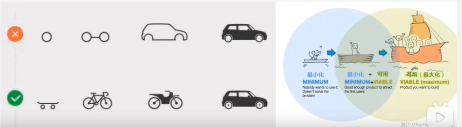
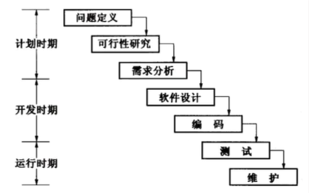
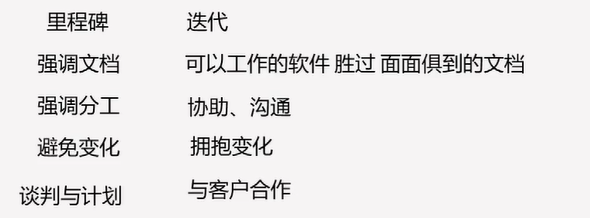
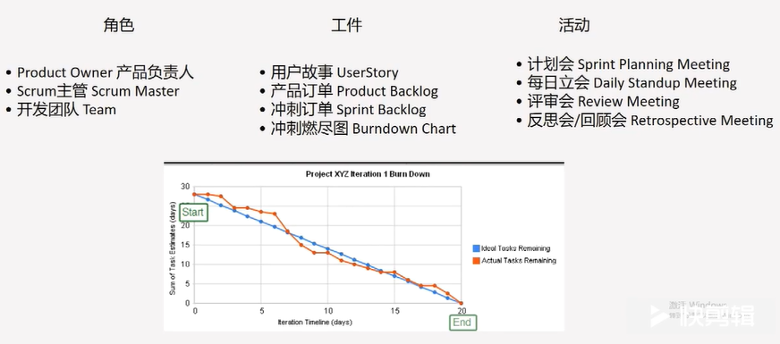
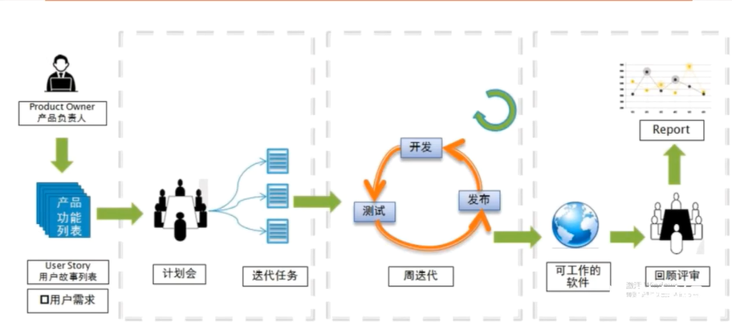
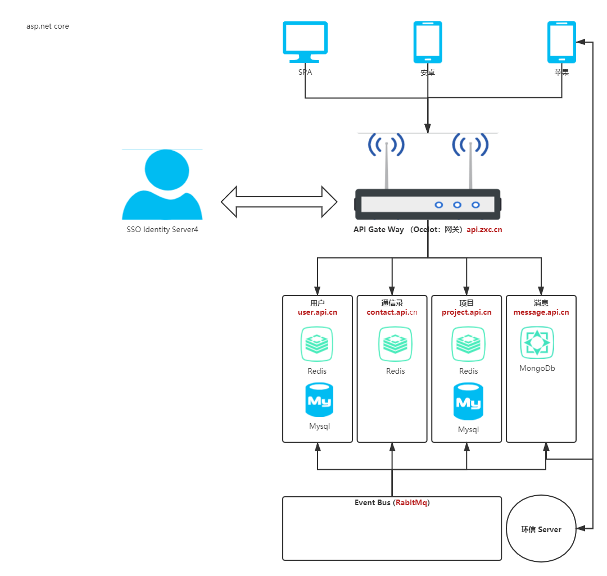

[TOC]

# 最小可行化产品MVp

## 产品mvp概念

> 是一种避免开发出客户并不是正真需要的产品的开发策略。快速地构建出符合产品预期功能的最小功能集合，通过迭代来完善，是让开发团队用最小的代价实现一个产品，以此最大程度上了解和验证对用户问题的解决程度。

## 两种开发模式

### 瀑布

### 瀑布VS敏捷

### Scrum

# 第一章计划

## 敏捷产品开发流程

## 原型预览与业务介绍

## 整体架构设计

## API 接口设计

### OAuth2

#### 什么是oauth

> OAuth 就是一种授权机制。数据的所有者告诉系统，同意授权第三方应用进入系统，获取这些数据。系统从而产生一个短期的进入令牌（token），用来代替密码，供第三方应用使用。

#### oauth 四种方式

> 授权码（authorization-code）

> 隐藏式（implicit）

> 密码式（password）

> 客户端凭证（client credentials）

## Id4 搭建登录

## 账号API实现

## 配置中心

