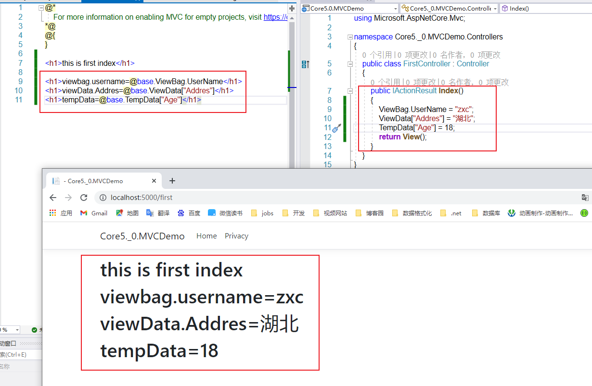
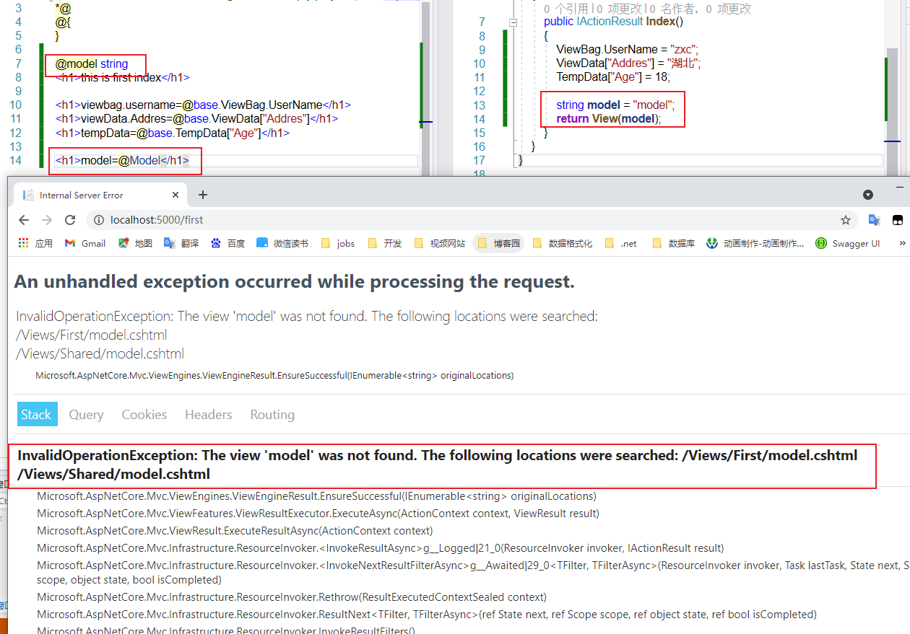
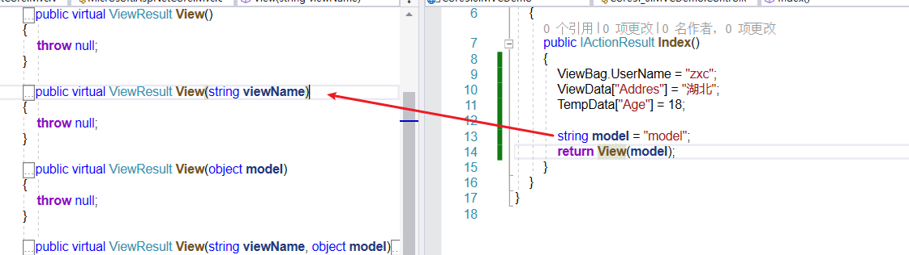
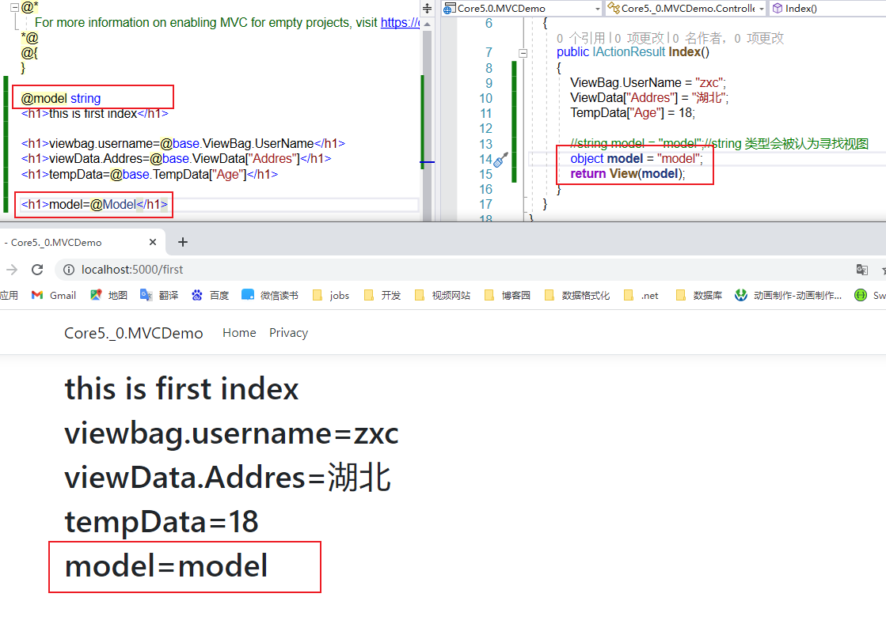
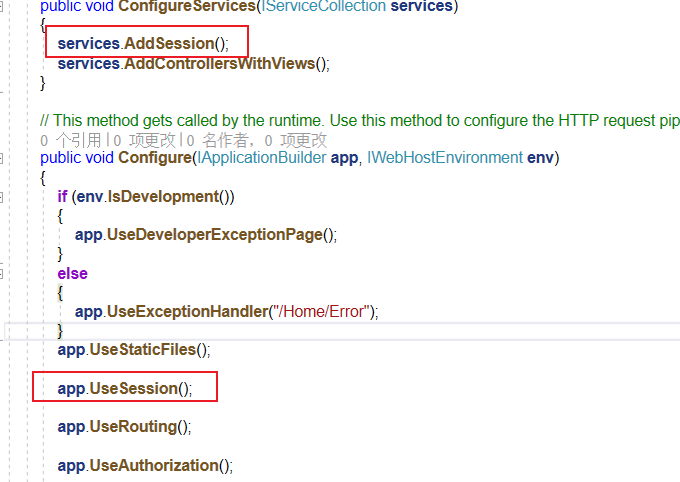
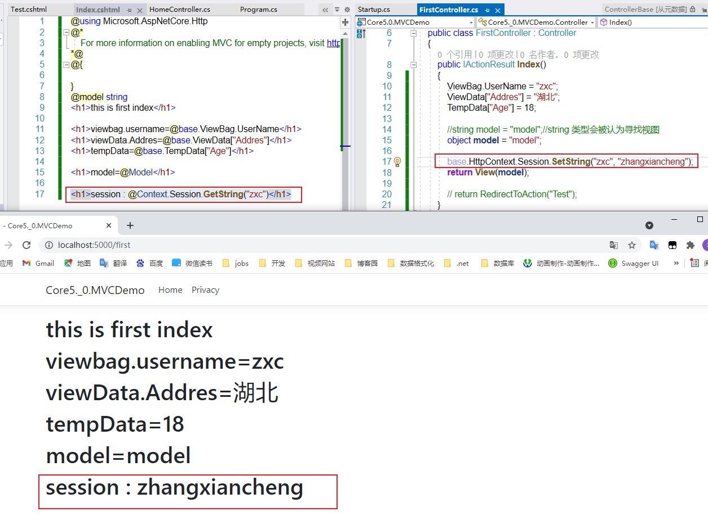
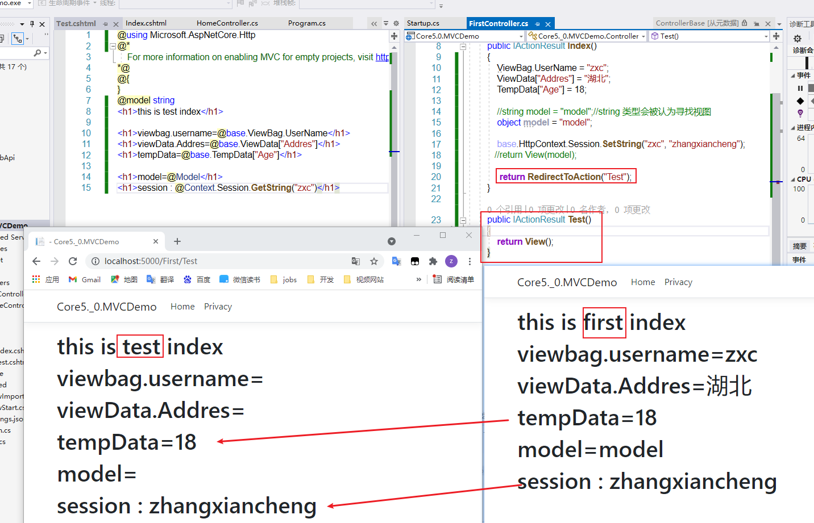

[TOC]

# 项目-Core5.0.MVCDemo

## 1、传值

```
1.ViewBag

2.ViewData

3.TempData(session)--跳转就需要session，

4.Model

5.session
```


### 1.1 先看几个简单的 




---


### 1.2 model 传值

```
定义一个:
	string model ="model"
返回 View(model)，页面会显示一个错误信息： 找不到model.cshtml
```



```
原因：
string 类型的model 会被View 方法当做寻找视图
```



```
解决方法：
model 定义为 object 类型
```



---


### 1.3 Session 传值

```
在使用session的时候出现一个错误：尚未为此应用程序或请求配置会话
```


```
解决方法：在Startup 类中进行配置
```



```
配置好session后就可以使用session了
```



---


### 1.4 思考一个问题 当前方法中的数据是否在其他方法中也能使用呢？

```
通过测试 发现 好像只有tempData（基于session实现的）和session能够携带过去
```




