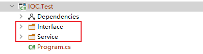
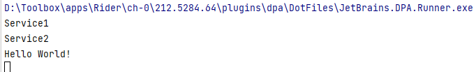

[TOC]

# ioc容器

## 1、使用 asp.net core 自带ioc容器

### 1.1 创建一个控制台项目



### 1.2 在Interface 下添加接口 IService1、Service下添加Service1 并且Service1 继承IService1，实现show 方法

```c#
IService1：

namespace IOC.Test.Interface
{
    public interface IService1
    {
        void Show();
    }
}
```

```C#
Service1：

namespace IOC.Test.Service
{
    public class Service1:IService1
    {
        public void Show()
        {
            Console.WriteLine("Service1");
        }
    }
}
```

### 1.3 在main 方法中注册和使用服务

```C#
        static void Main(string[] args)
        {
            #region 使用 asp.net core 内置容器

            {
                // Nuget 包
                // 1.Microsoft.Extensions.DependencyInjection

                // 1 实例化 容器
                IServiceCollection serviceCollection = new ServiceCollection();

                // 2 注册服务
                serviceCollection.AddTransient<IService1, Service1>();
                
                // 3 获取服务
                ServiceProvider serviceProvider = serviceCollection.BuildServiceProvider();

                IService1 service1 = serviceProvider.GetService<IService1>();
                
                service1.Show();

            }

            #endregion


            Console.WriteLine("Hello World!");
        }
```

----


## 2、通过构造函数进行依赖注入

### 2.1 在Interface 下添加IService2 ， Service 下添加Service2    在Service2 构造函数中注入IService1

```C#
IService2：

namespace IOC.Test.Interface
{
    public interface IService2
    {
        void Show();
    }
}

```


```C#
Service2：
    
namespace IOC.Test.Service
{
    public class Service2 : IService2
    {
        public Service2(IService1 service1)
        {
            service1.Show();
        }

        public void Show()
        {
            Console.WriteLine("Service2");
        }
    }
}
```

### 2.2 在main方法中进行注册和使用


```c#
		static void Main(string[] args)
        {


            #region 构造函数注入

            {
                // 1、实例化容器
                IServiceCollection serviceCollection = new ServiceCollection();

                // 2 注册服务
                serviceCollection.AddTransient<IService1, Service1>();
                serviceCollection.AddTransient<IService2, Service2>();

                // 3 获取服务
                IServiceProvider serviceProvider = serviceCollection.BuildServiceProvider();

                IService2 service2 = serviceProvider.GetService<IService2>();
                service2.Show();
            }

            #endregion
```



### 2.3 当没有将IService1 服务注入到容器时  ，获取IService2 会抛出异常

```
 英文：Unable to resolve service for type 'IOC.Test.Interface.IService1' while attempting to activate 'IOC.Test.Service.Service2'.
 中文：尝试激活“IOC.Test.Service.Service2”时无法解析“IOC.Test.Interface.IService1”类型的服务
```


## 3、IOC 生命周期

### 3.1 瞬时

```C#
            //瞬时生命周期 AddTrAddTransient
            //每次创建都是新的实例
            {
                //实例化容器
                IServiceCollection serviceCollection = new ServiceCollection();

                //注册服务
                serviceCollection.AddTransient<IService1, Service1>();

                //获取服务
                IServiceProvider serviceProvider = serviceCollection.BuildServiceProvider();
                IService1 service1 = serviceProvider.GetService<IService1>();
                IService1 service2 = serviceProvider.GetService<IService1>();

                //比较两个实例是否为同一引用
                bool transientResult = object.ReferenceEquals(service1, service2);
                Console.WriteLine($"Transient :{transientResult}");
            }
```

### 3.2 单例

```C#
			// 单例生命周期 AddSingleton
            // 在同一进程里 ，创建出来的都是同一个实例
            {
                //实例化容器
                IServiceCollection serviceCollection = new ServiceCollection();

                //注册服务
                serviceCollection.AddSingleton<IService1, Service1>();

                //获取服务
                IServiceProvider serviceProvider = serviceCollection.BuildServiceProvider();
                IService1 service1 = serviceProvider.GetService<IService1>();
                IService1 service2 = serviceProvider.GetService<IService1>();

                //比较两个实例的引用
                bool singletonResult = object.ReferenceEquals(service1, service2);
                Console.WriteLine($"Singleton :{singletonResult}");
            }
```

### 3.3 作用域

```C#
            // 作用域生命周期 AddScoped
            // 同一个作用域创建出来实例是同一个实例
            {
                //实例化容器
                IServiceCollection serviceCollection = new ServiceCollection();

                //注入服务
                serviceCollection.AddScoped<IService1, Service1>();

                //获取服务
                IServiceProvider serviceProvider = serviceCollection.BuildServiceProvider();
                IService1 service1 = serviceProvider.GetService<IService1>();
                
               // IServiceProvider serviceProvider1 = serviceCollection.BuildServiceProvider();
                IService1 service2 = serviceProvider.GetService<IService1>();
                
                //比较两个实例的引用
                bool singletonResult = object.ReferenceEquals(service1, service2);
                Console.WriteLine($"Singleton :{singletonResult}");
            }
```

