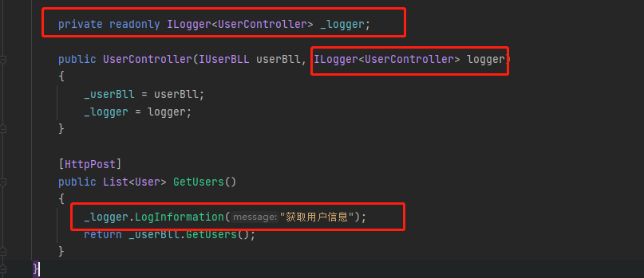

[TOC]

# 日志

1.Nuget引入

```
log4net
Microsoft.Extensions.Logging.Log4Net.AspNetCore
```

2.准备配置文件

```
<?xml version="1.0" encoding="utf-8"?>
<log4net>
	<!-- Define some output appenders -->
	<appender name="rollingAppender" type="log4net.Appender.RollingFileAppender">
		<file value="..\log\log.txt" />
		<!--追加日志内容-->
		<appendToFile value="true" />

		<!--防止多线程时不能写Log,官方说线程非安全-->
		<lockingModel type="log4net.Appender.FileAppender+MinimalLock" />

		<!--可以为:Once|Size|Date|Composite-->
		<!--Composite为Size和Date的组合-->
		<rollingStyle value="Composite" />

		<!--当备份文件时,为文件名加的后缀-->
		<datePattern value="yyyyMMdd.TXT" />

		<!--日志最大个数,都是最新的-->
		<!--rollingStyle节点为Size时,只能有value个日志-->
		<!--rollingStyle节点为Composite时,每天有value个日志-->
		<maxSizeRollBackups value="20" />

		<!--可用的单位:KB|MB|GB-->
		<maximumFileSize value="3MB" />

		<!--置为true,当前最新日志文件名永远为file节中的名字-->
		<staticLogFileName value="true" />

		<!--输出级别在INFO和ERROR之间的日志-->
		<filter type="log4net.Filter.LevelRangeFilter">
			<param name="LevelMin" value="ALL" />
			<param name="LevelMax" value="FATAL" />
		</filter>
		<layout type="log4net.Layout.PatternLayout">
			<conversionPattern value="%date [%thread] %-5level %logger - %message%newline"/>
		</layout>
	</appender>
	<root>
		<priority value="ALL"/>
		<level value="ALL"/>
		<appender-ref ref="rollingAppender" />
	</root>
</log4net>

```

3.配置替换系统的日志组件

```
        private static IHostBuilder CreateHostBuilder(string[] args) =>
            Host.CreateDefaultBuilder(args)
                //替换logger
                .ConfigureLogging(logger => logger.AddLog4Net("CfgFile/log4net.Config"))
                .ConfigureWebHostDefaults(webBuilder => { webBuilder.UseStartup<Startup>(); })
                //替换autofac
                .UseServiceProviderFactory(new AutofacServiceProviderFactory());
```


4.注入使用

