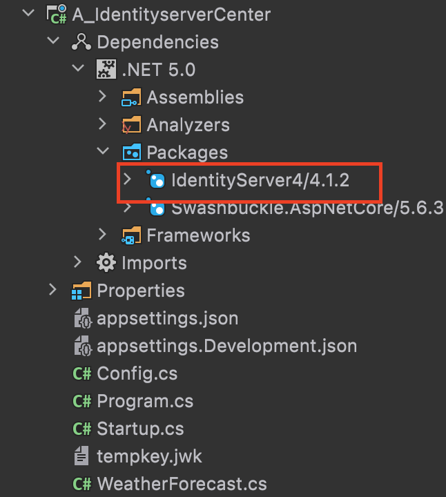

[TOC]

# identityserver4

##  identityCenter(认证中心)

### 1、安装identityserver4 




### 2、添加Config.cs 类文件

~~~ c#
using System;
using System.Collections.Generic;
using System.Linq;
using System.Threading.Tasks;

namespace A_IdentityserverCenter
{
    public class Config
    {
        /// <summary>
        /// 定义api
        /// </summary>
        /// <returns></returns>
        public static IEnumerable<IdentityServer4.Models.ApiResource> GetApiResources()
        {
            return new List<IdentityServer4.Models.ApiResource>
            {
                new IdentityServer4.Models.ApiResource("api","my api"){  Scopes={ "api"} }
            };
        }
        /// <summary>
        /// 定义客户端
        /// </summary>
        /// <returns></returns>
        public static IEnumerable<IdentityServer4.Models.Client> GetClients()
        {
            return new List<IdentityServer4.Models.Client>
            {
                new IdentityServer4.Models.Client
                {
                    ClientId = "client",
                    AllowedGrantTypes =IdentityServer4.Models. GrantTypes.ClientCredentials, // 没有交互性用户，使用 clientid/secret 实现认证。
                    ClientSecrets = // 用于认证的密码
                    {
                      new IdentityServer4.Models. Secret( IdentityServer4.Models.HashExtensions.Sha256("secret"))
                    },
                     AllowedScopes = { "api" } // 客户端有权访问的范围（Scopes）
                }
            };
        }

        public static IEnumerable<IdentityServer4.Models.ApiScope> GetApiScopes()
        {
            return new List<IdentityServer4.Models.ApiScope>
            {
                new IdentityServer4.Models.ApiScope("api")
            };
        }

        public static IEnumerable<IdentityServer4.Models.IdentityResource> GetIdentityResources()
        {
            return new List<IdentityServer4.Models.IdentityResource>
            {
                new IdentityServer4.Models.IdentityResources.OpenId()
            };
        }
    }
}


~~~

### 3、startup 配置

ConfigureServices

~~~ c#
//注册
            services.AddAuthentication("Bearer")
                .AddIdentityServerAuthentication(options =>
                {
                    options.Authority = "http://localhost:5000";
                    options.RequireHttpsMetadata = false;
                    options.ApiName = "api";
                });
~~~

Configure

```
//使用identityserver
app.UseIdentityServer();
```

## identityApi（资源）

### 1、引用包


### 2、保护资源

```c#
using Microsoft.AspNetCore.Mvc;
using Microsoft.Extensions.Logging;
using System;
using System.Collections.Generic;
using System.Linq;
using System.Threading.Tasks;
//应用
using Microsoft.AspNetCore.Authorization;
namespace B_ClientCredentialApi.Controllers
{
  //添加认证
    [Authorize]
    [ApiController]
    [Route("[controller]/[action]")]
    public class WeatherForecastController : ControllerBase
    {
        private static readonly string[] Summaries = new[]
        {
            "Freezing", "Bracing", "Chilly", "Cool", "Mild", "Warm", "Balmy", "Hot", "Sweltering", "Scorching"
        };

        private readonly ILogger<WeatherForecastController> _logger;

        public WeatherForecastController(ILogger<WeatherForecastController> logger)
        {
            _logger = logger;
        }

        [HttpGet]
        public IEnumerable<WeatherForecast> Get()
        {
            var rng = new Random();
            return Enumerable.Range(1, 5).Select(index => new WeatherForecast
            {
                Date = DateTime.Now.AddDays(index),
                TemperatureC = rng.Next(-20, 55),
                Summary = Summaries[rng.Next(Summaries.Length)]
            })
            .ToArray();
        }
    }
}
```

### 3、配置

```c#
public void ConfigureServices(IServiceCollection services)
{
    //注册
    services.AddAuthentication("Bearer")
        .AddIdentityServerAuthentication(options =>
        {
            options.Authority = "http://localhost:5000";
            options.RequireHttpsMetadata = false;
            options.ApiName = "api";
        });

    services.AddControllers();
    services.AddSwaggerGen(c =>
    {
        c.SwaggerDoc("v1", new OpenApiInfo { Title = "B_ClientCredentialApi", Version = "v1" });
    });
}
```

```c#
public void Configure(IApplicationBuilder app, IWebHostEnvironment env)
{
    if (env.IsDevelopment())
    {
        app.UseDeveloperExceptionPage();
        app.UseSwagger();
        app.UseSwaggerUI(c => c.SwaggerEndpoint("/swagger/v1/swagger.json", "B_ClientCredentialApi v1"));
    }

    app.UseRouting();

    //身份证
    app.UseAuthentication();

    app.UseAuthorization();

    app.UseEndpoints(endpoints =>
    {
        endpoints.MapControllers();
    });
}
```

## identityClient（客户端）

### 1、引用包


### 2、调用

```c# 
using System;
using System.Threading.Tasks;
using IdentityModel.Client;
using Newtonsoft.Json.Linq;
using System.Net.Http;

namespace IdentityServerClient
{
    class Program
    {
        static async Task Main(string[] args)
        {
            #region 官网
            // discover endpoints from metadata
            var client = new HttpClient();
            var disco = await client.GetDiscoveryDocumentAsync("http://localhost:5000");
            if (disco.IsError)
            {
                Console.WriteLine(disco.Error);
                return;
            }

            // request token
            var tokenResponse = await client.RequestClientCredentialsTokenAsync(new ClientCredentialsTokenRequest
            {
                Address = disco.TokenEndpoint,

                ClientId = "client",
                ClientSecret = "secret",
                Scope = "api"
            });

            if (tokenResponse.IsError)
            {
                Console.WriteLine(tokenResponse.Error);
                return;
            }

            Console.WriteLine(tokenResponse.Json);

            // call api
            var apiClient = new HttpClient();
            apiClient.SetBearerToken(tokenResponse.AccessToken);

            var response = await apiClient.GetAsync("http://localhost:5001/WeatherForecast/Get");
            if (!response.IsSuccessStatusCode)
            {
                Console.WriteLine(response.StatusCode);
            }
            else
            {
                var content = await response.Content.ReadAsStringAsync();
                Console.WriteLine(JArray.Parse(content));
            }
            #endregion

           
            Console.WriteLine("Hello World!");
        }
    }
}
```

