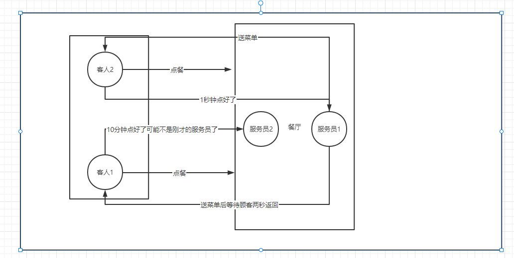

异步编程 ：仅仅是不等待，并不会使单个请求的处理速度变快

例如处理一个图片的上传单个请求的处理速度并不会变快 ，只是同时处理的请求变多了

使用 Async 和 Await 的异步编程：https://docs.microsoft.com/zh-cn/dotnet/csharp/programming-guide/concepts/async/#asynchronous-exceptions

基于任务的异步模式： https://docs.microsoft.com/zh-cn/dotnet/standard/asynchronous-programming-patterns/consuming-the-task-based-asynchronous-pattern

并行：https://docs.microsoft.com/zh-cn/dotnet/standard/parallel-processing-and-concurrency

线程：https://docs.microsoft.com/zh-cn/dotnet/standard/threading/

# async await

 “异步方法”:用async 关键字修饰的方法

1 异步方法的返回值一般是Task<T> T是真正的返回值类型,按照惯例异步方法名称以Async结尾。

2 即使方法没有返回值，也最后将返回值类型声明为非泛型的Task。

3 调用方法时一般在**方法前加上await**关键字，这样获取到的关键字就是指定的T类型

4 一个方法中如果有await 调用 则这个方法**必须**修饰为async 

 ~~~c#
 string file = @"d:\1.txt";
 File.Delete(file);
 await File.WriteAllTextAsync(file, "zxc");
 string s = await File.ReadAllTextAsync(file);
 Console.WriteLine(s);
 Console.ReadKey();
 ~~~

# 封装一个异步方法

~~~C#
//下载网页
static async Task<int> DownLoadHtmlAsync(string url, string path)
{
    using (HttpClient httpClient = new HttpClient())
    {
        string html = await httpClient.GetStringAsync(url);
        await File.WriteAllTextAsync(path, html);
        return html.Length;
    }
}
~~~

同样的功能，既有同步方法也有异步方法，首先使用异步方法，对于不支持异步方法有以下解决方法，但是不建议使用，有死锁风险

Task.Result

Task.Wait

~~~C#
//有返回值
static string ReadAllText(string path)
{
    string s = File.ReadAllTextAsync(path).Result;
    return s;
}
//无返回值
static void WriteAllText(string path, string contents)
{
    File.WriteAllTextAsync(path, contents).Wait();
}
~~~

# 委托中的异步方法

~~~C#
//需要加上 async
ThreadPool.QueueUserWorkItem(async (obj) =>
{
    while (true)
    {
        await File.WriteAllTextAsync("zzz", "zxc");
    }
});
~~~

# 原理

await 调用的等待期间 .net会把当前的线程返回给线程池等异步方法调用执行完毕后框架会从线程池在取出来一个线程执行后续的代码

~~~C#
//验证
StringBuilder sb = new StringBuilder();
for (int i = 0; i < 10000000; i++)
{
    sb.Append("zxc");
}

await File.WriteAllTextAsync(@"d:\1.txt", sb.ToString());
Console.WriteLine(Thread.CurrentThread.ManagedThreadId);

string str = await File.ReadAllTextAsync(@"d:\1.txt");
Console.WriteLine(Thread.CurrentThread.ManagedThreadId);

//result ：两个线程不一样
F:/Learm/DotNet/DotNet/NetCore/NetCoreStudy/AsyncAwaitSample/bin/Debug/net6.0/AsyncAwaitSample.exe 
7
14

~~~

# 异步方法不等于多线程

异步方法中的代码如果没有手动放到新的线程中执行，是不会在开启一个新的线程执行的，如果想让异步方法中的代码在新的线程中执行，必须手动开启一个新的线程执行

~~~C#
//验证 不手动开启新线程就是同一个线程
Console.WriteLine($"Main :{Thread.CurrentThread.ManagedThreadId}");
await CalcAsync(50000);

static async Task<long> CalcAsync(int n)
{
    Console.WriteLine($"CalcAsync :{Thread.CurrentThread.ManagedThreadId}");
    long b = 0;
    Random r = new Random();
    for (int i = 0; i < n * n; i++)
    {
        b += r.NextInt64();
    }
    return b;
}

//result
F:/Learm/DotNet/DotNet/NetCore/NetCoreStudy/AsyncAwaitSample/bin/Debug/net6.0/AsyncAwaitSample.exe 
Main :1
CalcAsync :1

~~~

# 手动开启线程

~~~C#
//手动开启一个线程
static async Task<long> CalcAsync(int n)
{
    return await Task.Run(() =>
    {
        Console.WriteLine($"CalcAsync :{Thread.CurrentThread.ManagedThreadId}");
        long b = 0;
        Random r = new Random();
        for (int i = 0; i < n * n; i++)
        {
            b += r.NextInt64();
        }

        return b;
    });
}
F:/Learm/DotNet/DotNet/NetCore/NetCoreStudy/AsyncAwaitSample/bin/Debug/net6.0/AsyncAwaitSample.exe 
Main :1
CalcAsync :4
~~~

# 没有Async 的异步方法

返回值为Task的方法不一定要标注async 标注async 只是让我们可以更方便的await而已。

async 缺点：

1、会拆完了在装 ，影响效率

2、异步方法会生成一个类运行效率没有普通方法高

3、可能会占用非常多的线程

~~~C#
var result = await TestAsync(500);
Console.WriteLine(result);

static Task<long> TestAsync(int n)
{
    return Task.Run(() =>
    {
        Console.WriteLine($"CalcAsync :{Thread.CurrentThread.ManagedThreadId}");
        long b = 0;
        Random r = new Random();
        for (int i = 0; i < n * n; i++)
        {
            b += r.NextInt64();
        }
        //return Task.FromResult(b);
        return b;
    });
}
~~~

何时使用没有Async 的异步方法？

如果一个异步方法只是对别的异步方法调用的转发，并没有复杂的逻辑（比如等待A的结果，在用A的结果调用B）那么就可以去掉async，直接返回Task<TResult>

# 比较速度

~~~c#
Stopwatch sw = new Stopwatch();
sw.Start();
for (int i = 0; i < 100; i++)
{
    await TestWhenAllAndTaskRun();
}

sw.Stop();
Console.WriteLine($"async {sw.ElapsedMilliseconds}");

Stopwatch sw1 = new Stopwatch();

List<Task> list1 = new List<Task>();
sw1.Start();
for (int i = 0; i < 100; i++)
{
    list1.Add(TestWhenAllAndTaskRun());
}

Task.WaitAll(list1.ToArray());
sw1.Stop();
Console.WriteLine($"noasync {sw1.ElapsedMilliseconds}");

Stopwatch sw2 = new Stopwatch();

List<Task> list2 = new List<Task>();

sw2.Start();
for (int i = 0; i < 100; i++)
{
    list2.Add(Task.Run(async () => { await TestWhenAllAndTaskRun(); }));
}

Task.WaitAll(list2.ToArray());
sw2.Stop();
Console.WriteLine($"Thread {sw2.ElapsedMilliseconds}");

static async Task TestWhenAllAndTaskRun()
{
    //Console.WriteLine(Thread.CurrentThread.ManagedThreadId);
    StringBuilder result = new StringBuilder();
    for (int i = 0; i < 1000000; i++)
    {
        result.Append(i.ToString());
    }

    for (int i = 0; i < 1000000; i++)
    {
        result.Append(i.ToString());
    }

    for (int i = 0; i < 1000000; i++)
    {
        result.Append(i.ToString());
    }

    for (int i = 0; i < 1000000; i++)
    {
        result.Append(i.ToString());
    }
}
//result
AsyncAwaitSample.exe
async 2881
noasync 2229
Thread 1491

~~~

# 等待

不要使用 Thread.Sleep 他会阻塞线程 使用   await Task.Delay(3000);

# CancellationToken（取消任务）

场景 有时候需要提前终止任务，比如：请求超时、用户取消请求。

很多方法都有Cancellation Token参数 用于提前终止执行的信号

~~~C#
//创建取消
CancellationTokenSource cts = new CancellationTokenSource();
cts.CancelAfter(10000);//指定时间
//cts.Cancel();//直接终止
CancellationToken cancellationToken = cts.Token;
//调用
await DownloadlAsync("https://www.baidu.com", 100, cancellationToken);

static async Task DownloadlAsync(string url, int n, CancellationToken cancellationToken = default)
{
    using (HttpClient httpClient = new HttpClient())
    {
        for (int i = 0; i < n; i++)
        {
            string html = await httpClient.GetStringAsync(url);
            Console.WriteLine(html);
            #region 判断是否取消
            if (cancellationToken.IsCancellationRequested)
            {
                Console.WriteLine("取消");
                return;
            }
            #endregion

            #region 直接异常
            cancellationToken.ThrowIfCancellationRequested();
            #endregion

            #region 将参数传递给有 CancellationToken
            await httpClient.GetAsync(url, cancellationToken);
            #endregion
        }
    }
}
~~~

~~~C#
 		//web api 当前页面打开新的页面会停止请求，新标签页不行
		[HttpPost]
        public async Task GetToDo(CancellationToken cancellationToken)
        {
            await DownloadlAsync("http://www.baidu.com", 1000, cancellationToken);
        }

~~~

# 其他重要方法

whenAll --全部完成

whenAny-一个完成

FromResult -将对象包装为 Task<TResult>

waitAll--等待所有完成

~~~C#
//无返回值
List<Task> list = new List<Task>();
 list.Add(Task.Run(() => { Console.WriteLine(Thread.CurrentThread.ManagedThreadId); }));
 list.Add(Task.Run(() => { Console.WriteLine(Thread.CurrentThread.ManagedThreadId); }));
 list.Add(Task.Run(() => { Console.WriteLine(Thread.CurrentThread.ManagedThreadId); }));
 var array= await Task.whenAll (list.ToArray());

~~~

~~~C#
//有返回值
List<Task<int>> list = new List<Task<int>>();
list.Add(Task.Run(() => { return Thread.CurrentThread.ManagedThreadId; }));
list.Add(Task.Run(() => { return Thread.CurrentThread.ManagedThreadId; }));
list.Add(Task.Run(() => { return Thread.CurrentThread.ManagedThreadId; }));

var array = await Task.WhenAll(list.ToArray());

foreach (var item in array)
{
    Console.WriteLine(item);
}
~~~

# 其他问题

接口中的方法不能使用async 因为接口只是方法的定义，标记async 编译器会将方法拆分多块

yield return 不仅能简化数据的返回，而且让数据处理变的流水线化，提升性能。

~~~C#
static IEnumerable<string> Test()
{
    for (int i = 0; i < 10; i++)
    {
        yield return i.ToString();
    }
}
~~~

在旧版的C#中 async 方法中不能用yield。从C#8.0开始吧返回值声明为IAsyncEnumerable 然后遍历的时候用 await即可

~~~C#
static async IAsyncEnumerable<string> Test2()
{
    for (int i = 0; i < 10; i++)
    {
        yield return i.ToString();

    }
}

await ForEach(var n in Test2)
~~~

