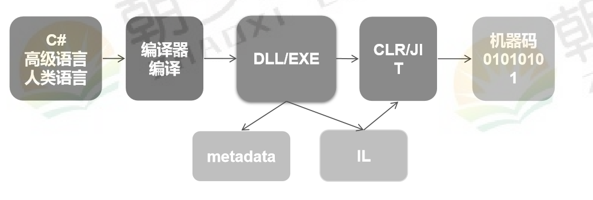

[TOC]

https://docs.microsoft.com/zh-cn/dotnet/csharp/programming-guide/generics/generic-type-parameters

# 1.泛型的引入

场景：

打印不同类型（int 、string、datetime ）的值

方案一：每个类型定义一个方法

缺点：如果有一百个类型就需要写一百个方法

```C#
		/// <summary>
        /// 打印个int值
        /// </summary>
        /// <param name="iParameter"></param>
        public static void ShowInt(int iParameter)
        {
            Console.WriteLine($"This is {typeof(CommonMethod).Name},parameter={iParameter.GetType().Name},type={iParameter}");
        } 
        /// <summary>
        /// 打印个string值
        /// </summary>
        /// <param name="sParameter"></param>
        public static void ShowString(string sParameter)
        {
            Console.WriteLine($"This is {typeof(CommonMethod).Name},parameter={sParameter.GetType().Name},type={sParameter}"); 
        } 
        /// <summary>
        /// 打印个DateTime值
        /// </summary>
        /// <param name="oParameter"></param>
        public static void ShowDateTime(DateTime dtParameter)
        {
            Console.WriteLine($"This is {typeof(CommonMethod).Name},parameter={dtParameter.GetType().Name},type={dtParameter}");
        }
```

方案二：使用Object作为参数（Object 是所有类型的基类）

缺点：1、拆装箱，性能不高，

​			2、类型不安全

~~~C#
 		/// <summary>
        /// object  :引用类型
        /// </summary>
        /// <param name="oParameter"></param>
        public static void ShowObject(object oParameter)
        {
            Console.WriteLine($"This is {typeof(CommonMethod).Name},parameter={oParameter.GetType().Name},type={oParameter}");
        }
~~~

方案三：泛型

优点：1、性能高

​			2、类型安全

~~~c#
        /// <summary>
        /// 泛型方法
        /// </summary>
        /// <typeparam name="T">类型变量  类型参数</typeparam>
        /// <param name="tParameter"></param>
        public static void Show<T>(T tParameter)
        {
            Console.WriteLine($"This is {typeof(CommonMethod).Name},parameter={tParameter.GetType().Name},type={tParameter}");
        }
~~~

性能对比：遍历 一亿次

~~~c#
                int iValue = 12345;
                long commonSecond = 0;  
                long objectSecond = 0;
                long genericSecond = 0;

                {
                    Stopwatch watch = new Stopwatch();
                    watch.Start();
                    for (int i = 0; i < 100_000_000; i++)
                    {
                        ShowInt(iValue);
                    }
                    watch.Stop();
                    commonSecond = watch.ElapsedMilliseconds;
                }
                {
                    Stopwatch watch = new Stopwatch();
                    watch.Start();
                    for (int i = 0; i < 100_000_000; i++)
                    {
                        ShowObject(iValue);
                    }
                    watch.Stop();
                    objectSecond = watch.ElapsedMilliseconds;
                }
                {
                    Stopwatch watch = new Stopwatch();
                    watch.Start();
                    for (int i = 0; i < 100_000_000; i++)
                    {
                        Show<int>(iValue);
                    }
                    watch.Stop();
                    genericSecond = watch.ElapsedMilliseconds;
                }
                Console.WriteLine($"commonSecond={commonSecond},objectSecond={objectSecond},genericSecond={genericSecond}");
~~~

结果 ： 泛型即保证了性能，也保证了类型安全

~~~shell
commonSecond=854,objectSecond=2841,genericSecond=937
~~~

# 2.泛型的声明

设计思想：延迟声明，声明的时候，给一个占位符T,调用的时候，指定T 的类型。

声明方式：'<T>' 

如：

泛型方法 

~~~c#
public void GetType<T>(T type){}
~~~

泛型类

~~~C#
public class MyClass<T>
{
    public T type;
}
~~~

# 3.泛型原理

原理：

在高级语言中，定义的泛型T，在计算机执行的执行的时候，一定要是一个具体的类型；

在底层如何支持泛型？

~~~c#
Console.WriteLine(typeof(List<>));
Console.WriteLine(typeof(Dictionary<,>));
~~~

> 在底层看到 生成的结果是：List`1[T]   
>
> ​											   Dictionary`2[TKey,TValue]

1编译器必须要能够支持泛型
2 CLR 运行时环境也必须要支持泛型
3泛型不是语法糖---由框架的升级支持的；



# 4.泛型多种应用

1.泛型方法----可以一个方法满足不同类型的需求

```c#
	public void GetType<T>(T type){}
```

2.泛型接口----可以一个接口满足不同类型的需求---尖括号+占位符

```c#
    public interface GenericInterfac<T>
    {
        public T Show();
    }
```

3.泛型类------可以一个类型满足不同类型的需求---尖括号+占位符

```c#
    public class GenericClass<T, S>
    {
        public S Show(T t)
        {
			return default(S);
        }
    }
```

4.泛型委托----可以一个委托满足不同类型的需求

~~~c#
    public delegate T Genericdelegate<T>();
~~~


# 5.泛型约束

https://docs.microsoft.com/zh-cn/dotnet/csharp/programming-guide/generics/constraints-on-type-parameters

~~~c#
        public static void ShowObject(object oParameter)
        {
            //传递一个实体对象：操作字段和数据 
            //问题：
            //1.无法取属性字段--因为oParameter是Object； C#是强类型语言，编译时决定参数是什么类型；
            //2.强制转换 可能抛异常
            People people = (People)oParameter;
            Console.WriteLine($"People.Id={people.Id}");
            Console.WriteLine($"People.Name={people.Name}");

        }

        /// <summary>
        /// 1.基类约束
        ///   a.就是把类型参数当做People
        ///   b.调用---就可以传递Popple或者People的子类型
        ///   c.泛型约束：要么不让你进来，如果让你进来，就一定是没有问题
        /// </summary>
        /// <typeparam name="T"></typeparam>
        /// <param name="tParameter"></param>
        public static void ShowBase<T>(T tParameter) where T : People //    ,ISports
        {
            Console.WriteLine($"People.Id={tParameter.Id}");
            Console.WriteLine($"People.Name={tParameter.Name}");
            //tParameter.Pingpang();
        }


        /// <summary>
        /// 接口约束：
        ///   a.把这个T 当做ISports
        ///   b.就只能传递ISports 这个接口或者是实现过这个接口的类
        ///   c.就可以增加功能，可以获取新的功能
        /// </summary>
        /// <typeparam name="T"></typeparam>
        /// <param name="tParameter"></param>
        public static void ShowInterface<T>(T tParameter) where T : ISports
        {
            tParameter.Pingpang();
        }


        /// <summary>
        /// 引用类型约束
        ///    a.就只能传递类型进来
        /// </summary>
        /// <typeparam name="T"></typeparam>
        /// <param name="tParameter"></param>
        public static void ShowClass<T>(T tParameter) where T : class
        {
           //T t = new T(); //不能这样写 ，因为T 可能没有无参数构造构造函数
        }

        /// <summary>
        /// 值类型约束
        ///    a.就只能传递值类型进来
        /// </summary>
        /// <typeparam name="T"></typeparam>
        /// <param name="tParameter"></param>
        public static void ShowStruct<T>(T tParameter) where T : struct
        {
            T t = new T();
        }

        /// <summary>
        /// 无参数构造函数约束
        ///    a.
        /// </summary>
        /// <typeparam name="T"></typeparam>
        /// <param name="tParameter"></param>
        public static void ShowNew<T>(T tParameter) where T : new()
        {
            T t = new T();
        }

        /// <summary>
        /// 枚举约束
        ///     a.必须是个枚举才能够传递进来
        /// </summary>
        /// <typeparam name="T"></typeparam>
        /// <param name="tParameter"></param>
        public static void ShowEnum<T>(T tParameter) where T : Enum
        {
             
        }

        /// <summary>
        /// 要么是同一个类型，要么是父子级关系
        /// </summary>
        /// <typeparam name="T"></typeparam>
        /// <typeparam name="S"></typeparam>
        /// <param name="tParameter"></param>
        /// <param name="sParameter"></param>
        public static void ShowParent<T,S>(T tParameter,S sParameter) where T : S
        {

        }

        public static void ShowTest<T, S>(T tParameter, S sParameter) where T:class where  S:struct
        {

        }
~~~


# 6泛型缓存

字典缓存：

```C#
    /// <summary>
    /// 字典缓存：静态属性常驻内存
    /// </summary>
    public class DictionaryCache
    {
        private static Dictionary<Type, string> _TypeTimeDictionary = null;

        //静态构造函数在整个进程中，执行且只执行一次；
        static DictionaryCache()
        {
            Console.WriteLine("This is DictionaryCache 静态构造函数");
            _TypeTimeDictionary = new Dictionary<Type, string>();
        }
        public static string GetCache<T>()
        {
            Type type = typeof(T);
            if (!_TypeTimeDictionary.ContainsKey(type))
            {
                _TypeTimeDictionary[type] = $"{typeof(T).FullName}_{DateTime.Now.ToString("yyyyMMddHHmmss.fff")}";
            }
            return _TypeTimeDictionary[type];
        }
    }
```

泛型缓存：可以根据不同的类型生成一个新的类的副本

~~~c#
    /// <summary>
    ///泛型缓存：
    /// </summary>
    /// <typeparam name="T"></typeparam>
    public class GenericCache<T>
    {
        static GenericCache()
        {
            Console.WriteLine("This is GenericCache 静态构造函数");
            _TypeTime = $"{typeof(T).FullName}_{DateTime.Now.ToString("yyyyMMddHHmmss.fff")}";
        }
        private static string _TypeTime = "";
        public static string GetCache()
        {
            return _TypeTime;
        }
    }
~~~


# 7协变，逆变 

