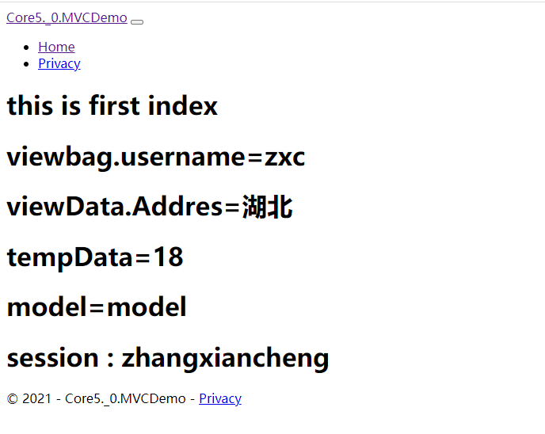
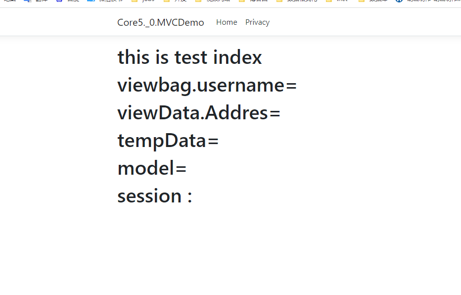

[TOC]

# 命令行启动

```
切换到dll 文件的目录 打开终端，输入命令，回车：

dotnet .\Core5.0.MVCDemo.dll --urls "http://localhost:6001"

```

```
正常启动

PS F:\Log\Code\DOTNET\NET\Core5.0.MVCDemo\bin\Debug\net5.0> dotnet .\Core5.0.MVCDemo.dll --urls "http://localhost:6001"
info: Microsoft.Hosting.Lifetime[0]
      Now listening on: http://localhost:6001
info: Microsoft.Hosting.Lifetime[0]
      Application started. Press Ctrl+C to shut down.
info: Microsoft.Hosting.Lifetime[0]
      Hosting environment: Production
info: Microsoft.Hosting.Lifetime[0]
      Content root path: F:\Log\Code\DOTNET\NET\Core5.0.MVCDemo\bin\Debug\net5.0
```

```
访问 http://localhost:6001 可以打开页面
```



```
样式丢失解决：
1、将项目的wwwroot 文件复制到 项目启动目录
2、指定 样式文件的路径

 app.UseStaticFiles(new StaticFileOptions()
{
   FileProvider = new PhysicalFileProvider(@"F:\Log\Code\DOTNET\NET\Core5.0.MVCDemo\wwwroot")
});
```



