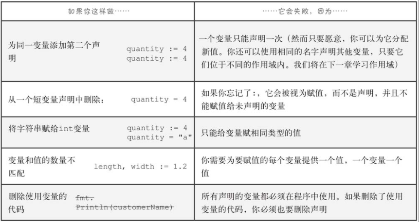
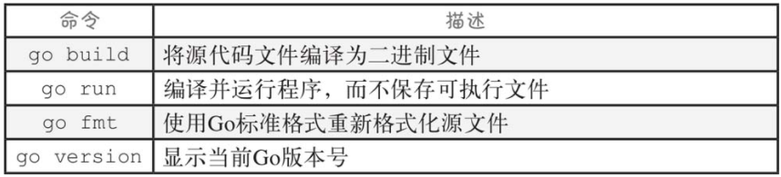

# hello Go

```go
package main

import "fmt"

func main() {
   fmt.Println("hello GO")
}
```

> ## package
>
> 每个GO 文件都已 package  xxx 字句开头。 package是一组代码，它们都做类似的事情，比如格式化字符串或绘制图像。package 字句给出包的名称。

> ## import
>
> GO 文件总是有一个或多个import语句。每个文件都需要导入其他包，然会才能使用包里面包含的代码

>## func
>
>Go 文件最后一部分都是实际代码，通常被分割成一个或多个function。当一个Go 程序运行时，它会寻找一个名为main的函数并首先运行它。

典型布局


注意：

Go文件都必须以package字句开头

Go文件都必须只导入它引用的包

Go查找main的函数并首先运行

Go区分大小写

Go需要在函数前调用包名

# 函数调用

> 函数调用 在同一个包中需要使用 方法名，不同的包中需要使用 包名.方法名

## 使用其他包中的函数

### fmt.Println（打印）

> 终端打印并换行（In）

```go
package main

import "fmt"

func main() {
   fmt.Println("hello GO")
}
```

### strings.Title（首字母大写）

> 将一个字符串，每个单词的第一个字母大写，并返回

~~~go
package main

import (
	"fmt"
	"strings"
)

func main() {
	fmt.Println(strings.Title("set"))
}

~~~

### math.Floor(向下取整)

> 将一个浮点数，将其向下取舍为最接近的整数，然后返回该整数

```go
package main

import (
   "fmt"
   "math"
)

func main() {
   fmt.Println(math.Floor(1111.111))
}
```

# 类型

## 字符串

> 字符串是一系列字节，通常表示文本字符。双引号之间的文本，Go将把它们视为字符串
>
> 如："hello Go "
>
> 字符串中，换行符、制表符和其他难以包含在程序代码中的字符可以用转义序列来表示：反斜杠后跟表示另一个字符的字符。
>
> 如: "hello Go \n"

## 符文

> 字符串字面量由双引号（"）包围，但rune字面量由单引号（'）包围。
>
> 如：'A'
>
> rune被保存为数字代码，而不是字符本身

~~~go
package main

import (
	"fmt"
)

func main() {
	fmt.Println('A')
}
//result : 65
~~~

## 布尔

> 布尔值只能是两个值中的一个：true或false。

## 数字

> 可以直接在代码中定义数字，它甚至比字符串字面量更简单：只需输入数字即可，使用小数点来区分整数和浮点数。
>
> 如 ： 123；123.1

```go
package main

import (
	"fmt"
)

func main() {
	fmt.Println(123)
	fmt.Println(123.1)
}

```

## 数学运算符与比较

> 运算符：＋  -   *   /    
>
> 比较运算符：>=  <=    ==   !=  ；比较结果要么是true，要么是false

## 类型

> Go 中的值被划分为不同的类型，整数可以参与计算但是字符串类型不行；字符串可以转换大小写，但是整数不行。
>
> Go 是静态类型的 如果在函数中使用了错误的值类型，Go会提示错误信息。

### reflect.TypeOf (查看类型)

> reflect.TypeOf 函数可以查看值得具体类型

```go
package main

import (
   "fmt"
   "reflect"
)

func main() {
   fmt.Println(reflect.TypeOf(123))
   fmt.Println(reflect.TypeOf("zhangxiancheng"))
   fmt.Println(reflect.TypeOf(true))
   fmt.Println(reflect.TypeOf(124.1))
}

//int
//string
//bool
//float64

```

## 变量

> Go中，变量是包含值的一块存储。可以使用变量声明为变量命名。只需使用var关键字，后跟所需的名称以及变量将保存的值的类型

```Go
package main

import (
	"fmt"
)

func main() {

	var name string = "zxc"        //变量名 类型  赋值
	var length, width int = 12, 14 // 一次声明同一个类型的多个变量 并赋值
	var age, address = 18, "北京"    // 一次声明不同类型的 并赋值

	fmt.Println(name)
	fmt.Println(length, width)
	fmt.Println(age, address)
}

```

### 短变量声明与赋值

> 如果你声明变量时就知道它的初始值是什么，那么更具有代表性的是使用短变量声明。你不必很明确地声明变量的类型并在之后使用=为其赋值，而是同时使用：=。

```go
package main

import (
   "fmt"
)

func main() {

   name := "zxc"            //变量名 类型  赋值
   length, width := 12, 14  // 一次声明同一个类型的多个变量 并赋值
   age, address := 18, "北京" // 一次声明不同类型的 并赋值
   name = "zhangxiancheng"	//从新赋值
   fmt.Println(name)
   fmt.Println(length, width)
   fmt.Println(age, address)
}
```

### 注意



## 类型默认值

> 如果声明一个变量而没有给它赋值，该变量将包含其类型的零值

~~~go
package main

import (
	"fmt"
)

func main() {

	var name string   //空字符串
	var length int    //0
	var isOk bool     //false
	var money float64 //0
	fmt.Println(name, length, isOk, money)

}

~~~

# 命名规则

> Go有一套简单的规则，适用于变量、函数和类型的名称：
>
> 1、名称必须以字母开头，并且可以有任意数量的额外的字母和数字。
>
> 如：length
>
> 2、如果变量、函数或类型的名称以大写字母开头，则认为它是导出的（共有），可以从当前包之外的包访问它。（这就是为什么fmt.Println中的P是大写的：这样它就可以在main包或任何其他包中使用。）如果变量/函数/类型的名称是以小写字母开头的，则认为该名称是未导出的（私有），只能在当前包中使用。
>
> 
>
> 3、如果一个名称由多个单词组成，那么第一个单词之后的每个单词都应该首字母大写，并且它们应该连接在一起，中间没有空格，比如topPrice、RetryConnection，等等

# 转换

> Go允许你将值从一种类型转换为另一种类型。只需提供要将值转换成的类型，后面紧接着是在圆括号中的要转换的值

```go
package main

import (
   "fmt"
   "reflect"
)

func main() {

   age := 123
   money := 123.1
   result1 := age == int(money)     //大转小
   result2 := float64(age) == money //小转大
   fmt.Println(result1)
   fmt.Println(result2)
   fmt.Println(reflect.TypeOf(age))          //int
   fmt.Println(reflect.TypeOf(float64(age))) //float64
}
```

### int -----string

```go
num := 0                       //int
result := strconv.Itoa(num)    //string
```

# 编译go源码

> 安装 Go
>
> https://golang.org
>
> go version

> 编译
>
>  go build .\first.go

> 执行
>
> windows： first.exe

# Go 工具



# 第一章总结

### 函数调用

函数是一段代码，你可以从程序的其他位置调用它。调用函数时，可以使用参数向函数提供数据。

### 类型

Go中的值被分为不同的类型，这些类型指定了值的用途。不同类型之间进行数学运算和比较是不允许的。但如果需要，可以将值转换为新类型。Go变量只能存储其声明类型的值。

### 要点

■　包是一组相关函数和其他代码的组合。

■　在Go文件中使用包的函数之前，需要先导入该包。

■　string是一系列字节，通常表示文本字符。

■　rune表示单个文本字符。

■　Go最常见的两种数字类型是int（保存整数）和float64（保存浮点数）。

■　bool类型保存布尔值，这些值要么为true，要么为false。

■　变量是一段可以包含指定类型值的存储。

■　如果没有给变量赋值，它将包含其类型的零值。零值的示例包括对int或float64变量来说是0，对string变量来说是""。

■　你可以使用：=短变量声明来声明一个变量，并同时为其赋值。

■　如果变量、函数或类型的名称以大写字母开头，则只能从其他包中的代码访问它们。

■　go fmt命令自动重新格式化源文件以便使用Go标准格式。如果你打算与其他人共享任何代码，你应该对它们运行go fmt。

■　go build命令将Go源代码编译成计算机可以执行的二进制格式。

■　go run命令编译并运行一个程序，而不将可执行文件保存在当前目录中。