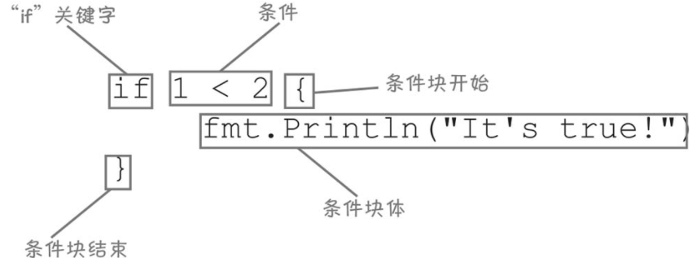
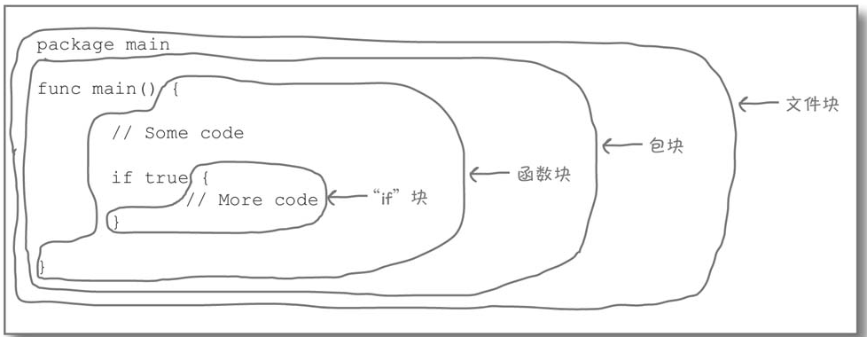
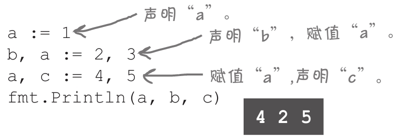

# 调用方法

> 方法是与特定类型的值关联的函数
>
> 如 ：1、使用 time 包中的 Now 函数获取 time.Time 值(now)，在调用 time.Time  值的方法 Yeat|Mnoth|Day 方法获取相应的信息

~~~go
package main

import (
	"fmt"
	"strconv"
	"time"
)

func main() {

	var now time.Time = time.Now() // time.Now 返回一个代表当前日期和时间的time.Time 值
	year := now.Year()             //time.Time 中包含年月日等的信息
	month := now.Month().String()
	day := now.Day()
	fmt.Println(strconv.Itoa(year) + ":" + month + ":" + strconv.Itoa(day))
}
~~~

> 如：替换字符串
>
> strings包有一个Replacer类型，可以在字符串中搜索子字符串，并且在每次该子字符串出现的地方用另一个字符串替换它：
>
> strings.NewReplacer函数接受要替换的字符串（"#"）和要替换为的字符串（"o"）的参数，并返回strings.Replacer。当我们将一个字符串传递给Replacer值的Replace方法时，它将返回一个完成了替换的字符串。

~~~go
package main

import (
	"fmt"
	"strings"
)

func main() {

	broken := "G# Hell#"
	replacer := strings.NewReplacer("#", "o") // old-new 老值-新值
	result := replacer.Replace(broken)
	fmt.Println(result)
}

~~~


## 函数与方法是同一个东西吗

> 函数属于一个包，而方法属于一个单独的值。这个值出现在圆点的左边。

****

# 注释

> //:单行注释
>
> /* content */ ：多行注释

# 函数或方法多返回值处理

## 获取键盘输入

> 1、reader :=  bufio.NewReader(os.Stdin) //设置从键盘获取文本的缓冲读取器
>
> 2、intput ,err:= reader.ReadString('\n')  返回换行符前的所有内容

### 多返回值

> 在大多数编程语言中，函数和方法只能有一个返回值，但在Go中，它们可以返回任意数量的值。
>
> reader.ReadString('\n') 返回两个值，所以我们需要提供 input 和 err 两个变量存储返回的值

#### 多返回值衍生的其他问题

> Go要求声明的每个变量都必须在程序的某个地方使用。未使用的变量通常表示一个bug。

##### 空白标识符忽略错误返回值

> 要使用空白标识符，只需在赋值语句中输入一个下划线（_）字符

```go
package main

import (
	"bufio"
	"fmt"
	"os"
)

func main() {

	fmt.Println("请输入分数")
	reader := bufio.NewReader(os.Stdin) // os.Stdin Reader 将从标准输入中读取；bufio.NewReader 返回bufio.Reader
	input, _ := reader.ReadString('\n') //以字符串形式返回用户输入的内容；\n 表示换行符前的所有内容都将被读取
	fmt.Println(input)

}

```


# 条件

> 只有在满足某个条件时，才导致代码块（一个或多个由花括号{}包围的语句）被执行的语句。
>
> 取反：!
>
> 与：&&
>
> 或：||



# 错误处理

## log.Fatal 函数

> Fatal函数来记录错误并停止程序运行

### 有条件的记录致命错误

> error 不为 nil 时 才需要记录错误

```go
package main

import (
   "bufio"
   "fmt"
   "log"
   "os"
)

func main() {

   fmt.Println("请输入分数")
   reader := bufio.NewReader(os.Stdin)   // os.Stdin Reader 将从标准输入中读取；bufio.NewReader 返回bufio.Reader
   input, err := reader.ReadString('\n') //以字符串形式返回用户输入的内容；\n 表示换行符前的所有内容都将被读取

   if err != nil {
      log.Fatal(err)
   }
   fmt.Println(input)

}
```

### 读取文件获取大小

> 调用os.Stat函数，该函数返回一个os.FileInfo值，可能还返回错误值。然后它对FileInfo值调用Size方法来获取文件大小。

```go
package main

import (
   "fmt"
   "log"
   "os"
)

func main() {

   fileinfo, err := os.Stat("Dockerfile1")

   if err != nil {
      log.Fatal(err)
   }
   fmt.Println(fileinfo.Size())
}
/*
 err 不为 nil
 2022/04/17 20:32:00 CreateFile Dockerfile1: The system cannot find the file specified. 


*/
```

# 避免遮盖名字

> 命名一个error变量是一个坏主意，因为它会遮盖一个名为error的类型的名称。
>
> 声明一个名为int的变量，它遮盖了一个类型名
>
> 一个名为append的变量遮盖了一个内置函数名
>
> 一个名为fmt的变量遮盖了一个导入的包名


## 字符串转换为数字

### strings.TrimSpace (删除两头空白字符)

> strings包有一个TrimSpace函数，它将删除字符串开头和结尾的所有空白字符（换行符、制表符和常规空格）。

###  strconv.ParseFloat(字符串-float64)

> strconv包的ParseFloat函数将其转换为float64值。

~~~go
package main

import (
	"bufio"
	"fmt"
	"log"
	"os"
	"strconv"
	"strings"
)

func main() {

	fmt.Println("请输入分数")
	reader := bufio.NewReader(os.Stdin)   // os.Stdin Reader 将从标准输入中读取；bufio.NewReader 返回bufio.Reader
	input, err := reader.ReadString('\n') //以字符串形式返回用户输入的内容；\n 表示换行符前的所有内容都将被读取

	if err != nil {
		log.Fatal(err)
	}
	input = strings.TrimSpace(input)
	grade, err := strconv.ParseFloat(input, 64)
	if err != nil {
		log.Fatal(err)
	}
	if grade > 60 {
		fmt.Println("及格")
	} else {
		fmt.Println("不及格")
	}
	fmt.Println(input)

}

~~~

# 块

> Go代码可以分为块，即代码段。块通常由大括号（{}）包围，尽管在源代码文件和包级别也有块。块可以彼此嵌套。



# 短变量声明中 如果只有一位变量名必须是最新的

> error 只有一位时 不能出现重复变量名


> 正确 多位时 其实是赋值



# 综合测试


## 生成随机数

> 导入包 math/rand 调用 rand.Intn(100)+1。
>
> rand.Intn，它将返回一个介于0和你提供的数字之间的随机整数

~~~go
package main

import (
	"fmt"
	"math/rand"
	"time"
)

func main() {

	//随机数
	//rand.Seed函数需要一个整数，所以我们不能直接给它传递一个Time值。相反，我们对Time调用Unix方法，它将把时间转换为整数。具体地说，它将把时间转换成Unix时间格式，这是一个整数，是自1970年1月1日以来的秒数。
	rand.Seed(time.Now().Unix())
	target := rand.Intn(100)
	fmt.Println(target)
}
~~~

# 循环和条件

~~~go
package main

import (
	"bufio"
	"fmt"
	"log"
	"math/rand"
	"os"
	"strconv"
	"strings"
	"time"
)

func main() {

	//随机数
	//rand.Seed函数需要一个整数，所以我们不能直接给它传递一个Time值。相反，我们对Time调用Unix方法，它将把时间转换为整数。具体地说，它将把时间转换成Unix时间格式，这是一个整数，是自1970年1月1日以来的秒数。
	rand.Seed(time.Now().Unix())
	target := rand.Intn(100)
	//fmt.Println(target)
	fmt.Println("请输入1-100 之间的数字")
	//创建bufio.Reader允许我们读取键盘输入， 并通过readstring 接收用户输入
	reader := bufio.NewReader(os.Stdin)
	source := false
	for i := 0; i < 10; i++ {
		fmt.Println("剩余：" + strconv.Itoa(10-i))
		input, err := reader.ReadString('\n')
		//是否出错
		if err != nil {
			log.Fatal(err)
		}
		//去除空格
		input = strings.TrimSpace(input)
		//转换为int
		guess, err := strconv.Atoi(input)

		if err != nil {
			log.Fatal(err)
		}
		if guess > target {
			fmt.Println("你猜的过头了")
			continue
		} else if guess < target {
			fmt.Println("你猜的太低了")
			continue
		} else {
			fmt.Println("猜对了")
			source = true
			break
		}
	}
	if !source {
		fmt.Println("10 次全部猜错了！")
	}

}

~~~

