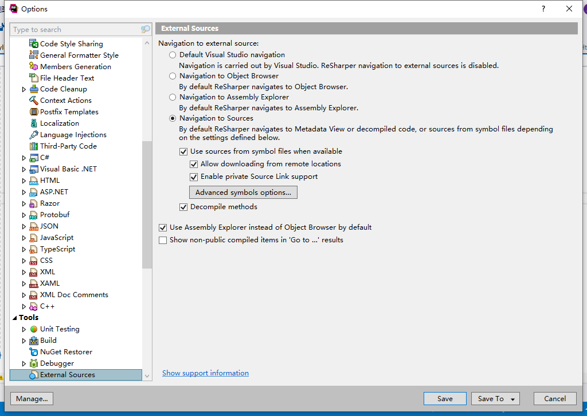
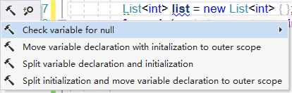
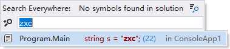
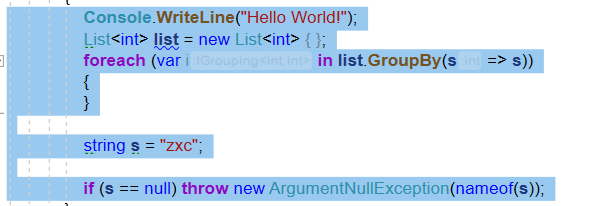
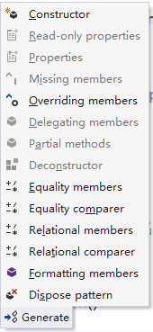
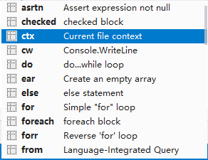
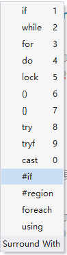
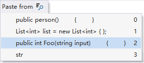

[TOC]

# 快捷键

## Alt + R，O 打开配置面板



## Alt + Enter 修复

```c#
                List<int> list = new List<int> { };
```



## Ctrl + T 搜索



## Ctrl + Alt +Right 选择代码块



##  Ctrl + Shift + Alt + ↑ ,↓ 移动代码块  


## Ctrl + Shift + R 重构代码

## Alt + Inset 生成类型成员



## Ctrl+E L 应用代码模板



## Ctrl+E U  



## Ctrl+Shift+Enter  插入应遵循的所有语法元素，并进入您可以继续输入的位置

```c#
        public int Foo(string input)
```

```c#
        public int Foo(string input)
        {

        }
```

## Ctrl+Shift+Space 查看历史复制



## Shift+Ctrl+Backspace 定位最后编辑的位置

## Alt+Down；Alt+Up 转到类的下一位成员

