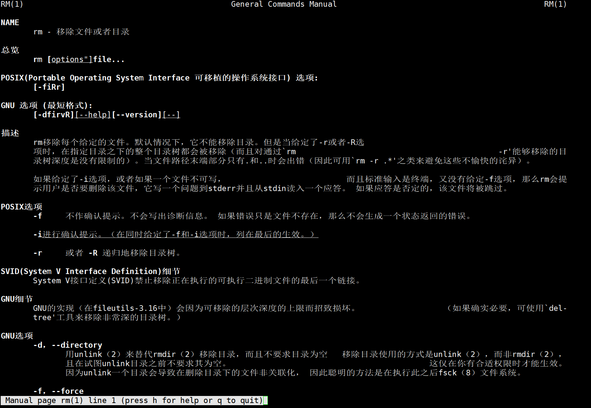

[TOC]

# 设置man 中文显示

```
yum 下载中文说明手册，包名称为man-pages-zh-CN

yum install man-pages-zh-CN

下载完成后，安装保存在/ usr/share/man下

为了区别原有的man命令，采用cman进行别名配置

alias cman='man -M /usr/share/man/zh_CN'

完成后，直接输入cman 命名，就可以看中文手册了

cman rm

编辑配置文件使中文包生效

vim ~/.bashrc

在.bashrc中增加:

export PS1='\n\e[1;37m[\e[m\e[1;32m\u\e[m\e[1;33m@\e[m\e[1;35m\H\e[m \e[4m`pwd`\e[m\e[1;37m]\e[m\e[1;36m\e[m\n\$'

alias cman='man -M /usr//share/man/zh_CN'

使刚刚添加的alias生效

source ~/.bashrc
```


