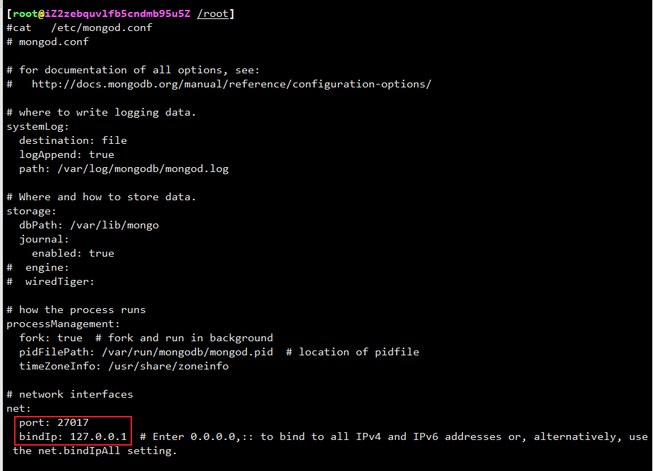
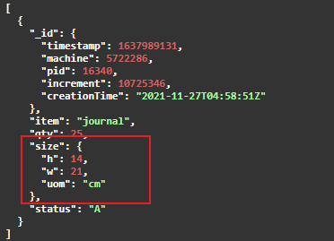
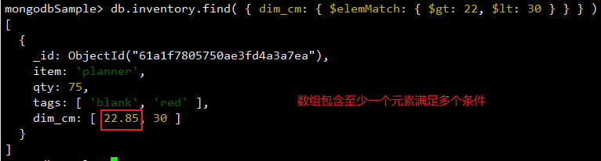

安装

## Linux

### Centos

>① 配置包管理系统（yum）
>
>~~~shell
># 创建 /etc/yum.repos.d/mongodb-org-5.0.repo 可以使用yum以下命令直接安装 MongoDB
>
># 使用 vim 命令创建文件
>vim /etc/yum.repos.d/mongodb-org-5.0.repo
>
># 进入vim 编辑器 按 i 键，将一下内容粘贴
>[mongodb-org-5.0]
>name=MongoDB Repository
>baseurl=https://repo.mongodb.org/yum/redhat/$releasever/mongodb-org/5.0/x86_64/
>gpgcheck=1
>enabled=1
>gpgkey=https://www.mongodb.org/static/pgp/server-5.0.asc
>
># 按 ESC 键 后， 在输入 :wq 保存 退出
>~~~

>② 安装 MongoDB 包
>
>~~~shell
># 使用 yum 命令安装mongodb
>yum install -y mongodb-org
>~~~
>
>~~~shell
># 安装指定版本
>yum install -y mongodb-org-5.0.2 mongodb-org-database-5.0.2 mongodb-org-server-5.0.2 mongodb-org-shell-5.0.2 mongodb-org-mongos-5.0.2 mongodb-org-tools-5.0.2
>~~~


> ③ 目录
>
> ~~~shell
> # 使用默认目录
> 
> # 默认情况下，MongoDB 使用mongod用户帐户运行并使用以下默认目录：
> /var/lib/mongo 	 #（数据目录）
> /var/log/mongodb #（日志目录）
> 
> # 包管理器在安装期间创建默认目录。所有者和组名是mongod.
> ~~~
>
> ~~~shell、
> # 使用非默认目录
> 
> # 要使用默认目录以外的数据目录和/或日志目录：
> # 1、 在其他目录（我这里是root/mongo目录）下创建多个自定义目录（我这里是 lib/mongo 、log/mongodb ）
> mkdir -p /root/mongodb/lib/mongo
> mkdir -p /root/mongodb/log/mongodb
> 
> # 2、编辑 /etc/mongod.conf 文件，修改相应字段
> storage.dbPath指定新的数据目录路径（例如/root/mongodb/lib/mongo）
> systemLog.path指定新的日志文件路径（例如/root/mongodb/log/mongodb/mongod.log）
> 
> # 3、确保运行 MongoDB 的用户有权访问一个或多个目录
> chown -R mongod:mongod <directory>
> ~~~
>
> 

> ④ 运行mongo
>
> ~~~shell
> # 初始化系统
> 要运行和管理您的mongod进程，您将使用操作系统的内置init system。最新版本的 Linux 倾向于使用systemd（使用systemctl命令），而旧版本的 Linux 倾向于使用System V init
> 运行以下命令查看：
> ps --no-headers -o comm 1
> ~~~
>
> ~~~shell
> # 启动MongoDB
> systemctl start mongod
> 
> # 注意：如果出现错误
> Job for mongod.service failed because the control process exited with error code. See "systemctl status mongod.service" and "journalctl -xe" for details.
> # 修改文件权限
> chown mongod:mongod /tmp/mongodb-27017.sock 
> 
> # 如果出现 
> Failed to start mongod.service: Unit mongod.service not found
> systemctl daemon-reload
> ~~~
>
> ~~~shell
> # 查看 mongodb 状态
> systemctl status mongod
> ~~~
>
> 
>
> ~~~shell
> # 停止 mongodb
> systemctl stop mongod
> ~~~
>
> ~~~SHELL
> # 重启 mongodb
> systemctl restart mongod
> ~~~
>
> ~~~shell
> # 连接到 mongodb
> mongosh
> ~~~
>
> 


# 卸载

>~~~shell
># 停止 Mongodb
>service mongod stop
>~~~
>
>~~~shell
># 删除包
>yum erase $(rpm -qa | grep mongodb-org)
>~~~
>
>~~~shell
># 删除数据目录
>sudo rm -r /var/log/mongodb
>sudo rm -r /var/lib/mongo
>~~~


# IP绑定

> ~~~shell
> # 默认本机主机绑定
> ~~~
>
> 
>
> ~~~shell
> # 修改默认绑定
> vim  /etc/mongod.conf
> ~~~
>
> 
>
> ~~~shell
> # 浏览器访问
> ~~~
>
> 


# 主流语言对接

## C#

> 1、 引用 nuget 包 ：MongoDB.Driver
>
> 
>
> 2、创建客户端实例
>
> ```c#
> IMongoClient _mongoClient = new MongoClient("mongodb://47.94.85.108:27017");
> ```
>
> 3、获取数据库实例
>
> ```c#
> IMongoDatabase _mongoDatabase=_mongoClient.GetDatabase("dataBaseName");
> ```
>
> 4 、获取集合实例
>
> ~~~C#
> IMongoCollection collection = _mongoDatabase.GetCollection<BsonDocument>("collectionName");
> ~~~
>
> 5、通过集合实例操作 CRUD
>
> ```C#
> collection.InsertOne();
> collection.DeleteOne();
> collection.UpdateOne();
> collection.Find();
> ```
>
> 


# MongoDB CRUD 操作

## 添加

### 添加单个文档

> > #### mongosh
> >
> > ~~~sql
> > db.inventory.insertOne(
> >    { item: "canvas", qty: 100, tags: ["cotton"], size: { h: 28, w: 35.5, uom: "cm" } }
> > )
> > ~~~
> >
> > 
> >
> > 
>
> > #### C#
> >
> > ```c#
> > public async Task InsertSingleDocment()
> > {
> >     var document = new BsonDocument
> >     {
> >         {"item", "canvas"},
> >         {"qty", 200},
> >         {"tags", new BsonArray {"cotton"}},
> >         {"size", new BsonDocument {{"h", 38}, {"w", 45.5}, {"zom", "dm"}}}
> >     };
> >     var collection = _mongoDatabase.GetCollection<BsonDocument>("inventory");
> >     collection.InsertOne(document);
> > }
> > ```
> >
> > 
>
> 


### 添加多个文档

>
>
>> mongosh
>>
>> ~~~sql
>> db.inventory.insertMany([
>>    { item: "journal", qty: 25, tags: ["blank", "red"], size: { h: 14, w: 21, uom: "cm" } },
>>    { item: "mat", qty: 85, tags: ["gray"], size: { h: 27.9, w: 35.5, uom: "cm" } },
>>    { item: "mousepad", qty: 25, tags: ["gel", "blue"], size: { h: 19, w: 22.85, uom: "cm" } }
>> ])
>> ~~~
>>
>> 
>
>
>
>> C# 
>>
>> ```C#
>> public async Task InsertManyDocment()
>> {
>>     var documents = new BsonDocument[]
>>     {
>>         new BsonDocument
>>         {
>>             {"item", "journal"},
>>             {"qty", 25},
>>             {"tags", new BsonArray {"blank", "red"}},
>>             {"size", new BsonDocument {{"h", 14}, {"w", 21}, {"uom", "cm"}}}
>>         },
>>         new BsonDocument
>>         {
>>             {"item", "mat"},
>>             {"qty", 85},
>>             {"tags", new BsonArray {"gray"}},
>>             {"size", new BsonDocument {{"h", 27.9}, {"w", 35.5}, {"uom", "cm"}}}
>>         },
>>         new BsonDocument
>>         {
>>             {"item", "mousepad"},
>>             {"qty", 25},
>>             {"tags", new BsonArray {"gel", "blue"}},
>>             {"size", new BsonDocument {{"h", 19}, {"w", 22.85}, {"uom", "cm"}}}
>>         },
>>     };
>>     var collection = _mongoDatabase.GetCollection<BsonDocument>("inventory");
>>     collection.InsertMany(documents);
>> }
>> ```
>>
>> 


### 添加行为

- 集合创建：如果该集合当前不存在，则插入操作将创建该集合

- _ id 字段： 在Mongodb中 ，集合中的每个文档都需要唯一的  _ id 字段作为主键。如果插入的文档省略了该_id字段，MongoDB 驱动程序会自动为该字段生成一个ObjectId_id。
- 原子性：MongoDB 中的所有写操作在单个文档的级别上都是原子的。
- 写确认：对于写入问题，您可以指定从 MongoDB 请求的写入操作的确认级别。

### 其他方法

>db.collection.update()  								与upsert: true 选项一起使用时。
>db.collection.updateOne()						  与upsert: true选项一起使用时。
>db.collection.updateMany()					    与upsert: true选项一起使用时。
>db.collection.findAndModify()					与upsert: true选项一起使用时。
>db.collection.findOneAndUpdate()			与upsert: true选项一起使用时 。
>db.collection.findOneAndReplace()			与upsert: true选项一起使用时 。
>db.collection.bulkWrite()


## 查询

### 初始化数据

> >  mongosh 添加数据
> >
> > ~~~shell
> > db.inventory.insertMany([
> >    { item: "journal", qty: 25, size: { h: 14, w: 21, uom: "cm" }, status: "A" },
> >    { item: "notebook", qty: 50, size: { h: 8.5, w: 11, uom: "in" }, status: "A" },
> >    { item: "paper", qty: 100, size: { h: 8.5, w: 11, uom: "in" }, status: "D" },
> >    { item: "planner", qty: 75, size: { h: 22.85, w: 30, uom: "cm" }, status: "D" },
> >    { item: "postcard", qty: 45, size: { h: 10, w: 15.25, uom: "cm" }, status: "A" }
> > ]);
> > ~~~
> >
> > 
>
> 
>
> 
>
> >  C# 初始化数据
> >
> > ~~~shell
> > var documents = new BsonDocument[]
> > {
> >     new BsonDocument
> >     {
> >         { "item", "journal" },
> >         { "qty", 25 },
> >         { "size", new BsonDocument { { "h", 14 }, { "w", 21 }, {  "uom", "cm"} } },
> >         { "status", "A" }
> >     },
> >     new BsonDocument
> >     {
> >         { "item", "notebook" },
> >         { "qty", 50 },
> >         { "size", new BsonDocument { { "h",  8.5 }, { "w", 11 }, {  "uom", "in"} } },
> >         { "status", "A" }
> >     },
> >     new BsonDocument
> >     {
> >         { "item", "paper" },
> >         { "qty", 100 },
> >         { "size", new BsonDocument { { "h",  8.5 }, { "w", 11 }, {  "uom", "in"} } },
> >         { "status", "D" }
> >     },
> >     new BsonDocument
> >     {
> >         { "item", "planner" },
> >         { "qty", 75 },
> >         { "size", new BsonDocument { { "h", 22.85 }, { "w", 30  }, {  "uom", "cm"} } },
> >         { "status", "D" }
> >     },
> >     new BsonDocument
> >     {
> >         { "item", "postcard" },
> >         { "qty", 45 },
> >         { "size", new BsonDocument { { "h", 10 }, { "w", 15.25 }, {  "uom", "cm"} } },
> >         { "status", "A" }
> >     },
> > };
> > collection.InsertMany(documents);
> > ~~~
> >
> > 
>
> 
>
> 


### 查询所有文档

> 选择集合中的所有文档，请将一个空文档作为查询过滤器参数传递给 find 方法
>
> 该操作对应以下SQL语句：
>
> SELECT * FROM inventory

>
>
>> mongosh
>>
>> ~~~sql
>> db.inventory.find( {} )
>> ~~~
>>
>> 
>
>
>
>> C#
>>
>> ```C#
>> public async Task<object> FindAll()
>> {
>>     var filter = Builders<BsonDocument>.Filter.Empty;
>>     var collection = _mongoDatabase.GetCollection<BsonDocument>("inventory");
>>     var result = collection.Find(filter).ToList();
>>     List<Dictionary<string, object>> data = new List<Dictionary<string, object>>();
>>     foreach (var item in result)
>>     {
>>         var dic = item.ToDictionary();
>>         data.Add(dic);
>>     }
>> 
>>     return data;
>> }
>> ```
>>
>> 


### 相等条件查询

> 以下示例从`inventory`集合中选择`status`等于的所有文档`"D"`：
>
> 该操作对应以下SQL语句：
>
> SELECT * FROM inventory WHERE status = "D"

>  
>
> > mongosh
> >
> > > 要指定相等条件，请`<field>:<value>` 在[查询过滤器文档中](https://docs.mongodb.com/manual/core/document/#std-label-document-query-filter)使用表达式 
> > >
> > > { <field1>: <value1>, ... }
> >
> > ~~~shell
> > db.inventory.find( { status: "D" } )
> > ~~~
> >
> > 
>
>  
>
> > C# 
> >
> > > 要指定相等条件，请使用[Eq](https://mongodb.github.io/mongo-csharp-driver/2.10/apidocs/html/Overload_MongoDB_Driver_FilterDefinitionBuilder_1_Eq.htm)方法构造过滤器 
> > >
> > > Builders<BsonDocument>.Filter.Eq(<field>, <value>);
> >
> > ```c#
> > public async Task<object> FindEq()
> > {
> >     var filter = Builders<BsonDocument>.Filter.Eq("status", "D");
> >     var collection = _mongoDatabase.GetCollection<BsonDocument>("inventory");
> >     var result = collection.Find(filter).ToList();
> >     List<Dictionary<string, object>> data = new List<Dictionary<string, object>>();
> >     foreach (var item in result)
> >     {
> >         var dic = item.ToDictionary();
> >         data.Add(dic);
> >     }
> > 
> >     return data;
> > }
> > ```
> >
> > 
> >
> >  


### 指定条件运算符查询

> 以下示例从`inventory` 集合中检索`status`等于`"A"`或"D"的所有文档：
>
> 尽管您可以使用[`$or`](https://docs.mongodb.com/manual/reference/operator/query/or/#mongodb-query-op.-or)运算符来表达此查询，但 在对同一字段执行相等性检查时，请使用[`$in`](https://docs.mongodb.com/manual/reference/operator/query/in/#mongodb-query-op.-in)运算符而不是[`$or`](https://docs.mongodb.com/manual/reference/operator/query/or/#mongodb-query-op.-or)运算符。
>
> 该操作对应以下SQL语句：
>
> SELECT * FROM inventory WHERE status in ("A", "D")

>  
>
> >  mongosh
> >
> > > [查询过滤器文档](https://docs.mongodb.com/manual/core/document/#std-label-document-query-filter)可以使用[查询运算符](https://docs.mongodb.com/manual/reference/operator/query/#std-label-query-selectors)，以指定在以下形式的条件：
> > >
> > > { <field1>: { <operator1>: <value1> }, ... }
> >
> > ~~~sh
> > db.inventory.find( { status: { $in: [ "A", "D" ] } } )
> > ~~~
> >
> > 
>
>  
>
> > C#
> >
> > > 除了相等过滤器，MongoDB 还提供了各种[查询运算符](https://docs.mongodb.com/manual/reference/operator/query/#std-label-query-selectors)来指定过滤条件。
> > >
> > > 使用 [FilterDefinitionBuilder](https://mongodb.github.io/mongo-csharp-driver/2.10/apidocs/html/T_MongoDB_Driver_FilterDefinitionBuilder_1.htm) 方法创建过滤器文档。例如：
> > >
> > > var builder = Builders<BsonDocument>.Filter.In(<field1>, <value1>);
> >
> > ```C#
> > public async Task<object> FindIn()
> > {
> >     var filter = Builders<BsonDocument>.Filter.In("status", new[] {"A", "D"});
> >     var collection = _mongoDatabase.GetCollection<BsonDocument>("inventory");
> >     var result = collection.Find(filter).ToList();
> >     List<Dictionary<string, object>> data = new List<Dictionary<string, object>>();
> >     foreach (var item in result)
> >     {
> >         var dic = item.ToDictionary();
> >         data.Add(dic);
> >     }
> > 
> >     return data;
> > }
> > ```
> >
> > 
>
> 


### 指定 And 条件查询

> 复合查询可以为集合文档中的多个字段指定条件。隐式地，逻辑`AND`连词连接复合查询的子句，以便查询选择集合中与所有条件匹配的文档。
>
> 以下示例检索`inventory` 集合中`status`等于`"A"` **和** `qty`小于 30 的所有文档：

> 该操作对应以下SQL语句：
>
> SELECT * FROM inventory WHERE status = "A" AND qty < 30

>  
>
> > mongosh
> >
> > > 复合查询可以为集合文档中的多个字段指定条件。隐式地，逻辑`AND`连词连接复合查询的子句，以便查询选择集合中与所有条件匹配的文档。
> > >
> > > {<field1>: <value1>,<field1>: <value1>,......}
> >
> > ~~~shell
> > db.inventory.find( { status: "A", qty: { $lt: 30 } } )
> > ~~~
> >
> >  
>
>  
>
> > C# 
> >
> > >复合查询可以为集合文档中的多个字段指定条件。隐式地，逻辑`AND`连词连接复合查询的子句，以便查询选择集合中与所有条件匹配的文档。
> > >
> > >var filter = builder.And(builder.Eq("status", "A"), builder.Lt("qty", 30));
> >
> > ```C#
> > public async Task<object> FindAnd()
> > {
> >     var builder = Builders<BsonDocument>.Filter;
> >     var filter = builder.And(builder.Eq("status", "A"), builder.Lt("qty", 30));
> >     var collection = _mongoDatabase.GetCollection<BsonDocument>("inventory");
> >     var result = collection.Find(filter).ToList();
> >     List<Dictionary<string, object>> data = new List<Dictionary<string, object>>();
> >     foreach (var item in result)
> >     {
> >         var dic = item.ToDictionary();
> >         data.Add(dic);
> >     }
> > 
> >     return data;
> > }
> > ```
> >
> > 


### 指定 Or 条件查询

> 使用[`$or`](https://docs.mongodb.com/manual/reference/operator/query/or/#mongodb-query-op.-or)运算符，您可以指定一个复合查询，该查询将每个子句与逻辑`OR`连词连接起来，以便查询选择集合中至少匹配一个条件的文档。
>
> 以下示例检索集合中`status`等于`"D"` **或** `qty`小于 ( [`$lt`](https://docs.mongodb.com/manual/reference/operator/query/lt/#mongodb-query-op.-lt)) 30 的所有文档：
>
> 该操作对应以下SQL语句：
>
> SELECT * FROM inventory WHERE status = "D" OR qty < 30

>  
>
> > mongosh
> >
> > > 使用[`$or`](https://docs.mongodb.com/manual/reference/operator/query/or/#mongodb-query-op.-or)运算符，您可以指定一个复合查询，该查询将每个子句与逻辑`OR`连词连接起来，以便查询选择集合中至少匹配一个条件的文档。
> > >
> > > { $or: [ { <field1>: <value1> }, { <field1>: {<operator1>: <value1> } } ] 
> >
> >  ~~~shell
> >  db.inventory.find( { $or: [ { status: "D" }, { qty: { $lt: 30 } } ] } )
> >  ~~~
> >
> > 
>
>  
>
> > C# 
> >
> > >  使用[`$or`](https://docs.mongodb.com/manual/reference/operator/query/or/#mongodb-query-op.-or)运算符，您可以指定一个复合查询，该查询将每个子句与逻辑`OR`连词连接起来，以便查询选择集合中至少匹配一个条件的文档。
> > >
> > > var filter = builder.Or(builder.Eq("status", "A"), builder.Lt("qty", 30));
> >
> > ```c#
> > public async Task<object> FindOr()
> > {
> >     var builder = Builders<BsonDocument>.Filter;
> >     var filter = builder.Or(builder.Eq("status", "D"), builder.Lt("qty", 30));
> >     var collection = _mongoDatabase.GetCollection<BsonDocument>("inventory");
> >     var result = collection.Find(filter).ToList();
> >     List<Dictionary<string, object>> data = new List<Dictionary<string, object>>();
> >     foreach (var item in result)
> >     {
> >         var dic = item.ToDictionary();
> >         data.Add(dic);
> >     }
> > 
> >     return data;
> > }
> > ```
> >
> > 
> >
> > 

### 指定 And 和 Or 条件

> 在下面的例子中，化合物查询文档中选择该集合中的所有文档，其中`status`等于`"A"` **和** *任一* `qty`小于（[`$lt`](https://docs.mongodb.com/manual/reference/operator/query/lt/#mongodb-query-op.-lt)）`30` *或* `item` 以字符`p`开始：
>
> 该操作对应以下SQL语句：
>
> SELECT * FROM inventory WHERE status = "A" AND ( qty < 30 OR item LIKE "p%")

>  
>
> > mongosh
> >
> > > and 和 or 可以结合使用
> > >
> > > { <field1>: <value1>, $or: [ {<field1>: { <operator1>: <value1>  } }, {<field1>: <value1> } ] }
> >
> >  ~~~shell
> >  db.inventory.find( {
> >       status: "A",
> >       $or: [ { qty: { $lt: 30 } }, { item: /^p/ } ]
> >  } )
> >  ~~~
> >
> > 
>
>  
>
> > C# 
> >
> > > and 和 or 可以结合使用
> > >
> > > var filter = builder.And(
> > > 	builder.Eq("status", "A"),
> > > 	builder.Or(
> > >
> > > ​		builder.Lt("qty", 30),
> > >
> > > ​		builder.Regex("item", new BsonRegularExpression("^p")))
> > >
> > > );
> >
> > ```C#
> > public async Task<object> FindAnd_Or()
> > {
> >     var builder = Builders<BsonDocument>.Filter;
> >     var filter = builder.And(
> >         builder.Eq("status", "A"),
> >         builder.Or(builder.Lt("qty", 30), builder.Regex("item", new BsonRegularExpression("^p"))));
> >     var collection = _mongoDatabase.GetCollection<BsonDocument>("inventory");
> >     var result = collection.Find(filter).ToList();
> >     List<Dictionary<string, object>> data = new List<Dictionary<string, object>>();
> >     foreach (var item in result)
> >     {
> >         var dic = item.ToDictionary();
> >         data.Add(dic);
> >     }
> > 
> >     return data;
> > }
> > ```
> >
> > 


### 查询嵌入/嵌套文档

#### 匹配嵌套文档

> 要在嵌入/嵌套文档的字段上指定相等条件，请使用 [查询过滤器文档](https://docs.mongodb.com/manual/core/document/#std-label-document-query-filter) `{ <field>: <value> } 。`<value>`是一个文档。
>
> 整个嵌入文档的相等匹配需要 指定文档的*精确*匹配`<value>`，包括字段顺序。
>
> 以下查询选择字段`size`等于{ h: 14, w: 21, uom: "cm" }  的所有 文档。


>  
>
> > mongosh
> >
> > >要在嵌入/嵌套文档的字段上指定相等条件，请使用 [查询过滤器文档](https://docs.mongodb.com/manual/core/document/#std-label-document-query-filter) `{ <field>: <value> }`
> > >
> > > `<value>`是要匹配的文档。
> >
> >  ~~~sql
> >  db.inventory.find( { size: { h: 14, w: 21, uom: "cm" } } )
> >  ~~~
> >
> > 
> >
> >   
>
>  
>
> > C#
> >
> > > 要在嵌入/嵌套文档的字段上指定相等条件，请使用[Eq](https://mongodb.github.io/mongo-csharp-driver/2.10/apidocs/html/Overload_MongoDB_Driver_FilterDefinitionBuilder_1_Eq.htm) 方法构造过滤器 
> > >
> > > Builders<BsonDocument>.Filter.Eq(<field>, <value>) 
> > >
> > > `<value>` 是要匹配的文档。
> >
> >  
> >
> > ```C#
> > public async Task<object> FindEqDocument()
> > {
> >     var filter =
> >         Builders<BsonDocument>.Filter.Eq("size", new BsonDocument {{"h", 14}, {"w", 21}, {"uom", "cm"}});
> >     var collection = _mongoDatabase.GetCollection<BsonDocument>("inventory");
> >     var result = collection.Find(filter).ToList();
> >     List<Dictionary<string, object>> data = new List<Dictionary<string, object>>();
> >     foreach (var item in result)
> >     {
> >         var dic = item.ToDictionary();
> >         data.Add(dic);
> >     }
> > 
> >     return data;
> > }
> > ```
> >
> >  
> >
> > 
>
>  


#### 嵌套字段查询

> 要对嵌入/嵌套文档中的字段指定查询条件，请使用[点表示法](https://docs.mongodb.com/manual/reference/glossary/#std-term-dot-notation)( `"field.nestedField"`)。
>
> 使用圆点表示法查询时，字段和嵌套字段必须在引号内。

##### 嵌套字段相等匹配

> 以下示例选择字段中`uom` 嵌套的`size`字段等于 `"in"` 的所有文档：

> > mongosh
> >
> > ~~~shell
> > db.inventory.find( { "size.uom": "in" } )
> > ~~~
> >
> > 
>
> 
>
> > C# 
> >
> > ```c#
> > public async Task<object> FindEqNestedField()
> > {
> >     var filter = Builders<BsonDocument>.Filter.Eq("size.uom", "in");
> >     var collection = _mongoDatabase.GetCollection<BsonDocument>("inventory");
> >     var result = collection.Find(filter).ToList();
> >     List<Dictionary<string, object>> data = new List<Dictionary<string, object>>();
> >     foreach (var item in result)
> >     {
> >         var dic = item.ToDictionary();
> >         data.Add(dic);
> >     }
> > 
> >     return data;
> > }
> > ```
> >
> > 
>
> 

 

##### 指定运算符查询

> 以下查询在字段中 size 嵌入的 h 小于15的文档 ：

> > mongosh
> >
> > > [查询过滤器文档](https://docs.mongodb.com/manual/core/document/#std-label-document-query-filter)可以使用[查询运算符](https://docs.mongodb.com/manual/reference/operator/query/#std-label-query-selectors)，以指定在以下形式的条件：
> > >
> > > { <field1>: { <operator1>: <value1> }, ... }
> >
> >  
> >
> >  ~~~shell
> >  db.inventory.find( { "size.h": { $lt: 15 } } )
> >  ~~~
> >
> > 
>
>  
>
> > C# 
> >
> >    >除了相等过滤器，MongoDB 还提供了各种[查询运算符](https://docs.mongodb.com/manual/reference/operator/query/#std-label-query-selectors)来指定过滤条件。使用 [FilterDefinitionBuilder](https://mongodb.github.io/mongo-csharp-driver/2.10/apidocs/html/T_MongoDB_Driver_FilterDefinitionBuilder_1.htm) 方法创建过滤器文档。例如：
> >    >
> >    >var builder = Builders<BsonDocument>.Filter.Lt(<field2>, <value2>);
> >
> > ```c#
> > public async Task<object> FindNestedFieldOperator()
> > {
> >     var filter = Builders<BsonDocument>.Filter.Lt("size.h", 15);
> >     var collection = _mongoDatabase.GetCollection<BsonDocument>("inventory");
> >     var result = collection.Find(filter).ToList();
> >     List<Dictionary<string, object>> data = new List<Dictionary<string, object>>();
> >     foreach (var item in result)
> >     {
> >         var dic = item.ToDictionary();
> >         data.Add(dic);
> >     }
> > 
> >     return data;
> > }
> > ```
> >
> >  
>
> 


##### 指定 And 条件

> 以下查询在字段中 size 嵌入的 h 小于15、uom 等于 in 、status 等于 d文档 ：

>  
>
> > mongosh
> >
> > >  {<field1>: <value1>,<field1>: <value1>,......}
> >
> > ~~~shell
> > db.inventory.find( { "size.h": { $lt: 15 }, "size.uom": "in", status: "D" } )
> > ~~~
> >
> > 
>
> > C# 
> >
> > > var builder = Builders<BsonDocument>.Filter;
> > > builder.And(builder.Eq(<field1>, <value1>), builder.Lt(<field2>, <value2>));
> >
> > 
> >
> > ```c#
> > public async Task<object> FindNestedFieldAnd()
> > {
> >     var builder = Builders<BsonDocument>.Filter;
> >     var filter = builder.And(builder.Lt("size.h", 15), builder.Eq("size.uom", "in"), builder.Eq("status", "D"));
> >     var collection = _mongoDatabase.GetCollection<BsonDocument>("inventory");
> >     var result = collection.Find(filter).ToList();
> >     List<Dictionary<string, object>> data = new List<Dictionary<string, object>>();
> >     foreach (var item in result)
> >     {
> >         var dic = item.ToDictionary();
> >         data.Add(dic);
> >     }
> > 
> >     return data;
> > }
> > ```
> >
> > 
> >
> > 
>
> 

### 

### 查询数组

#### 初始化数据

>>  mongosh
>>
>> ~~~shell
>> db.inventory.insertMany([
>>    { item: "journal", qty: 25, tags: ["blank", "red"], dim_cm: [ 14, 21 ] },
>>    { item: "notebook", qty: 50, tags: ["red", "blank"], dim_cm: [ 14, 21 ] },
>>    { item: "paper", qty: 100, tags: ["red", "blank", "plain"], dim_cm: [ 14, 21 ] },
>>    { item: "planner", qty: 75, tags: ["blank", "red"], dim_cm: [ 22.85, 30 ] },
>>    { item: "postcard", qty: 45, tags: ["blue"], dim_cm: [ 10, 15.25 ] }
>> ]);
>> ~~~
>>
>> 
>
>
>
>> C#
>>
>> ~~~shell
>> var documents = new[]
>> {
>>     new BsonDocument
>>     {
>>         { "item", "journal" },
>>         { "qty", 25 },
>>         { "tags", new BsonArray { "blank", "red" } },
>>         { "dim_cm", new BsonArray { 14, 21 } }
>>     },
>>     new BsonDocument
>>     {
>>         { "item", "notebook" },
>>         { "qty", 50 },
>>         { "tags", new BsonArray { "red", "blank" } },
>>         { "dim_cm", new BsonArray { 14, 21 } }
>>     },
>>     new BsonDocument
>>     {
>>         { "item", "paper" },
>>         { "qty", 100 },
>>         { "tags", new BsonArray { "red", "blank", "plain" } },
>>         { "dim_cm", new BsonArray { 14, 21 } }
>>     },
>>     new BsonDocument
>>     {
>>         { "item", "planner" },
>>         { "qty", 75 },
>>         { "tags", new BsonArray { "blank", "red" } },
>>         { "dim_cm", new BsonArray { 22.85, 30 } }
>>     },
>>     new BsonDocument
>>     {
>>         { "item", "postcard" },
>>         { "qty", 45 },
>>         { "tags", new BsonArray { "blue" } },
>>         { "dim_cm", new BsonArray { 10, 15.25 } }
>>     }
>> };
>> collection.InsertMany(documents);
>> ~~~
>
>


#### 匹配一个数组

> 要在数组上指定相等条件，请使用查询文档
>
> `{ <field>: <value> }`
>
> `<value>`是要匹配的确切数组，包括元素的顺序。	
>
> 以下示例查询所有文档，其中字段`tags` 值是一个正好包含两个元素的数组，并且按指定的顺序 `"red"`、`"blank"`

> 
>
>> mongosh
>>
>> > 完全匹配
>> >
>> > > `{ <field>: <value> } `
>> > >
>> > > `<value>`是要匹配的确切数组，包括元素的顺序。
>> >
>> >  ~~~shell
>> >  db.inventory.find( { tags: ["red", "blank"] } )
>> >  ~~~
>> >
>> > 
>> >
>> > 
>>
>> > 元素匹配，不考虑数组中的顺序或其他元素
>> >
>> > > { <field>: {$all:<value>} } 
>> > >
>> > > `<value>`是要匹配的数组 ，不考虑数组中的顺序或其他元素
>> >
>> >  ~~~shell
>> >  db.inventory.find( { tags: { $all: ["red", "blank"] } } )
>> >  ~~~
>> >
>> > 
>> >
>> > 
>
> 
>
>> C# 
>>
>> > 完全匹配
>> >
>> > > 要在数组上指定相等条件，请使用[Eq](https://mongodb.github.io/mongo-csharp-driver/2.10/apidocs/html/Overload_MongoDB_Driver_FilterDefinitionBuilder_1_Eq.htm)方法构造过滤器：
>> > >
>> > > Builders<BsonDocument>.Filter.Eq(<field>, <value>)
>> > >
>> > > `<value>` 是要匹配的确切数组，包括元素的顺序
>> >
>> > ```c#
>> > public async Task<object> FindEqArray()
>> > {
>> >     var filter = Builders<BsonDocument>.Filter.Eq("tags", new[] {"red", "blank"});
>> >     var collection = _mongoDatabase.GetCollection<BsonDocument>("inventory");
>> >     var result = collection.Find(filter).ToList();
>> >     List<Dictionary<string, object>> data = new List<Dictionary<string, object>>();
>> >     foreach (var item in result)
>> >     {
>> >         var dic = item.ToDictionary();
>> >         data.Add(dic);
>> >     }
>> > 
>> >     return data;
>> > }
>> > ```
>> >
>> > 
>> >
>> > 
>>
>>  
>>
>> > 元素匹配，不考虑数组中的顺序或其他元素
>> >
>> > > 如果您希望找到一个数组包含元素`"red"`和 `"blank"`，而不考虑数组中的顺序或其他元素，请使用[`$all`](https://docs.mongodb.com/manual/reference/operator/query/all/#mongodb-query-op.-all)运算符：
>> > >
>> > > var filter = Builders<BsonDocument>.Filter.All(<field>, <value>);
>> > >
>> > > `<value>` 是要匹配的数组，不考虑数组中的顺序或其他元素
>> >
>> > ```c#
>> > public async Task<object> FindEqArrayIgnoreElementAndElementOrder()
>> > {
>> >     var filter = Builders<BsonDocument>.Filter.All("tags", new[] {"red", "blank"});
>> >     var collection = _mongoDatabase.GetCollection<BsonDocument>("inventory");
>> >     var result = collection.Find(filter).ToList();
>> >     List<Dictionary<string, object>> data = new List<Dictionary<string, object>>();
>> >     foreach (var item in result)
>> >     {
>> >         var dic = item.ToDictionary();
>> >         data.Add(dic);
>> >     }
>> > 
>> >     return data;
>> > }
>> > ```
>> >
>> >  
>> >
>> > 
>>
>> 
>>
>> 
>>
>> 


#### 查询数组的包含元素的文档

> 以下示例查询所有文档，查询`tags`数组包含字符串`"plain"`的文档：

>  
>
> > mongosh
> >
> > > 要查询数组字段是否至少包含*一个*具有指定值的元素，请使用过滤器 
> > >
> > > `{ <field>: <value> }`
> > >
> > >  `<value>元素的值 (多个使用 all)。
> >
> >  ~~~shell
> >  db.inventory.find({tags:"plain"})
> >  ~~~
> >
> > 
>
>  
>
> > C# 
> >
> > > 要查询数组字段是否至少包含*一个*具有指定值的元素，请使用[Eq](https://mongodb.github.io/mongo-csharp-driver/2.10/apidocs/html/Overload_MongoDB_Driver_FilterDefinitionBuilder_1_Eq.htm)方法构造一个过滤器 ：
> > >
> > > Builders<BsonDocument>.Filter.Eq(<field>, <value>)
> > >
> > > `<value>` 是要匹配的元素值(多个使用 all)
> > >
> > > ```C#
> > > public async Task<object> FindArrayElement()
> > > {
> > >     var filter = Builders<BsonDocument>.Filter.Eq("tags", "plain");
> > >     var collection = _mongoDatabase.GetCollection<BsonDocument>("inventory");
> > >     var result = collection.Find(filter).ToList();
> > >     List<Dictionary<string, object>> data = new List<Dictionary<string, object>>();
> > >     foreach (var item in result)
> > >     {
> > >         var dic = item.ToDictionary();
> > >         data.Add(dic);
> > >     }
> > > 
> > >     return data;
> > > }
> > > ```
> > >
> > > 
> >
> >  
>
> 

#### 查询数组包含指定条件的元素

> 以下操作查询数组`dim_cm`中至少包含一个值大于 25 的 所有文档 。


>  
>
> > mongosh
> >
> > > 要对数组字段中的元素指定条件，请在 [查询过滤器文档中](https://docs.mongodb.com/manual/core/document/#std-label-document-query-filter)使用[查询运算符](https://docs.mongodb.com/manual/reference/operator/query/#std-label-query-selectors)：
> > >
> > > { <array field>: { <operator1>: <value1>, ... } }
> >
> >  ~~~shell
> >  db.inventory.find( { dim_cm: { $gt: 25 } } )
> >  ~~~
> >
> > 
> >
> > 
>
>   
>
> > C# 
> >
> > >  要对数组字段中的元素指定条件，请在 [查询过滤器文档中](https://docs.mongodb.com/manual/core/document/#std-label-document-query-filter)使用[查询运算符](https://docs.mongodb.com/manual/reference/operator/query/#std-label-query-selectors)。例如：
> > >
> > >  Builders<BsonDocument>.Filter.Gt(<array field>, <value1>);
> >
> >   
> >
> > ```c#
> > public async Task<object> FindArrayElementOperator()
> > {
> >     var filter = Builders<BsonDocument>.Filter.Gt("dim_cm", 25);
> >     var collection = _mongoDatabase.GetCollection<BsonDocument>("inventory");
> >     var result = collection.Find(filter).ToList();
> >     List<Dictionary<string, object>> data = new List<Dictionary<string, object>>();
> >     foreach (var item in result)
> >     {
> >         var dic = item.ToDictionary();
> >         data.Add(dic);
> >     }
> > 
> >     return data;
> > }
> > ```
> >
> > 
> >
> >  
> >
> > 
>
> 


#### 为数组元素指定多个条件

> 在数组元素上指定复合条件时，您可以指定查询使得单个数组元素满足这些条件或数组元素的任意组合满足条件。


##### 使用复合过滤条件查询数组

> 以下示例查询文档，其中`dim_cm`数组包含以某种组合方式满足查询条件的元素；例如，一个元素可以满足大于`15` 条件，另一个元素可以满足小于`20` 条件，或者单个元素可以同时满足两者：

> > mongosh
> >
> >  ~~~shell
> >  db.inventory.find( { dim_cm: { $gt: 15, $lt: 20 } } )
> >  ~~~
> >
> > 
> >
> >  
> >
> > 
>
>   
>
> > C# 
> >
> > > var builder = Builders<BsonDocument>.Filter;
> > > builder.And(builder.Eq(<field1>, <value1>), builder.Lt(<field2>, <value2>));
> >
> > ```c#
> > public async Task<object> FindArrayElementManyOperator()
> > {
> >     var builder = Builders<BsonDocument>.Filter;
> >     var filter = builder.And(builder.Gt("dim_cm", 15), builder.Lt("dim_cm", 20));
> >     var collection = _mongoDatabase.GetCollection<BsonDocument>("inventory");
> >     var result = collection.Find(filter).ToList();
> >     List<Dictionary<string, object>> data = new List<Dictionary<string, object>>();
> >     foreach (var item in result)
> >     {
> >         var dic = item.ToDictionary();
> >         data.Add(dic);
> >     }
> > 
> >     return data;
> > }
> > ```
> >
> > 
>
> 


##### 查询数组元素满足多个条件

> 使用[`$elemMatch`](https://docs.mongodb.com/manual/reference/operator/query/elemMatch/#mongodb-query-op.-elemMatch)运算符在数组元素上指定多个条件，使得至少一个数组元素满足所有指定的条件。
>
> 以下示例查询`dim_cm`数组包含至少一个大于 ( [`$gt`](https://docs.mongodb.com/manual/reference/operator/query/gt/#mongodb-query-op.-gt)) `22`且小于 ( [`$lt`](https://docs.mongodb.com/manual/reference/operator/query/lt/#mongodb-query-op.-lt)) `30`的元素的文档：

>  
>
> > mongosh
> >
> > >  { <array field>: { $elemMatch: { <operator1>: <value1>, <operator1>: <value1> } } } 
> >
> >  ~~~shell
> >  db.inventory.find( { dim_cm: { $elemMatch: { $gt: 22, $lt: 30 } } } )
> >  ~~~
> >
> > 
> >
> > 
>
>  
>
> > C# 
> >
> > >  Builders<BsonDocument>.Filter.ElemMatch<BsonValue>(<array field>, new BsonDocument  { 
> > >
> > > ​	{ "$gt", 22 },
> > >
> > > ​	{ "$lt", 30 }
> > >
> > > }
> >
> >   
> >
> > ```c#
> > public async Task<object> FindArrayElemMatch()
> > {
> >     var builder = Builders<BsonDocument>.Filter;
> >     var filter = builder.ElemMatch<BsonValue>("dim_cm", new BsonDocument {{"$gt", 22}, {"$lt", 30}});
> >     var collection = _mongoDatabase.GetCollection<BsonDocument>("inventory");
> >     var result = collection.Find(filter).ToList();
> >     List<Dictionary<string, object>> data = new List<Dictionary<string, object>>();
> >     foreach (var item in result)
> >     {
> >         var dic = item.ToDictionary();
> >         data.Add(dic);
> >     }
> > 
> >     return data;
> > }
> > ```
> >
> > 
> >
> > 
>
> 

##### 通过数组索引位置查询元素

> 使用[点表示法](https://docs.mongodb.com/manual/reference/glossary/#std-term-dot-notation)，您可以为数组的特定索引或位置处的元素指定查询条件。该数组使用从零开始的索引
>
> 以下示例查询数组中第二个元素`dim_cm`大于 的所有文档`25`：

>  
>
> > mongosh 
> >
> > > { <array field>.index.index: { $gt: 25 } }
> >
> >  ~~~shell
> >  db.inventory.find( { "dim_cm.1":{"$gt":<array value>}})
> >  ~~~
> >
> > 
> >
> > 
> >
> > 
>
>  
>
> > C# 
> >
> > > Builders<BsonDocument>.Filter.Gt(<array field>.index, <value>);
> >
> >  
> >
> > ```c#
> > public async Task<object> FindArrayElementByIndex()
> > {
> >     var filter = Builders<BsonDocument>.Filter.Gt("dim_cm.1", 25);
> >     var collection = _mongoDatabase.GetCollection<BsonDocument>("inventory");
> >     var result = collection.Find(filter).ToList();
> >     List<Dictionary<string, object>> data = new List<Dictionary<string, object>>();
> >     foreach (var item in result)
> >     {
> >         var dic = item.ToDictionary();
> >         data.Add(dic);
> >     }
> > 
> >     return data;
> > }
> > ```
>
> 
>
>  
>
> 


##### 按数组长度查询数组

> 使用[`$size`](https://docs.mongodb.com/manual/reference/operator/query/size/#mongodb-query-op.-size)运算符按元素数查询数组。
>
> 例如，以下选择数组`tags`有 3 个元素的文档 。


>  
>
> >  mongosh
> >
> > > { <array field>: { $size: length }
> >
> >  ~~~shell
> >  db.inventory.find( { "tags": { $size: 3 } } )
> >  ~~~
> >
> >  
> >
> > 
>
>   
>
> > C# 
> >
> > >  Builders<BsonDocument>.Filter.Size(<array field>, length );
> >
> > ```C#
> > public async Task<object> FindArrayElementByLength()
> > {
> >     var filter = Builders<BsonDocument>.Filter.Size("tags", 3);
> >     var collection = _mongoDatabase.GetCollection<BsonDocument>("inventory");
> >     var result = collection.Find(filter).ToList();
> >     List<Dictionary<string, object>> data = new List<Dictionary<string, object>>();
> >     foreach (var item in result)
> >     {
> >         var dic = item.ToDictionary();
> >         data.Add(dic);
> >     }
> > 
> >     return data;
> > }
> > ```
> >
> >  
> >
> > 
>
> 


### 查询嵌入文档数组

#### 初始化数据

> > mongosh
> >
> > ~~~shell
> > db.inventory.insertMany( [
> >    { item: "journal", instock: [ { warehouse: "A", qty: 5 }, { warehouse: "C", qty: 15 } ] },
> >    { item: "notebook", instock: [ { warehouse: "C", qty: 5 } ] },
> >    { item: "paper", instock: [ { warehouse: "A", qty: 60 }, { warehouse: "B", qty: 15 } ] },
> >    { item: "planner", instock: [ { warehouse: "A", qty: 40 }, { warehouse: "B", qty: 5 } ] },
> >    { item: "postcard", instock: [ { warehouse: "B", qty: 15 }, { warehouse: "C", qty: 35 } ] }
> > ]);
> > ~~~
> >
> > 
>
>  
>
> >  C# 
> >
> > ~~~C#
> > var documents = new[]
> > {
> >     new BsonDocument
> >     {
> >         { "item", "journal" },
> >         { "instock", new BsonArray
> >             {
> >                 new BsonDocument { { "warehouse", "A" }, { "qty", 5 } },
> >                 new BsonDocument { { "warehouse", "C" }, { "qty", 15 } } }
> >             }
> >     },
> >     new BsonDocument
> >     {
> >         { "item", "notebook" },
> >         { "instock", new BsonArray
> >             {
> >                 new BsonDocument { { "warehouse", "C" }, { "qty", 5 } } }
> >             }
> >     },
> >     new BsonDocument
> >     {
> >         { "item", "paper" },
> >         { "instock", new BsonArray
> >             {
> >                 new BsonDocument { { "warehouse", "A" }, { "qty", 60 } },
> >                 new BsonDocument { { "warehouse", "B" }, { "qty", 15 } } }
> >             }
> >     },
> >     new BsonDocument
> >     {
> >         { "item", "planner" },
> >         { "instock", new BsonArray
> >             {
> >                 new BsonDocument { { "warehouse", "A" }, { "qty", 40 } },
> >                 new BsonDocument { { "warehouse", "B" }, { "qty", 5 } } }
> >             }
> >     },
> >     new BsonDocument
> >     {
> >         { "item", "postcard" },
> >         { "instock", new BsonArray
> >             {
> >                 new BsonDocument { { "warehouse", "B" }, { "qty", 15 } },
> >                 new BsonDocument { { "warehouse", "C" }, { "qty", 35 } } }
> >             }
> >     }
> > };
> > collection.InsertMany(documents);
> > ~~~
> >
> > 
>
> 


#### 匹配一个数组文档

> 要在数组上指定相等条件，请使用查询文档
>
> { <field>: <value> }
>
> `<value>`是要匹配的确切数组文档，包括文档的顺序。	
>
> 以下示例查询所有文档，其中字段`instock` 值是一个正好包含两个文档的数组，
>
> 并且按指定的顺序 `{ warehouse: 'A', qty: 5 }`、`{ warehouse: 'C', qty: 15 }`


>  
>
> > mongosh
> >
> > > 完全匹配
> > >
> > > > { <field>: <value> }
> > > >
> > > > `<value>`是要匹配的确切数组文档，包括文档的顺序。
> > >
> > > ~~~shell
> > >  db.inventory.find({instock:[{ warehouse: 'A', qty: 5 }, { warehouse: 'C', qty: 15 }]})
> > > ~~~
> > >
> > > 
> >
> > > 文档匹配
> > >
> > > > { <field>: {$all:<value>} } 
> > > >
> > > > `<value>`是要匹配的数组 文档，不考虑数组文档中的顺序或其他文档
> > >
> > >  ~~~shell
> > >  db.inventory.find({instock:{$all:[{ warehouse: 'C', qty: 15 }]}})
> > >  ~~~
> > >
> > > 
> > >
> > > 
>
>   
>
> > C#
> >
> > > 完全匹配
> > >
> > > > Builders<BsonDocument>.Filter.Eq(<field>, <value>)
> > > >
> > > > `<value>` 是要匹配的确切数组文档，包括文档元素的顺序
> > >
> > > ```c#
> > > public async Task<object> FindArrayDocmentAnyEq()
> > > {
> > >     var filter =
> > >         Builders<BsonDocument>.Filter.AnyEq("instock",
> > >             new[]
> > >             {
> > >                 new BsonDocument {{"warehouse", "A"}, {"qty", 5}},
> > >                 new BsonDocument {{"warehouse", "C"}, {"qty", 15}}
> > >             }
> > >         );
> > >     var collection = _mongoDatabase.GetCollection<BsonDocument>("inventory");
> > >     var result = collection.Find(filter).ToList();
> > >     List<Dictionary<string, object>> data = new List<Dictionary<string, object>>();
> > >     foreach (var item in result)
> > >     {
> > >         var dic = item.ToDictionary();
> > >         data.Add(dic);
> > >     }
> > > 
> > >     return data;
> > > }
> > > ```
> > >
> > > 
> >
> >  
> >
> > > 文档元素匹配，不考虑数组中的顺序或其他文档元素
> > >
> > > > var filter = Builders<BsonDocument>.Filter.All(<field>, <value>);
> > > >
> > > > `<value>` 是要匹配的文档数组，不考虑数组中的顺序或其他文档元素
> > >
> > > ```c#
> > > public async Task<object> FindArrayDocmentIgnoreDocumentAndDocumentOrder()
> > > {
> > >     var filter =
> > >         Builders<BsonDocument>.Filter.All("instock",
> > >             new[]
> > >             {
> > >                 new BsonDocument {{"warehouse", "C"}, {"qty", 15}}
> > >             });
> > >     var collection = _mongoDatabase.GetCollection<BsonDocument>("inventory");
> > >     var result = collection.Find(filter).ToList();
> > >     List<Dictionary<string, object>> data = new List<Dictionary<string, object>>();
> > >     foreach (var item in result)
> > >     {
> > >         var dic = item.ToDictionary();
> > >         data.Add(dic);
> > >     }
> > > 
> > >     return data;
> > > }
> > > ```
> > >
> > > 
>
>  
>
>  

#### 查询数组中包含文档元素的文档

> 整个嵌入/嵌套文档的相等匹配需要指定文档的 *精确*匹配，包括字段顺序。
>
> 以下示例选择`instock`数组中的元素 与指定文档匹配的所有文档：

>  
>
> > mongosh
> >
> > > {<array filed>:<value>}
> > >
> > > <value> 是数组中的文档
> >
> >  ~~~shell
> >  db.inventory.find( { "instock": { warehouse: "A", qty: 5 } } )
> >  ~~~
> >
> > 
> >
> > 
>
>  
>
> > C#
> >
> > > > Builders<BsonDocument>.Filter.AnyEq(<array field>, <value>);
> > > >
> > > > <value> 是数组中的文档元素.
> > >
> > > ```c#
> > > public async Task<object> FindArrayDocmentSingeAnyEq()
> > > {
> > >     var filter =
> > >         Builders<BsonDocument>.Filter.AnyEq("instock", new BsonDocument {{"warehouse", "A"}, {"qty", 5}});
> > >     var collection = _mongoDatabase.GetCollection<BsonDocument>("inventory");
> > >     var result = collection.Find(filter).ToList();
> > >     List<Dictionary<string, object>> data = new List<Dictionary<string, object>>();
> > >     foreach (var item in result)
> > >     {
> > >         var dic = item.ToDictionary();
> > >         data.Add(dic);
> > >     }
> > > 
> > >     return data;
> > > }
> > > ```
> > >
> > > 
> >
> >  
>
> 


#### 为文档数组字段指定查询条件

##### 文档字段指定查询条件

>  如果您不知道嵌套在数组中的文档的索引位置，请将数组字段的名称与点 ( `.`) 和嵌套文档中的字段名称连接起来。
>
> 以下示例选择`instock`数组至少有一个包含字段`qty` 的值小于或等于`20`的所有文档：

>  
>
> >  mongosh
> >
> > > { <array field>.<docment field>: { $lte: <value> } }
> > >
> > >  <array field> 是数组字段名
> > >
> > > docment field 是文档中的字段名
> >
> >  ~~~shell
> >  db.inventory.find( { 'instock.qty': { $lte: 20 } } )
> >  ~~~
> >
> > 
> >
> > 
>
>  
>
> > C# 
> >
> >  > Builders<BsonDocument>.Filter.Lte(`<array field>.<docment field>`, `<value1>`);
> >
> >  
> >
> > ```c#
> > public async Task<object> FindArrayDocmentFieldOperator()
> > {
> >     var filter = Builders<BsonDocument>.Filter.Lte("instock.qty", 20);
> >     var collection = _mongoDatabase.GetCollection<BsonDocument>("inventory");
> >     var result = collection.Find(filter).ToList();
> >     List<Dictionary<string, object>> data = new List<Dictionary<string, object>>();
> >     foreach (var item in result)
> >     {
> >         var dic = item.ToDictionary();
> >         data.Add(dic);
> >     }
> > 
> >     return data;
> > }
> > ```
> >
> >  
> >
> > 
>
>  
>
> 


## 更新

> 

## 删除

>

