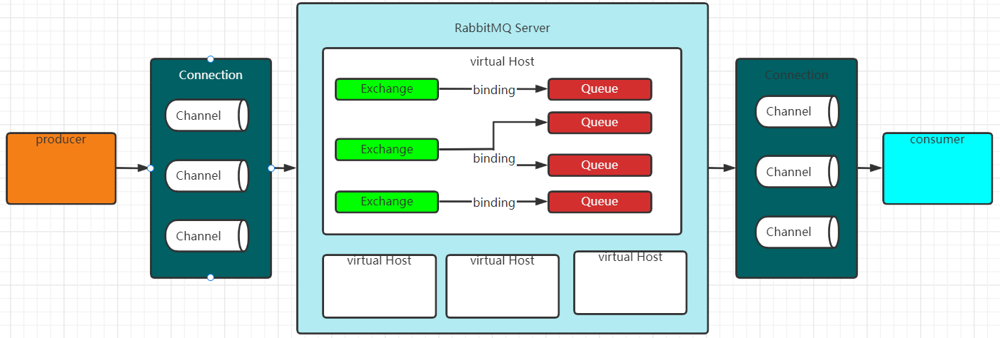
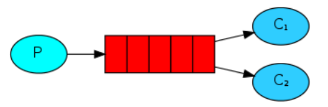
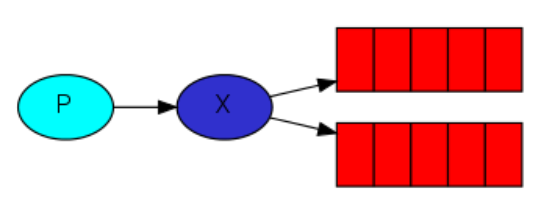
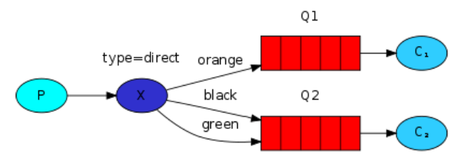
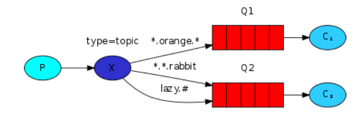
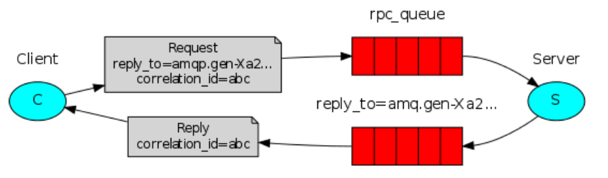

# 交换机（Exchange）

交换机负责接受来自生产者的消息，依据交换机类型（ExchangeType）规则，将它们推送到相应的队列中。

所有的消息推送都是由交换机完成。不指定交换机则使用默认交换机AMQP default 交换机类型为 Direct。

## RabbitMQ工作模型

~~~toml
RabbitMQ Server：又称 Broker，接收客户端连接。
producer：生产者，发送消息的程序。
connection：生产者/消费者与 RabbitMQ 之间的TCP长连接实现。
channel：connection 内部建立的虚拟连接信道,Channel 是进行消息读写的通道，客户端可以建立自己的Channel，每个Channel代表一个会话任务。
Virtual Host：虚拟地址，用于逻辑隔离，不同虚拟地址的不能相互访问。
Exchange：交换机，生产者将消息发送到交换机，在由交换机发送到对应队列中。
Queue：消息队列，消息在队列中等待被消费者消费。
Binding：交换机和队列之间的虚拟连接。
consumer：消费者，接受消息的程序。
~~~

~~~toml
producer（生产者）通过 connection 创建 RabbitMQ server 连接，通过 channel（信道） 建立虚拟连接信道，channel 将 producer 消息发送到 exchange（交换机），因为 exchange 和 queue（队列）通过 exchangeType 进行绑定，所以 exchange 直接发送到绑定的 queue 中，消费者通过 connection 连接到 RabbitMQ server ，channel 建立虚拟连接信道 ，RabbitMQ 通过 channel 将 queue 中消息推送给消费者进行处理。
~~~

## 核心思想

生产者不直接向队列发送任何消息，也不需要知道消息是否被传递到队列，生产者只能向交换机发送消息，其他由交换机处理。

## 交换机类型

~~~bash
交换机类型定义规则，具体需要将消息推送到那些队列或者丢弃。

direct：定向，将消息推送到符合指定routing key 的队列

topic：通配符，将消息推送到符合routing pattern（路由模式） 的队列

headers：根据消息内容中的 headers 属性进行匹配推送。

fanout：广播，将消息推送到所有绑定到此交换机的队列中，忽略routingkey匹配。
~~~

# RabbitMQ 支持的消息模式

## hello world

> 简单模式下，需要一个生产者、一个队列、一个消费者，使用默认的 exchange 

## Work Queues

> work queue模式下，存在多个消费者，多个消费者共同消费队列里的消息。一条消息只会被一个消费者消费，类似于负载均衡，使用默认的 exchange 

## Publish/Subscribe

> Publish/Subscribe，只需要将交换机与多个队列进行绑定，无需指定 Routing key ，每个队列存在一个消费者。生产者发送的消息，每个消费者都会消费，并且每个消费者收到的消息是一致的，使用 FanoutExchange。

## Rutoing

> Rutoing模式，交换机绑定多个队列，每个队列存在一个消费者。在结构上和发布订阅模式完全一致，区别在于交换机绑定队列时，给每个队列设置Routing key属性，生产者发送消息时，会携带Routing key，根据Routing key交换机会将消息发送到不同的队列中
>
> Exchange 使用  DirectExchange

## Topic

> topic模式，交换机绑定多个队列，每个队列存在一个消费者。在结构和原理上和Routing 匹配模式非常相似，区别在 于Routing匹配模式下，routing key 是一个固定的值，需要完全匹配， 而Topic 匹配模式支持模糊匹配。
>
> topic 模式通配符：
>
> “ * ”：匹配一个词，ams.* 能匹配 ams.insert； 
>
> “ # ”：匹配一个或多个词，ams.# 可以 匹配 ams.insert.abc 和 ams.insert
>
> Exchange 使用 TopicExchange

## Headers

## RPC

