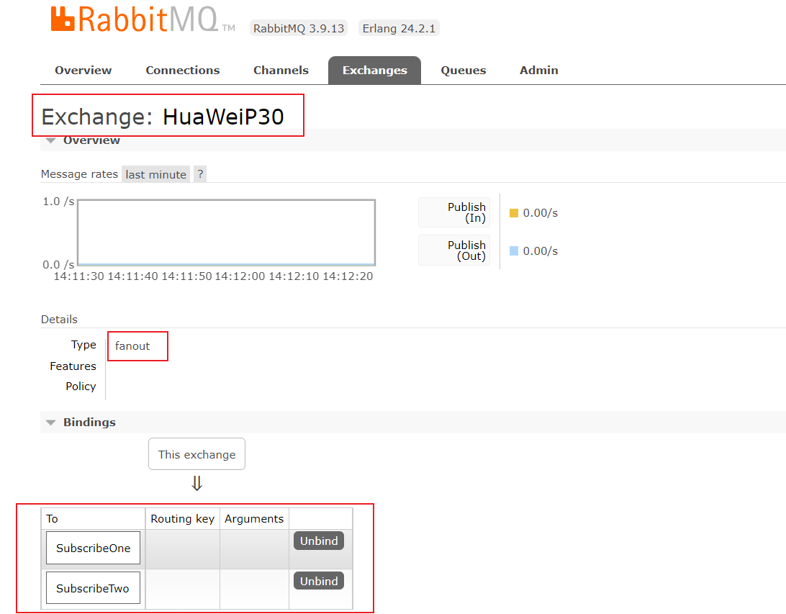

# 发布订阅（PUblish/Subscribe）

> 场景：生产者发送的消息需要推送到每一个绑定的队列中。
>
> 本质：发布的消息将被广播给所有的接收者。
>
> ExchangeType：FanoutExchange

# 生产者

...省略连接流程

## 声明交换机

~~~C#
//声明交换机，并指定交换机类型为 Fanout
var exchange = "HuaWeiP30";
channel.ExchangeDeclare(exchange: exchange, type: ExchangeType.Fanout);
~~~

## 将消息发送到交换机

~~~C#
var message = "HuaWeiP30到货了";
var body = Encoding.UTF8.GetBytes(message);
//指定交换机为声明的交换机 HuaWeiP30 
channel.BasicPublish(
        exchange: exchange,
        routingKey: "",
        basicProperties: null,
        body: body);
~~~

# 消费者1

...省略连接流程

## 声明交换机

~~~C#
 //声明交换机
var exchange = "HuaWeiP30";
channel.ExchangeDeclare(exchange: exchange, type: ExchangeType.Fanout);
~~~

## 声明队列

~~~C#
var queueName = channel.QueueDeclare("SubscribeOne").QueueName;
~~~

## 绑定交换机和消息队列

~~~C#
channel.QueueBind(queue: queueName,
                  exchange: exchange,
                  routingKey: "");
~~~

# 消费者2

...与消费者1雷同，只需改变队列名称为 SubscribeTwo

~~~C#
var queueName = channel.QueueDeclare("SubscribeTwo").QueueName;
~~~

# 分别启动消费者1、消费者2

# 可视化界面查看 Exchange 绑定队列

> HuaWeiP30  交换机下绑定了  SubscribeOne、SubscribeTwo两个消息队列

# 启动生产者

>消费者1和消费者2都接收到了同一条消息。

