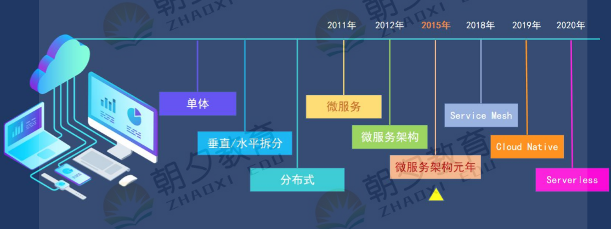
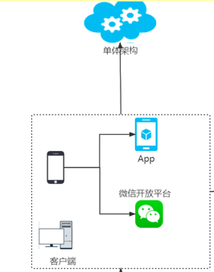
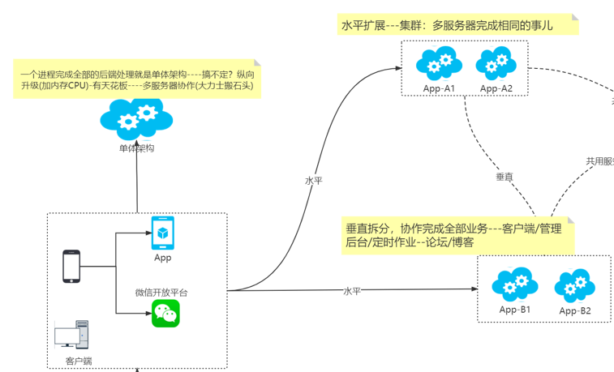
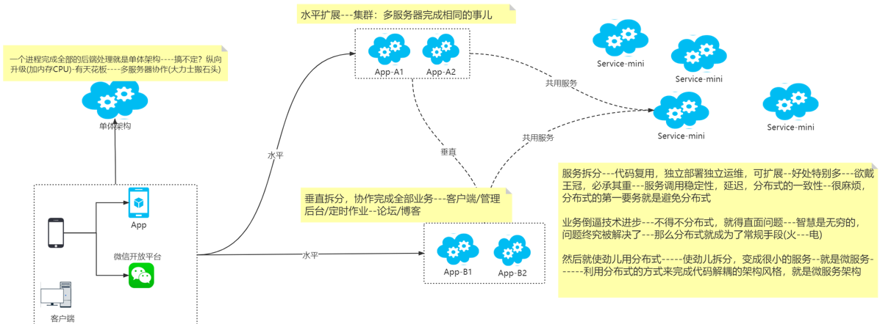
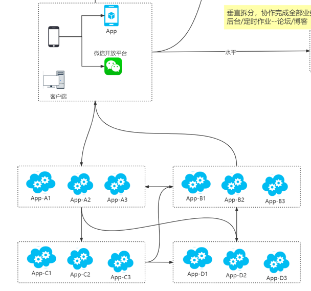

# 01 微服务编年史

# 02 什么是微服务

## 单体：

一个进程完成全部的后端处理就是单体架构

问题：用户增长一台机器扛不住

解决方案：加内存 加cpu 优化代码，当用户不断增加就会出现天花板。

## 水平拆分：

集群，多个服务器完成相同的事

## 垂直拆分：

协作完成全部业务

## 分布式：

A服务需要权限验证，B服务需要权限验证，将权限验证拆分为权限验证服务，代码复用，独立部署运维可扩展。

缺点：服务调用的稳定性；延迟；分布式一致性；

## 微服务：

不断的将服务拆分 ，使用分布式的方式完成代码解耦的架构风格就是微服务架构。

# 03微服务落地

## 服务拆分

微服务落地，写代码前的第一件事儿就是完成服务拆分。 按照啥维度拆分？拆分到啥程度？ (服务高内聚低耦合---大小适中）

DDD：应对复杂软件开发核心；按照业务做领域设计；领域的粒度去拆分服务；ABP vNext遵循DDD；也合适服务拆分

## 高可用

任意节点都是不可靠的，微 服务下会放大这个问题---一个节点的问题，还会引发更多的问题(雪崩 效应)

1、可用性：节点故障，引发雪崩

2、伸缩性：流量有高峰有低谷，微服务堆服务器浪费资源，能自动伸缩，也是微服务架构必须做到的。

解决方案：集群。保证可用性；水平扩展；能满足伸缩的要求

## 服务发现

