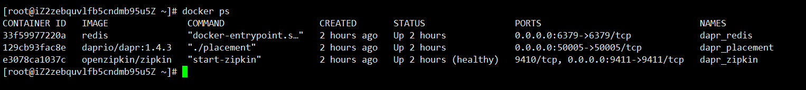
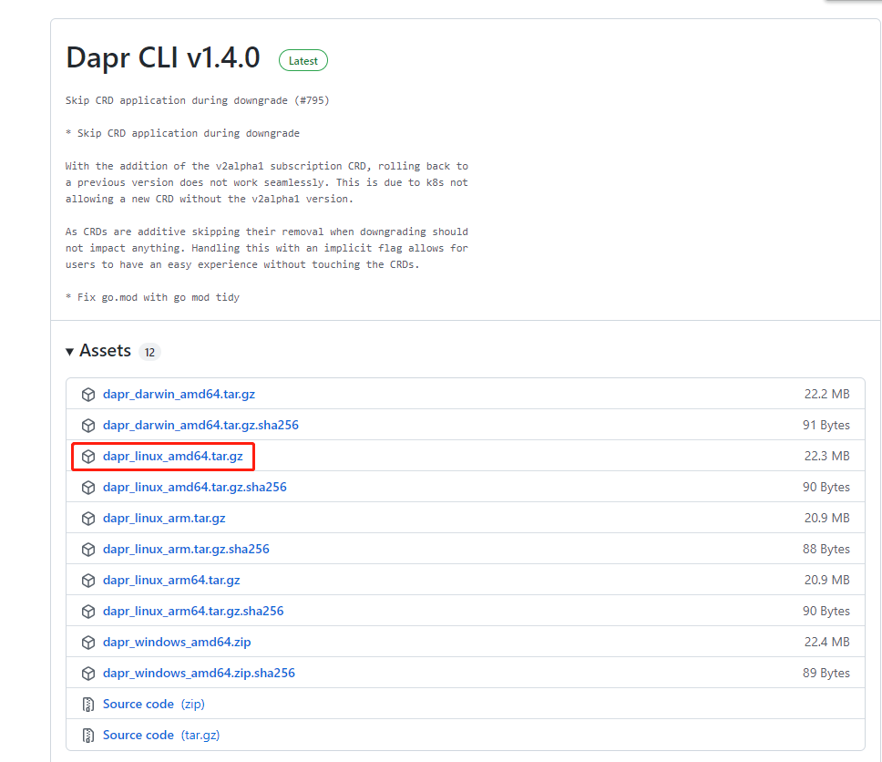
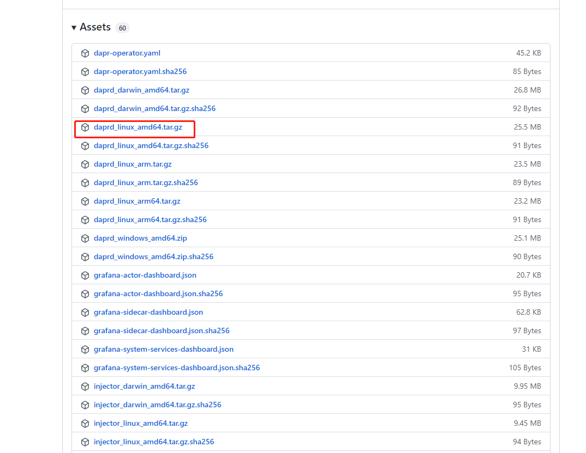
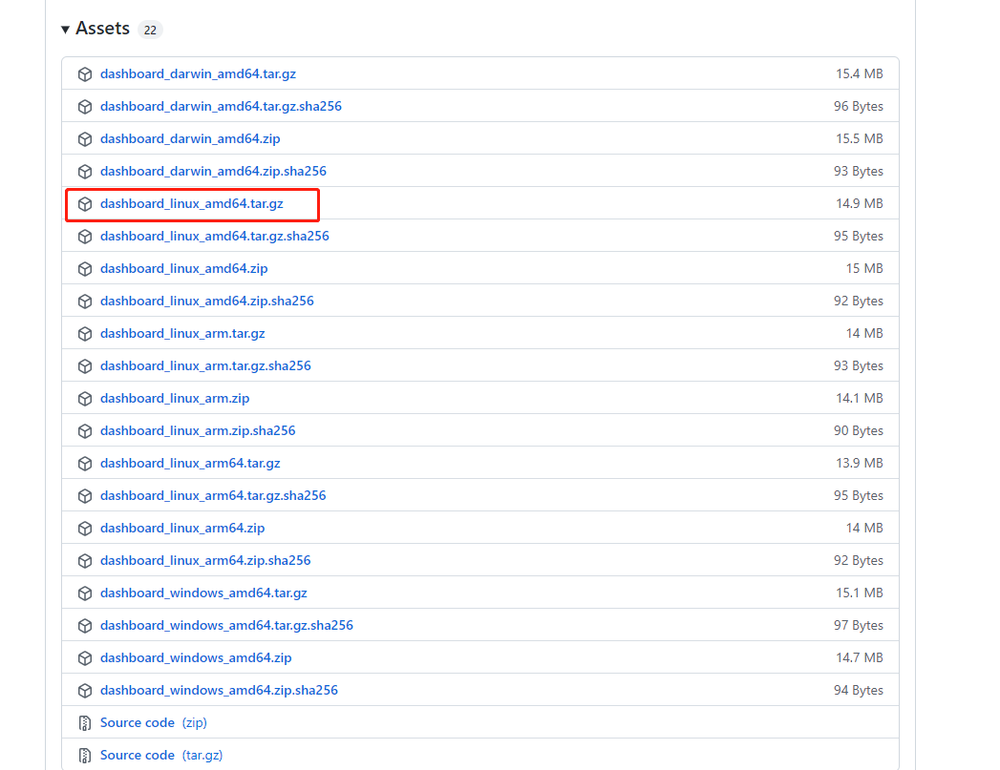
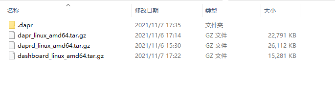
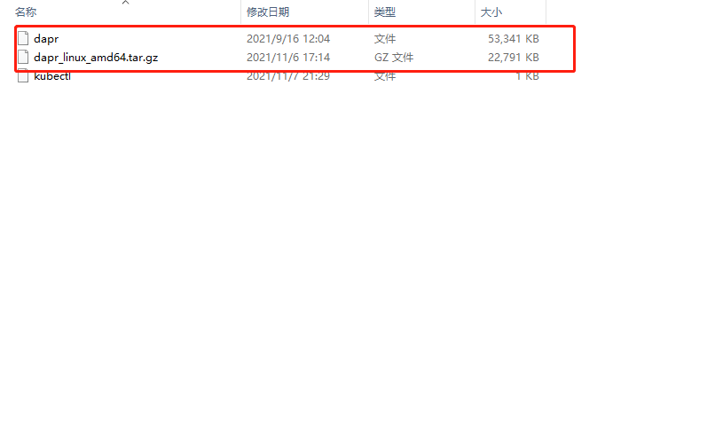
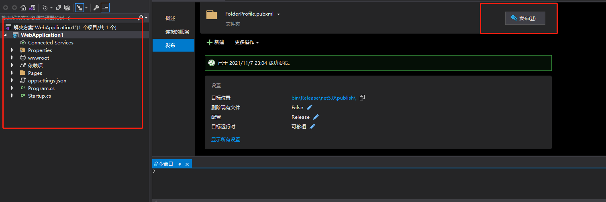
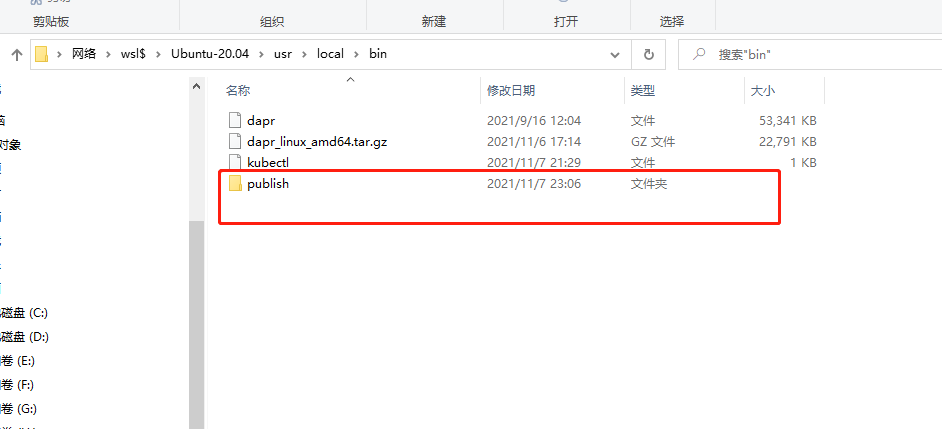

[TOC]

# 在线安装

## linux

## 在线安装

~~~shell
# 下载
wget -q https://raw.githubusercontent.com/dapr/cli/master/install/install.sh -O - | /bin/bash
~~~

```shell
# 验证
dapr
```

```shell
# 安装成功
         __
    ____/ /___ _____  _____
   / __  / __ '/ __ \/ ___/
  / /_/ / /_/ / /_/ / /
  \__,_/\__,_/ .___/_/
              /_/

===============================
Distributed Application Runtime

Usage:
  dapr [command]

Available Commands:
  completion     Generates shell completion scripts
  components     List all Dapr components. Supported platforms: Kubernetes
  configurations List all Dapr configurations. Supported platforms: Kubernetes
  dashboard      Start Dapr dashboard. Supported platforms: Kubernetes and self-hosted
  help           Help about any command
  init           Install Dapr on supported hosting platforms. Supported platforms: Kubernetes and self-hosted
  invoke         Invoke a method on a given Dapr application. Supported platforms: Self-hosted
  list           List all Dapr instances. Supported platforms: Kubernetes and self-hosted
  logs           Get Dapr sidecar logs for an application. Supported platforms: Kubernetes
  mtls           Check if mTLS is enabled. Supported platforms: Kubernetes
  publish        Publish a pub-sub event. Supported platforms: Self-hosted
  run            Run Dapr and (optionally) your application side by side. Supported platforms: Self-hosted
  status         Show the health status of Dapr services. Supported platforms: Kubernetes
  stop           Stop Dapr instances and their associated apps. . Supported platforms: Self-hosted
  uninstall      Uninstall Dapr runtime. Supported platforms: Kubernetes and self-hosted
  upgrade        Upgrades a Dapr control plane installation in a cluster. Supported platforms: Kubernetes

Flags:
  -h, --help      help for dapr
  -v, --version   version for dapr

Use "dapr [command] --help" for more information about a command.
```

```shell
# 初始化
dapr init 
```

```shell
# 版本
[root@iZ2zebquvlfb5cndmb95u5Z ~]# dapr -v
CLI version: 1.4.0 
Runtime version: 1.4.3
```

## 手动安装

## ubuntu（wsl2）/centos 类似

## 下载安装包

```shell
# Dapr CLI v1.4.0
地址： https://github.com/dapr/cli/releases
```




```shell
# Dapr Runtime v1.4.3
地址：https://github.com/dapr/dapr/releases
```



```shell
# 控制面板
地址：https://github.com/dapr/dashboard/releases
```



### 下载完成




## 安装

### cli安装


```shell
# 打开wls2 切换到 /usr/local/bin/
zxc@DESKTOP-NQ9L1A6:~$ cd /usr/local/bin/

# 打开资源管理器
zxc@DESKTOP-NQ9L1A6:/usr/local/bin$ explorer.exe .

# 将 dapr_linux_amd64.tar.gz 拖入文件夹中（可能会提示没有权限）

# 设置权限 (后面提示没有权限一样这样设置)
sudo chown -R $USER /usr/local/bin/

# 解压 dapr_linux_amd64.tar.gz
tar -zxvf dapr_linux_amd64.tar.gz
```



```shell
# 执行dapr

         __
    ____/ /___ _____  _____
   / __  / __ '/ __ \/ ___/
  / /_/ / /_/ / /_/ / /
  \__,_/\__,_/ .___/_/
              /_/

===============================
Distributed Application Runtime

Usage:
  dapr [command]

Available Commands:
  build-info     Print build info of Dapr CLI and runtime
  completion     Generates shell completion scripts
  components     List all Dapr components. Supported platforms: Kubernetes
  configurations List all Dapr configurations. Supported platforms: Kubernetes
  dashboard      Start Dapr dashboard. Supported platforms: Kubernetes and self-hosted
  help           Help about any command
  init           Install Dapr on supported hosting platforms. Supported platforms: Kubernetes and self-hosted
  invoke         Invoke a method on a given Dapr application. Supported platforms: Self-hosted
  list           List all Dapr instances. Supported platforms: Kubernetes and self-hosted
  logs           Get Dapr sidecar logs for an application. Supported platforms: Kubernetes
  mtls           Check if mTLS is enabled. Supported platforms: Kubernetes
  publish        Publish a pub-sub event. Supported platforms: Self-hosted
  run            Run Dapr and (optionally) your application side by side. Supported platforms: Self-hosted
  status         Show the health status of Dapr services. Supported platforms: Kubernetes
  stop           Stop Dapr instances and their associated apps. Supported platforms: Self-hosted
  uninstall      Uninstall Dapr runtime. Supported platforms: Kubernetes and self-hosted
  upgrade        Upgrades or downgrades a Dapr control plane installation in a cluster. Supported platforms: Kubernetes

Flags:
  -h, --help          help for dapr
      --log-as-json   Log output in JSON format
  -v, --version       version for dapr

Use "dapr [command] --help" for more information about a command.
```

### 运行时安装

```shell
# 先执行dapr init 进行初始化 会出现错误 
zxc@DESKTOP-NQ9L1A6:/root$ dapr init
⌛  Making the jump to hyperspace...
ℹ️  Installing runtime version 1.4.3
❌  Downloading binaries and setting up components...
❌  error downloading dashboard binary: Get "https://github.com/dapr/dashboard/releases/download/v0.8.0/dashboard_linux_amd64.tar.gz": unexpected EOF
```

```shell
# 使用docker ps 命令查看容器 中 redis  dapr zipkin 是否启动 

# 没有启动 执行dapr uninstall 卸载后继续执行 dapr init 直到出现这3个容器

zxc@DESKTOP-NQ9L1A6:/usr/local/bin$ docker ps
CONTAINER ID   IMAGE               COMMAND                  CREATED          STATUS                    PORTS                              NAMES
051f943f7541   daprio/dapr:1.4.3   "./placement"            42 minutes ago   Up 42 minutes             0.0.0.0:50005->50005/tcp           dapr_placement
4b5416820802   openzipkin/zipkin   "start-zipkin"           42 minutes ago   Up 42 minutes (healthy)   9410/tcp, 0.0.0.0:9411->9411/tcp   dapr_zipkin
5da51e91779a   redis               "docker-entrypoint.s…"   42 minutes ago   Up 42 minutes             0.0.0.0:6379->6379/tcp             dapr_redis

```


```shell
# 检查当前用户下有没有.dapr/目录，没有 还是需要继续 dapr uninstall dapr init
zxc@DESKTOP-NQ9L1A6:~$ ls -a
.  ..  .aws  .azure  .bash_history  .bash_logout  .bashrc  .dapr  .docker  .dotnet  .landscape  .motd_shown  .profile  .sudo_as_admin_successful  .wget-hsts
```


```shell
# 切换到当前用户的.dapr/bin 目录 我这里是 /home/zxc/.dapr/bin
zxc@DESKTOP-NQ9L1A6:~$ cd /home/zxc/.dapr/bin

# 将dashboard_linux_amd64.tar.gz 和 daprd_linux_amd64.tar.gz 移动到此目录解压
zxc@DESKTOP-NQ9L1A6:~$ tar -zxvf dashboard_linux_amd64.tar.gz
zxc@DESKTOP-NQ9L1A6:~$ tar -zxvf daprd_linux_amd64.tar.gz
```

```shell
# dashboard_linux_amd64.tar.gz 是多层目录 需要将dashboard 和web 移出来
```


```shell
# 运行dapr run  可能会报错 是daprd 没有权限
zxc@DESKTOP-NQ9L1A6:~$ dapr run --app-id server
WARNING: no application command found.
ℹ️  Starting Dapr with id server. HTTP Port: 43815. gRPC Port: 37037
❌  fork/exec /home/zxc/.dapr/bin/daprd: permission denied

#修改 daprd 权限
zxc@DESKTOP-NQ9L1A6:~$ chmod 777 /home/zxc/.dapr/bin/daprd
```

```shell
# 再次执行 dapr run  应该就成功了
zxc@DESKTOP-NQ9L1A6:~$ dapr run --app-id server
WARNING: no application command found.
ℹ️  Starting Dapr with id server. HTTP Port: 35437. gRPC Port: 40529
ℹ️  Checking if Dapr sidecar is listening on HTTP port 35437
INFO[0000] starting Dapr Runtime -- version 1.4.3 -- commit a8ee30180e1183e2a2e4d00c283448af6d73d0d0  app_id=server instance=DESKTOP-NQ9L1A6 scope=dapr.runtime type=log ver=1.4.3
INFO[0000] log level set to: info                        app_id=server instance=DESKTOP-NQ9L1A6 scope=dapr.runtime type=log ver=1.4.3
INFO[0000] metrics server started on :43279/             app_id=server instance=DESKTOP-NQ9L1A6 scope=dapr.metrics type=log ver=1.4.3
INFO[0000] standalone mode configured                    app_id=server instance=DESKTOP-NQ9L1A6 scope=dapr.runtime type=log ver=1.4.3
INFO[0000] app id: server                                app_id=server instance=DESKTOP-NQ9L1A6 scope=dapr.runtime type=log ver=1.4.3
INFO[0000] mTLS is disabled. Skipping certificate request and tls validation  app_id=server instance=DESKTOP-NQ9L1A6 scope=dapr.runtime type=log ver=1.4.3
INFO[0000] local service entry announced: server -> 192.168.66.42:36379  app_id=server instance=DESKTOP-NQ9L1A6 scope=dapr.contrib type=log ver=1.4.3
INFO[0000] Initialized name resolution to mdns           app_id=server instance=DESKTOP-NQ9L1A6 scope=dapr.runtime type=log ver=1.4.3
INFO[0000] loading components                            app_id=server instance=DESKTOP-NQ9L1A6 scope=dapr.runtime type=log ver=1.4.3
INFO[0000] component loaded. name: pubsub, type: pubsub.redis/v1  app_id=server instance=DESKTOP-NQ9L1A6 scope=dapr.runtime type=log ver=1.4.3
INFO[0000] waiting for all outstanding components to be processed  app_id=server instance=DESKTOP-NQ9L1A6 scope=dapr.runtime type=log ver=1.4.3
INFO[0000] component loaded. name: statestore, type: state.redis/v1  app_id=server instance=DESKTOP-NQ9L1A6 scope=dapr.runtime type=log ver=1.4.3
INFO[0000] all outstanding components processed          app_id=server instance=DESKTOP-NQ9L1A6 scope=dapr.runtime type=log ver=1.4.3
INFO[0000] enabled gRPC tracing middleware               app_id=server instance=DESKTOP-NQ9L1A6 scope=dapr.runtime.grpc.api type=log ver=1.4.3
INFO[0000] enabled gRPC metrics middleware               app_id=server instance=DESKTOP-NQ9L1A6 scope=dapr.runtime.grpc.api type=log ver=1.4.3
INFO[0000] API gRPC server is running on port 40529      app_id=server instance=DESKTOP-NQ9L1A6 scope=dapr.runtime type=log ver=1.4.3
INFO[0000] enabled metrics http middleware               app_id=server instance=DESKTOP-NQ9L1A6 scope=dapr.runtime.http type=log ver=1.4.3
INFO[0000] enabled tracing http middleware               app_id=server instance=DESKTOP-NQ9L1A6 scope=dapr.runtime.http type=log ver=1.4.3
INFO[0000] http server is running on port 35437          app_id=server instance=DESKTOP-NQ9L1A6 scope=dapr.runtime type=log ver=1.4.3
INFO[0000] The request body size parameter is: 4         app_id=server instance=DESKTOP-NQ9L1A6 scope=dapr.runtime type=log ver=1.4.3
INFO[0000] enabled gRPC tracing middleware               app_id=server instance=DESKTOP-NQ9L1A6 scope=dapr.runtime.grpc.internal type=log ver=1.4.3
INFO[0000] enabled gRPC metrics middleware               app_id=server instance=DESKTOP-NQ9L1A6 scope=dapr.runtime.grpc.internal type=log ver=1.4.3
INFO[0000] internal gRPC server is running on port 36379  app_id=server instance=DESKTOP-NQ9L1A6 scope=dapr.runtime type=log ver=1.4.3
INFO[0000] actor runtime started. actor idle timeout: 1h0m0s. actor scan interval: 30s  app_id=server instance=DESKTOP-NQ9L1A6 scope=dapr.runtime.actor type=log ver=1.4.3
WARN[0000] app channel not initialized, make sure -app-port is specified if pubsub subscription is required  app_id=server instance=DESKTOP-NQ9L1A6 scope=dapr.runtime type=log ver=1.4.3
WARN[0000] failed to read from bindings: app channel not initialized   app_id=server instance=DESKTOP-NQ9L1A6 scope=dapr.runtime type=log ver=1.4.3
INFO[0000] dapr initialized. Status: Running. Init Elapsed 33.0158ms  app_id=server instance=DESKTOP-NQ9L1A6 scope=dapr.runtime type=log ver=1.4.3
ℹ️  Checking if Dapr sidecar is listening on GRPC port 40529
ℹ️  Dapr sidecar is up and running.
✅  You're up and running! Dapr logs will appear here.

docikeINFO[0010] placement tables updated, version: 0          app_id=server instance=DESKTOP-NQ9L1A6 scope=dapr.runtime.actor.internal.placement type=log ver=1.4.3
^CINFO[0102] Shutting down actor                           app_id=server instance=DESKTOP-NQ9L1A6 scope=dapr.runtime type=log ver=1.4.3
ℹ️
terminated signal received: shutting down
✅  Exited Dapr successfully
```


```shell
# 查看运行时 版本
zxc@DESKTOP-NQ9L1A6:/usr/local/bin/publish$ dapr -v
CLI version: 1.4.0
Runtime version: 1.4.3
```


## 新建 asp.net core 应用 发布



## 将发布的文件移动到wls2中




```shell
# 切换到publish 文件夹中
zxc@DESKTOP-NQ9L1A6:~$ cd /usr/local/bin/publish/

# 执行  dotnet WebApplication1.dll 
zxc@DESKTOP-NQ9L1A6:/usr/local/bin/publish$ dotnet WebApplication1.dll

warn: Microsoft.AspNetCore.DataProtection.KeyManagement.XmlKeyManager[35]
      No XML encryptor configured. Key {4c9c9cc6-1545-47c4-aee3-c6eea2d69cf4} may be persisted to storage in unencrypted form.
info: Microsoft.Hosting.Lifetime[0]
      Now listening on: http://localhost:5000
info: Microsoft.Hosting.Lifetime[0]
      Application started. Press Ctrl+C to shut down.
info: Microsoft.Hosting.Lifetime[0]
      Hosting environment: Production
info: Microsoft.Hosting.Lifetime[0]
      Content root path: /usr/local/bin/publish
warn: Microsoft.AspNetCore.HttpsPolicy.HttpsRedirectionMiddleware[3]
      Failed to determine the https port for redirect.
^Cinfo: Microsoft.Hosting.Lifetime[0]
      Application is shutting down...
```


```shell
# 使用dapr run 运行
zxc@DESKTOP-NQ9L1A6:/usr/local/bin/publish$ dapr run --dapr-http-port 3501 --app-port 5001  --app-id frontend dotnet  WebApplication1.dll

ℹ️  Starting Dapr with id frontend. HTTP Port: 3501. gRPC Port: 42031
INFO[0000] starting Dapr Runtime -- version 1.4.3 -- commit a8ee30180e1183e2a2e4d00c283448af6d73d0d0  app_id=frontend instance=DESKTOP-NQ9L1A6 scope=dapr.runtime type=log ver=1.4.3
INFO[0000] log level set to: info                        app_id=frontend instance=DESKTOP-NQ9L1A6 scope=dapr.runtime type=log ver=1.4.3
INFO[0000] metrics server started on :33611/             app_id=frontend instance=DESKTOP-NQ9L1A6 scope=dapr.metrics type=log ver=1.4.3
INFO[0000] standalone mode configured                    app_id=frontend instance=DESKTOP-NQ9L1A6 scope=dapr.runtime type=log ver=1.4.3
INFO[0000] app id: frontend                              app_id=frontend instance=DESKTOP-NQ9L1A6 scope=dapr.runtime type=log ver=1.4.3
INFO[0000] mTLS is disabled. Skipping certificate request and tls validation  app_id=frontend instance=DESKTOP-NQ9L1A6 scope=dapr.runtime type=log ver=1.4.3
INFO[0000] local service entry announced: frontend -> 192.168.66.42:34247  app_id=frontend instance=DESKTOP-NQ9L1A6 scope=dapr.contrib type=log ver=1.4.3
INFO[0000] Initialized name resolution to mdns           app_id=frontend instance=DESKTOP-NQ9L1A6 scope=dapr.runtime type=log ver=1.4.3
INFO[0000] loading components                            app_id=frontend instance=DESKTOP-NQ9L1A6 scope=dapr.runtime type=log ver=1.4.3
INFO[0000] component loaded. name: pubsub, type: pubsub.redis/v1  app_id=frontend instance=DESKTOP-NQ9L1A6 scope=dapr.runtime type=log ver=1.4.3
INFO[0000] waiting for all outstanding components to be processed  app_id=frontend instance=DESKTOP-NQ9L1A6 scope=dapr.runtime type=log ver=1.4.3
INFO[0000] component loaded. name: statestore, type: state.redis/v1  app_id=frontend instance=DESKTOP-NQ9L1A6 scope=dapr.runtime type=log ver=1.4.3
INFO[0000] all outstanding components processed          app_id=frontend instance=DESKTOP-NQ9L1A6 scope=dapr.runtime type=log ver=1.4.3
INFO[0000] enabled gRPC tracing middleware               app_id=frontend instance=DESKTOP-NQ9L1A6 scope=dapr.runtime.grpc.api type=log ver=1.4.3
INFO[0000] enabled gRPC metrics middleware               app_id=frontend instance=DESKTOP-NQ9L1A6 scope=dapr.runtime.grpc.api type=log ver=1.4.3
INFO[0000] API gRPC server is running on port 42031      app_id=frontend instance=DESKTOP-NQ9L1A6 scope=dapr.runtime type=log ver=1.4.3
INFO[0000] enabled metrics http middleware               app_id=frontend instance=DESKTOP-NQ9L1A6 scope=dapr.runtime.http type=log ver=1.4.3
INFO[0000] enabled tracing http middleware               app_id=frontend instance=DESKTOP-NQ9L1A6 scope=dapr.runtime.http type=log ver=1.4.3
INFO[0000] http server is running on port 3501           app_id=frontend instance=DESKTOP-NQ9L1A6 scope=dapr.runtime type=log ver=1.4.3
INFO[0000] The request body size parameter is: 4         app_id=frontend instance=DESKTOP-NQ9L1A6 scope=dapr.runtime type=log ver=1.4.3
INFO[0000] enabled gRPC tracing middleware               app_id=frontend instance=DESKTOP-NQ9L1A6 scope=dapr.runtime.grpc.internal type=log ver=1.4.3
INFO[0000] enabled gRPC metrics middleware               app_id=frontend instance=DESKTOP-NQ9L1A6 scope=dapr.runtime.grpc.internal type=log ver=1.4.3
INFO[0000] internal gRPC server is running on port 34247  app_id=frontend instance=DESKTOP-NQ9L1A6 scope=dapr.runtime type=log ver=1.4.3
INFO[0000] application protocol: http. waiting on port 5001.  This will block until the app is listening on that port.  app_id=frontend instance=DESKTOP-NQ9L1A6 scope=dapr.runtime type=log ver=1.4.3
== APP == info: Microsoft.Hosting.Lifetime[0]
== APP ==       Now listening on: http://localhost:5000
== APP == info: Microsoft.Hosting.Lifetime[0]
== APP ==       Now listening on: https://localhost:5001
== APP == info: Microsoft.Hosting.Lifetime[0]
== APP ==       Application started. Press Ctrl+C to shut down.
== APP == info: Microsoft.Hosting.Lifetime[0]
== APP ==       Hosting environment: Production
== APP == info: Microsoft.Hosting.Lifetime[0]
== APP ==       Content root path: /usr/local/bin/publish
INFO[0000] application discovered on port 5001           app_id=frontend instance=DESKTOP-NQ9L1A6 scope=dapr.runtime type=log ver=1.4.3
ℹ️  Updating metadata for app command: dotnet WebApplication1.dll
✅  You're up and running! Both Dapr and your app logs will appear here.

INFO[0001] actor runtime started. actor idle timeout: 1h0m0s. actor scan interval: 30s  app_id=frontend instance=DESKTOP-NQ9L1A6 scope=dapr.runtime.actor type=log ver=1.4.3
ERRO[0001] error getting topic list from app: the server closed connection before returning the first response byte. Make sure the server returns 'Connection: close' response header before closing the connection  app_id=frontend instance=DESKTOP-NQ9L1A6 scope=dapr.runtime type=log ver=1.4.3
ERRO[0001] error occurred while beginning pubsub pubsub: the server closed connection before returning the first response byte. Make sure the server returns 'Connection: close' response header before closing the connection  app_id=frontend instance=DESKTOP-NQ9L1A6 scope=dapr.runtime type=log ver=1.4.3
INFO[0001] dapr initialized. Status: Running. Init Elapsed 986.951ms  app_id=frontend instance=DESKTOP-NQ9L1A6 scope=dapr.runtime type=log ver=1.4.3
INFO[0001] placement tables updated, version: 0          app_id=frontend instance=DESKTOP-NQ9L1A6 scope=dapr.runtime.actor.internal.placement type=log ver=1.4.3
```

