[TOC]


# 环境查看

```shell
# 查看内核
[root@iZ2zebquvlfb5cndmb95u5Z ~]#  uname -r
3.10.0-957.21.3.el7.x86_64
```


```shell
# 查看配置
[root@iZ2zebquvlfb5cndmb95u5Z /]# cat etc/os-release 
NAME="CentOS Linux"
VERSION="7 (Core)"
ID="centos"
ID_LIKE="rhel fedora"
VERSION_ID="7"
PRETTY_NAME="CentOS Linux 7 (Core)"
ANSI_COLOR="0;31"
CPE_NAME="cpe:/o:centos:centos:7"
HOME_URL="https://www.centos.org/"
BUG_REPORT_URL="https://bugs.centos.org/"

CENTOS_MANTISBT_PROJECT="CentOS-7"
CENTOS_MANTISBT_PROJECT_VERSION="7"
REDHAT_SUPPORT_PRODUCT="centos"
REDHAT_SUPPORT_PRODUCT_VERSION="7"

```


# 安装

## Centos 7安装

```shell
# 卸载旧版本
sudo yum remove docker \
                  docker-client \
                  docker-client-latest \
                  docker-common \
                  docker-latest \
                  docker-latest-logrotate \
                  docker-logrotate \
                  docker-engine
```

```shell
# 需要的安装包
sudo yum install -y yum-utils
```

```shell
# 设置镜像地址

#国外地址
sudo yum-config-manager \
    --add-repo \
    https://download.docker.com/linux/centos/docker-ce.repo
    
#国内地址（推荐使用阿里）
sudo yum-config-manager \
    --add-repo \
	http://mirrors.aliyun.com/docker-ce/linux/centos/docker-ce.repo
```

```shell
# 更新yum软件包索引
sudo yum makecache fast	
```

```shell
# 安装docker引擎
sudo yum install docker-ce docker-ce-cli containerd.io

# 解释
docker-ce  #社区版
```

```shell
# 启动docker服务
sudo systemctl start docker
```

```shell
# 查看版本
[root@iZ2zebquvlfb5cndmb95u5Z /]# docker version

Client: Docker Engine - Community
 Version:           20.10.10
 API version:       1.41
 Go version:        go1.16.9
 Git commit:        b485636
 Built:             Mon Oct 25 07:44:50 2021
 OS/Arch:           linux/amd64
 Context:           default
 Experimental:      true

Server: Docker Engine - Community
 Engine:
  Version:          20.10.10
  API version:      1.41 (minimum version 1.12)
  Go version:       go1.16.9
  Git commit:       e2f740d
  Built:            Mon Oct 25 07:43:13 2021
  OS/Arch:          linux/amd64
  Experimental:     false
 containerd:
  Version:          1.4.11
  GitCommit:        5b46e404f6b9f661a205e28d59c982d3634148f8
 runc:
  Version:          1.0.2
  GitCommit:        v1.0.2-0-g52b36a2
 docker-init:
  Version:          0.19.0
  GitCommit:        de40ad0

```

```shell
# 测试 hello-world
[root@iZ2zebquvlfb5cndmb95u5Z /]# sudo docker run hello-world
Unable to find image 'hello-world:latest' locally									# 本地找不到 hello-world:latest
latest: Pulling from library/hello-world											# 仓库拉取  hello-world
2db29710123e: Pull complete 
Digest: sha256:37a0b92b08d4919615c3ee023f7ddb068d12b8387475d64c622ac30f45c29c51
Status: Downloaded newer image for hello-world:latest

Hello from Docker!																	#运行
This message shows that your installation appears to be working correctly.

To generate this message, Docker took the following steps:
 1. The Docker client contacted the Docker daemon.
 2. The Docker daemon pulled the "hello-world" image from the Docker Hub.
    (amd64)
 3. The Docker daemon created a new container from that image which runs the
    executable that produces the output you are currently reading.
 4. The Docker daemon streamed that output to the Docker client, which sent it
    to your terminal.

To try something more ambitious, you can run an Ubuntu container with:
 $ docker run -it ubuntu bash

Share images, automate workflows, and more with a free Docker ID:
 https://hub.docker.com/

For more examples and ideas, visit:
 https://docs.docker.com/get-started/
```


# 卸载

```shell
# 卸载依赖
sudo yum remove docker-ce docker-ce-cli containerd.io

# 删除资源
sudo rm -rf /var/lib/docker

sudo rm -rf /var/lib/containerd
```


# 配置镜像加速

登录阿里云 找到容器镜像服务

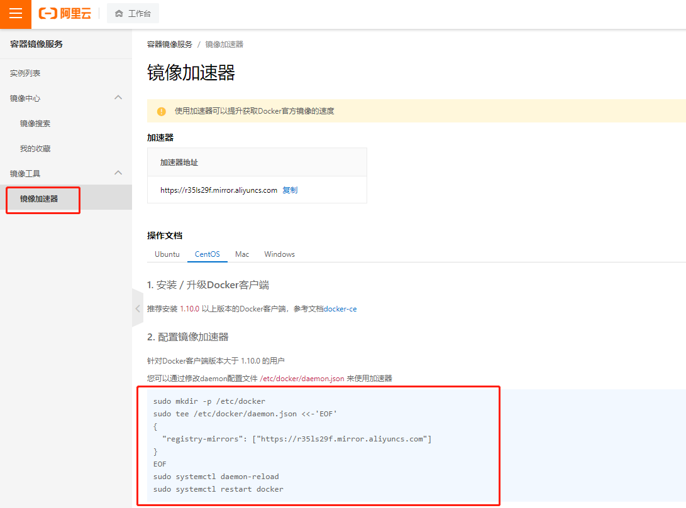

```shell
#创建目录
sudo mkdir -p /etc/docker

#配置
sudo tee /etc/docker/daemon.json <<-'EOF'
{
  "registry-mirrors": ["https://r35ls29f.mirror.aliyuncs.com"]
}
EOF

#重新加载
sudo systemctl daemon-reload

#重启docker
sudo systemctl restart docker
```


# docker run 的运行流程

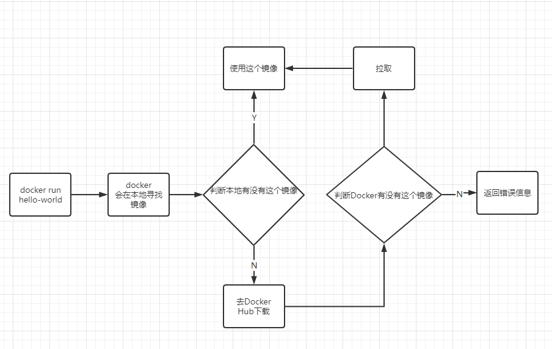


# 底层原理


## docker是怎么工作的 

docker是一个cs 结构的系统 ，docker 的守护进程运行在主机上。通过socket 从客户端访问！

docker server 接受到Dcoker client 的指令，就行执行命令

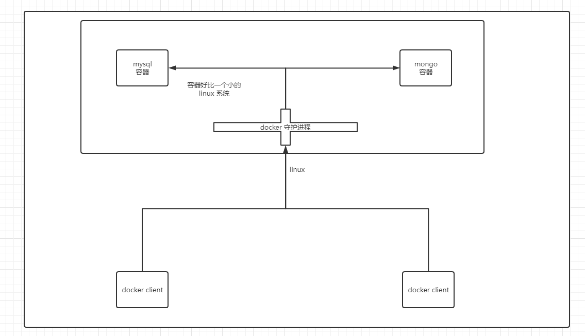


## docker 为什么比VM快

1、有更少的抽象层

2、docker 利用宿主机的内核 Vm 需要Guest OS

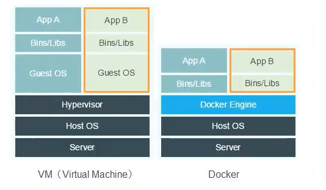

新建容器的时候，docker 不需要docker不需要重新加载操作系统内核       

# docker 常用命令


## 帮助命令

```shell
# 版本信息
docker version

# 详细信息
docker info

# 帮助
docker [cmd] --help


```


## 帮助文档

https://docs.docker.com/reference/

----


## 镜像命令


### docker images  查看本地所有镜像

帮助文档： https://docs.docker.com/engine/reference/commandline/images/

```shell
# docker images [可选参数]

# 可选项
  -a, --all             # 列出所有镜像
      --digests         Show digests
  -f, --filter filter   # 过滤
      --format string   Pretty-print images using a Go template
      --no-trunc        Don't truncate output
  -q, --quiet           # 只显示ID

# 查看镜像
[root@iZ2zebquvlfb5cndmb95u5Z ~]# docker images
REPOSITORY    TAG       IMAGE ID       CREATED       SIZE
hello-world   latest    feb5d9fea6a5   6 weeks ago   13.3kB

#解释
REPOSITORY      镜像仓库
TAG 			版本
IMAGE ID        镜像ID
CREATED			镜像创建时间
SIZE			大小

# 列出全部镜像
[root@iZ2zebquvlfb5cndmb95u5Z ~]# docker images -a
REPOSITORY    TAG       IMAGE ID       CREATED       SIZE
hello-world   latest    feb5d9fea6a5   6 weeks ago   13.3kB

# 显示镜像id
[root@iZ2zebquvlfb5cndmb95u5Z ~]# docker images -q
feb5d9fea6a5

```


### docker search 搜索

帮助文档：https://docs.docker.com/engine/reference/commandline/search/

```shell
# docker search [可选参数]

# 可选项
  -f, --filter filter   # 过滤
      --format string   Pretty-print search using a Go template
      --limit int       Max number of search results (default 25)
      --no-trunc        Don't truncate output

# 搜索镜像
[root@iZ2zebquvlfb5cndmb95u5Z ~]# docker search mysql
NAME                              DESCRIPTION                                     STARS     OFFICIAL   AUTOMATED
mysql                             MySQL is a widely used, open-source relation…   11647     [OK]       
mariadb                           MariaDB Server is a high performing open sou…   4433      [OK]       
mysql/mysql-server                Optimized MySQL Server Docker images. Create…   865                  [OK]

# 搜索 STARS 大于4000 的 mysql
[root@iZ2zebquvlfb5cndmb95u5Z ~]# docker search  mysql -f=STARS=4000
NAME      DESCRIPTION                                     STARS     OFFICIAL   AUTOMATED
mysql     MySQL is a widely used, open-source relation…   11647     [OK]       
mariadb   MariaDB Server is a high performing open sou…   4433      [OK]       

```


### docker pull 拉取镜像

帮助文档：https://docs.docker.com/engine/reference/commandline/pull/

```shell
# docker pull imageName [:tag]

[root@iZ2zebquvlfb5cndmb95u5Z ~]# docker pull mysql
Using default tag: latest								# 不写 tag 默认 latest
latest: Pulling from library/mysql						
b380bbd43752: Pull complete 							# docker image 核心 分层下载 、联合文件系统
f23cbf2ecc5d: Pull complete 
30cfc6c29c0a: Pull complete 
b38609286cbe: Pull complete 
8211d9e66cd6: Pull complete 
2313f9eeca4a: Pull complete 
7eb487d00da0: Pull complete 
4d7421c8152e: Pull complete 
77f3d8811a28: Pull complete 
cce755338cba: Pull complete 
69b753046b9f: Pull complete 
b2e64b0ab53c: Pull complete 
Digest: sha256:6d7d4524463fe6e2b893ffc2b89543c81dec7ef82fb2020a1b27606666464d87 		# image 签名
Status: Downloaded newer image for mysql:latest											
docker.io/library/mysql:latest															#真实地址

#docker pull mysql 等价于 docker pull  docker.io/library/mysql:latest					

#下载指定mysql版本镜像
[root@iZ2zebquvlfb5cndmb95u5Z ~]# docker pull mysql:5.7
5.7: Pulling from library/mysql
b380bbd43752: Already exists 								# 存在的无需下载
f23cbf2ecc5d: Already exists 
30cfc6c29c0a: Already exists 
b38609286cbe: Already exists 
8211d9e66cd6: Already exists 
2313f9eeca4a: Already exists 
7eb487d00da0: Already exists 
a71aacf913e7: Pull complete 								# 下载不存在的
393153c555df: Pull complete 
06628e2290d7: Pull complete 
ff2ab8dac9ac: Pull complete 
Digest: sha256:2db8bfd2656b51ded5d938abcded8d32ec6181a9eae8dfc7ddf87a656ef97e97
Status: Downloaded newer image for mysql:5.7
docker.io/library/mysql:5.7

# 查看本地镜像
[root@iZ2zebquvlfb5cndmb95u5Z ~]# docker images -a
REPOSITORY    TAG       IMAGE ID       CREATED       SIZE
mysql         5.7       938b57d64674   2 weeks ago   448MB
mysql         latest    ecac195d15af   2 weeks ago   516MB
hello-world   latest    feb5d9fea6a5   6 weeks ago   13.3kB

```


### docker rmi 删除镜像

帮助文档：https://docs.docker.com/engine/reference/commandline/rmi/

```shell
# docker rmi [可选参数]

# 可选参数
  -f, --force      # 强制移除
      --no-prune   Do not delete untagged parents


# 查看本地镜像
[root@iZ2zebquvlfb5cndmb95u5Z ~]# docker images
REPOSITORY    TAG       IMAGE ID       CREATED       SIZE
mysql         5.7       938b57d64674   2 weeks ago   448MB
mysql         latest    ecac195d15af   2 weeks ago   516MB
hello-world   latest    feb5d9fea6a5   6 weeks ago   13.3kB

# 删除 mysql（镜像ID：938b57d64674）
[root@iZ2zebquvlfb5cndmb95u5Z ~]# docker rmi -f 938b57d64674   						# 删除id 938b57d64674 的 image
Untagged: mysql:5.7
Untagged: mysql@sha256:2db8bfd2656b51ded5d938abcded8d32ec6181a9eae8dfc7ddf87a656ef97e97
Deleted: sha256:938b57d64674c4a123bf8bed384e5e057be77db934303b3023d9be331398b761	# 删除不共用的层
Deleted: sha256:d81fc74bcfc422d67d8507aa0688160bc4ca6515e0a1c8edcdb54f89a0376ff1
Deleted: sha256:a6a530ba6d8591630a1325b53ef2404b8ab593a0775441b716ac4175c14463e6
Deleted: sha256:2a503984330e2cec317bc2ef793f5d4d7b3fd8d50009a4f673026c3195460200
Deleted: sha256:e2a4585c625da1cf4909cdf89b8433dd89ed5c90ebdb3a979d068b161513de90

# 删除多个镜像
[root@iZ2zebquvlfb5cndmb95u5Z ~]# docker rmi -f 镜像id   镜像id   镜像id  镜像id

# 全部删除
[root@iZ2zebquvlfb5cndmb95u5Z ~]# docker rmi -f $(docker images -aq)				# 删除全部容器
Untagged: mysql:latest
Untagged: mysql@sha256:6d7d4524463fe6e2b893ffc2b89543c81dec7ef82fb2020a1b27606666464d87
Deleted: sha256:ecac195d15afac2335de52fd7a0e34202fe582731963d31830f1b97700bf9509
Deleted: sha256:451fe04d80b84c0b7aca0f0bbdaa5de7c7ac85a65389ed5d3ed492f63ac092e2
Deleted: sha256:814cbf8bc7f6bb85685e5b803e16a76406c30d1960c566eee76303ffac600600
Deleted: sha256:735f72e1d1b936bb641b6a1283e4e60bf10a0c36f8244a5e3f8c7d58fa95b98a
Deleted: sha256:f2d209a30c3950fadffb2d82e1faa434da0753bee7aacad9cdec7d8a7a83df37
Deleted: sha256:03b9f8c5331d9534d2372a144bcffc8402e5f7972c9e4b85c634bef203ec6d20
Deleted: sha256:80f5487a88b8061855e99782979ed6069a8dd1c7dfbb1eb63fe42a4a9d119436
Deleted: sha256:f791a6c727931d41c51f8bf24ee32a4dbf0169f372b174f1ff89b4836b97c48e
Deleted: sha256:4c88df098412e11a98936509f3cede57f87154b350b0f75d96713f6e1dd56101
Deleted: sha256:fdba3a2cd286d9a5f65fc00f5254048855ae7dc00f3b3fa3356981eb9a7fe6d0
Deleted: sha256:8b3a69042e0da82429d28be0c474e73290ba4908730de22b2200a7aac9b245bd
Deleted: sha256:90afe56a0643f5bf1b1e8ee147b40a8e12b3fdd7e26bc2d2c50180d68dd524d0
Deleted: sha256:e81bff2725dbc0bf2003db10272fef362e882eb96353055778a66cda430cf81b
Untagged: hello-world:latest
Untagged: hello-world@sha256:37a0b92b08d4919615c3ee023f7ddb068d12b8387475d64c622ac30f45c29c51
Deleted: sha256:feb5d9fea6a5e9606aa995e879d862b825965ba48de054caab5ef356dc6b3412

# 查看镜像
[root@iZ2zebquvlfb5cndmb95u5Z ~]# docker images -a
REPOSITORY   TAG       IMAGE ID   CREATED   SIZE									# 已经没有了


```

----


## 容器命令


### docker run   启动容器

 帮助文档： https://docs.docker.com/engine/reference/commandline/run/

```shell
# docker run [可选参数] image [bin/bash]

# 可选参数  

--name 			# 容器名称
-d 				# 后台运行
-it 			# 使用交互方式运行
-p				# 指定容器端口  -p 8080：8080
				# -p ip：主机端口:容器端口
				# -p 主机端口:容器端口
				# -p 容器端口
				# 容器端口
-P				#随机指定端口

# 拉取一个centos 用于测试
[root@iZ2zebquvlfb5cndmb95u5Z ~]# docker pull centos
Using default tag: latest
latest: Pulling from library/centos
a1d0c7532777: Pull complete 
Digest: sha256:a27fd8080b517143cbbbab9dfb7c8571c40d67d534bbdee55bd6c473f432b177
Status: Downloaded newer image for centos:latest
docker.io/library/centos:latest

# 启动并进入容器
[root@iZ2zebquvlfb5cndmb95u5Z ~]# docker run -it --name=centos1  centos /bin/bash
[root@7c41a13e0425 /]# ls
bin  dev  etc  home  lib  lib64  lost+found  media  mnt  opt  proc  root  run  sbin  srv  sys  tmp  usr  var

# 解释
docker run			# 运行
-it					# 交互模式
-- name=centos1		# 容器的名字
centos				# 镜像的名字
/bin/bash			# 使用bash 操作

# 退出容器
[root@7c41a13e0425 /]# exit  
exit

# 后台方式启动容器
[root@iZ2zebquvlfb5cndmb95u5Z ~]# docker run --name centos2 -d  centos
aeacf21532c77f0e6a5a624d2466aa24319fdaf1be9f21d1adf9958e479b5b4a

# 问题：docker ps 发现centos2 停止了

# 常见的坑：docker 容器使用后台运行，就必须要有一个前台进程，docker 发现没有应用，就会自动停止。

```


### docker ps 查看容器

帮助文档：https://docs.docker.com/engine/reference/commandline/ps/

```shell
# docker ps [可选参数]

#可选参数
			# 默认显示正在运行的容器
-a 			# 查看所有的容器
-n=1		# 显示最近创建的一个容器
-q			# 只显示容器编号

# 查看本地所有容器
[root@iZ2zebquvlfb5cndmb95u5Z ~]# docker ps -a
CONTAINER ID   IMAGE          COMMAND       CREATED         STATUS                      PORTS     NAMES
7c41a13e0425   centos         "/bin/bash"   3 minutes ago   Exited (0) 16 seconds ago             centos1

# 查看最近创建的一个容器
[root@iZ2zebquvlfb5cndmb95u5Z ~]# docker ps -n=1
CONTAINER ID   IMAGE     COMMAND       CREATED          STATUS                     PORTS     NAMES
7c41a13e0425   centos    "/bin/bash"   11 minutes ago   Exited (0) 7 minutes ago             centos1

# 查看容器的编号
[root@iZ2zebquvlfb5cndmb95u5Z ~]# docker ps -aq
7c41a13e0425
09c7ca86b0d2


```


### exit / ctrl+p+q退出容器

~~~shell
# 退出并关闭容器
[root@7c41a13e0425 /]# exit  
exit
# 退出不关闭（ ctrl + p + q）
[root@iZ2zebquvlfb5cndmb95u5Z ~]# docker run -it --name=centos2  centos /bin/bash				# ctrl + p + q
[root@iZ2zebquvlfb5cndmb95u5Z ~]# docker ps
CONTAINER ID   IMAGE     COMMAND       CREATED          STATUS         PORTS     NAMES			# 查看容器没有退出
bd7c90e8b239   centos    "/bin/bash"   10 seconds ago   Up 9 seconds             centos2

~~~


### docker rm 移除容器

帮助文档：https://docs.docker.com/engine/reference/commandline/rm/

~~~shell
# docker rm [可选参数] 容器id

# 可选参数
  -f, --force     强制移除
  -l, --link      Remove the specified link
  -v, --volumes   Remove anonymous volumes associated with the container

# 查看本地所有容器
[root@iZ2zebquvlfb5cndmb95u5Z ~]# docker ps -a
CONTAINER ID   IMAGE          COMMAND       CREATED          STATUS                      PORTS     NAMES
bd7c90e8b239   centos         "/bin/bash"   3 minutes ago    Up 3 minutes                          centos2
7c41a13e0425   centos         "/bin/bash"   21 minutes ago   Exited (0) 18 minutes ago             centos1
09c7ca86b0d2   feb5d9fea6a5   "/hello"      3 hours ago      Exited (0) 3 hours ago                inspiring_johnson

# 移除一个编号 7c41a13e0425 容器
[root@iZ2zebquvlfb5cndmb95u5Z ~]# docker rm  7c41a13e0425
7c41a13e0425

# 移除所有容器
[root@iZ2zebquvlfb5cndmb95u5Z ~]#  docker rm -f $(docker ps -aq)
bd7c90e8b239
09c7ca86b0d2

# 利用管道移除所有容器
[root@iZ2zebquvlfb5cndmb95u5Z ~]# docker ps -aq|xargs docker rm -f
bd7c90e8b239
09c7ca86b0d2

# 查看所有容器
[root@iZ2zebquvlfb5cndmb95u5Z ~]# docker ps -a
CONTAINER ID   IMAGE     COMMAND   CREATED   STATUS    PORTS     NAMES					# 已经没有了


~~~


### 启动、停止、杀死

帮助文档：https://docs.docker.com/engine/reference/commandline/start/

​				   https://docs.docker.com/engine/reference/commandline/stop/

​				   https://docs.docker.com/engine/reference/commandline/kill/

~~~shell
# 查看所有容器
[root@iZ2zebquvlfb5cndmb95u5Z ~]# docker ps -a
CONTAINER ID   IMAGE     COMMAND       CREATED          STATUS                     PORTS     NAMES
0670d4374aa3   centos    "/bin/bash"   14 seconds ago   Exited (0) 9 seconds ago             centos1

# 启动并查看
# docker start 容器id
[root@iZ2zebquvlfb5cndmb95u5Z ~]# docker start 0670d4374aa3
0670d4374aa3

[root@iZ2zebquvlfb5cndmb95u5Z ~]# docker ps 
CONTAINER ID   IMAGE     COMMAND       CREATED              STATUS         PORTS     NAMES
0670d4374aa3   centos    "/bin/bash"   About a minute ago   Up 2 seconds             centos1

# 关闭并查看
# docker stop 容器id
[root@iZ2zebquvlfb5cndmb95u5Z ~]# docker stop 0670d4374aa3
0670d4374aa3

[root@iZ2zebquvlfb5cndmb95u5Z ~]# docker ps
CONTAINER ID   IMAGE     COMMAND   CREATED   STATUS    PORTS     NAMES

#杀死并查看
# docker kill 容器id
[root@iZ2zebquvlfb5cndmb95u5Z ~]# docker ps
CONTAINER ID   IMAGE     COMMAND       CREATED         STATUS         PORTS     NAMES
0670d4374aa3   centos    "/bin/bash"   4 minutes ago   Up 6 seconds             centos1

[root@iZ2zebquvlfb5cndmb95u5Z ~]# docker kill 0670d4374aa3
0670d4374aa3

[root@iZ2zebquvlfb5cndmb95u5Z ~]# docker ps
CONTAINER ID   IMAGE     COMMAND   CREATED   STATUS    PORTS     NAMES

~~~


## 其他命令

### docker logs 查看日志

帮助文档：https://docs.docker.com/engine/reference/commandline/logs/

~~~shell
# docker logs [可选参数] 容器id

#可选参数
  -f, --follow         # 跟踪日志输出
  -n, --tail string    # 从日志末尾显示的行数（默认为“全部”
  -t, --timestamps     # 显示时间戳
      --until string   # 在时间戳（例如 2013-01-02T13:23:37Z）或相关（例如 42m 为 42 分钟）之前显示日志


# 编写一段 shell 脚本输出信息
[root@iZ2zebquvlfb5cndmb95u5Z /root]
#docker run --name centos3 -d centos /bin/sh -c "while true; do echo zxc; sleep 2;done"
2019c32f0dcde38a30481f6012fc310ea052f6c43b8d5481a6e01426cf7368ef

[root@iZ2zebquvlfb5cndmb95u5Z /root]
#docker ps
CONTAINER ID   IMAGE     COMMAND                  CREATED          STATUS          PORTS     NAMES
2019c32f0dcd   centos    "/bin/sh -c 'while t…"   11 seconds ago   Up 10 seconds             centos3

# 输出日志
[root@iZ2zebquvlfb5cndmb95u5Z /root]
#docker logs -tf --tail 5  2019c32f0dcd
2021-11-09T14:02:34.499444400Z zxc
2021-11-09T14:02:36.501801226Z zxc
2021-11-09T14:02:38.504164649Z zxc
2021-11-09T14:02:40.506568684Z zxc
2021-11-09T14:02:42.508835580Z zxc


~~~

### docker top 查看容器中的进程信息

帮助文档：https://docs.docker.com/engine/reference/commandline/top/

```shell
# docker top  容器id

[root@iZ2zebquvlfb5cndmb95u5Z /root]
#docker top  2019c32f0dcd
UID      PID     PPID      C      STIME   TTY  TIME      CMD
root     10579   10560     0      21:55   ?    00:00:00  /bin/sh -c while true; do echo zxc; sleep 2;done
root     11121   10579     0      22:08   ?    00:00:00  /usr/bin/coreutils --coreutils-prog-shebang=sleep /usr/bin/sleep 2
```

### docker inspect 查看镜像的元数据

帮助文档：https://docs.docker.com/engine/reference/commandline/inspect/

```shell
# docker inspect  容器id/镜像id

[root@iZ2zebquvlfb5cndmb95u5Z /root]
#docker inspect 2019c32f0dcd
[
    {
        "Id": "2019c32f0dcde38a30481f6012fc310ea052f6c43b8d5481a6e01426cf7368ef",
        "Created": "2021-11-09T13:55:57.701924242Z",
        "Path": "/bin/sh",
        "Args": [
            "-c",
            "while true; do echo zxc; sleep 2;done"
        ],
        "State": {
            "Status": "running",
            "Running": true,
            "Paused": false,
            "Restarting": false,
            "OOMKilled": false,
            "Dead": false,
            "Pid": 10579,
            "ExitCode": 0,
            "Error": "",
            "StartedAt": "2021-11-09T13:55:58.047646322Z",
            "FinishedAt": "0001-01-01T00:00:00Z"
        },
        "Image": "sha256:5d0da3dc976460b72c77d94c8a1ad043720b0416bfc16c52c45d4847e53fadb6",
        "ResolvConfPath": "/var/lib/docker/containers/2019c32f0dcde38a30481f6012fc310ea052f6c43b8d5481a6e01426cf7368ef/resolv.conf",
        "HostnamePath": "/var/lib/docker/containers/2019c32f0dcde38a30481f6012fc310ea052f6c43b8d5481a6e01426cf7368ef/hostname",
        "HostsPath": "/var/lib/docker/containers/2019c32f0dcde38a30481f6012fc310ea052f6c43b8d5481a6e01426cf7368ef/hosts",
        "LogPath": "/var/lib/docker/containers/2019c32f0dcde38a30481f6012fc310ea052f6c43b8d5481a6e01426cf7368ef/2019c32f0dcde38a30481f6012fc310ea052f6c43b8d5481a6e01426cf7368ef-json.log",
        "Name": "/centos3",
        "RestartCount": 0,
        "Driver": "overlay2",
        "Platform": "linux",
        "MountLabel": "",
        "ProcessLabel": "",
        "AppArmorProfile": "",
        "ExecIDs": null,
        "HostConfig": {
            "Binds": null,
            "ContainerIDFile": "",
            "LogConfig": {
                "Type": "json-file",
                "Config": {}
            },
            "NetworkMode": "default",
            "PortBindings": {},
            "RestartPolicy": {
                "Name": "no",
                "MaximumRetryCount": 0
            },
            "AutoRemove": false,
            "VolumeDriver": "",
            "VolumesFrom": null,
            "CapAdd": null,
            "CapDrop": null,
            "CgroupnsMode": "host",
            "Dns": [],
            "DnsOptions": [],
            "DnsSearch": [],
            "ExtraHosts": null,
            "GroupAdd": null,
            "IpcMode": "private",
            "Cgroup": "",
            "Links": null,
            "OomScoreAdj": 0,
            "PidMode": "",
            "Privileged": false,
            "PublishAllPorts": false,
            "ReadonlyRootfs": false,
            "SecurityOpt": null,
            "UTSMode": "",
            "UsernsMode": "",
            "ShmSize": 67108864,
            "Runtime": "runc",
            "ConsoleSize": [
                0,
                0
            ],
            "Isolation": "",
            "CpuShares": 0,
            "Memory": 0,
            "NanoCpus": 0,
            "CgroupParent": "",
            "BlkioWeight": 0,
            "BlkioWeightDevice": [],
            "BlkioDeviceReadBps": null,
            "BlkioDeviceWriteBps": null,
            "BlkioDeviceReadIOps": null,
            "BlkioDeviceWriteIOps": null,
            "CpuPeriod": 0,
            "CpuQuota": 0,
            "CpuRealtimePeriod": 0,
            "CpuRealtimeRuntime": 0,
            "CpusetCpus": "",
            "CpusetMems": "",
            "Devices": [],
            "DeviceCgroupRules": null,
            "DeviceRequests": null,
            "KernelMemory": 0,
            "KernelMemoryTCP": 0,
            "MemoryReservation": 0,
            "MemorySwap": 0,
            "MemorySwappiness": null,
            "OomKillDisable": false,
            "PidsLimit": null,
            "Ulimits": null,
            "CpuCount": 0,
            "CpuPercent": 0,
            "IOMaximumIOps": 0,
            "IOMaximumBandwidth": 0,
            "MaskedPaths": [
                "/proc/asound",
                "/proc/acpi",
                "/proc/kcore",
                "/proc/keys",
                "/proc/latency_stats",
                "/proc/timer_list",
                "/proc/timer_stats",
                "/proc/sched_debug",
                "/proc/scsi",
                "/sys/firmware"
            ],
            "ReadonlyPaths": [
                "/proc/bus",
                "/proc/fs",
                "/proc/irq",
                "/proc/sys",
                "/proc/sysrq-trigger"
            ]
        },
        "GraphDriver": {
            "Data": {
                "LowerDir": "/var/lib/docker/overlay2/4500e9f06fe6c774172facdd4d235da13c4518e6cd5cb8f719cfe56e5bd9493c-init/diff:/var/lib/docker/overlay2/4276982f224539f98d75963f237925c5c7be2e1b853743b33acfc0fd279e1513/diff",
                "MergedDir": "/var/lib/docker/overlay2/4500e9f06fe6c774172facdd4d235da13c4518e6cd5cb8f719cfe56e5bd9493c/merged",
                "UpperDir": "/var/lib/docker/overlay2/4500e9f06fe6c774172facdd4d235da13c4518e6cd5cb8f719cfe56e5bd9493c/diff",
                "WorkDir": "/var/lib/docker/overlay2/4500e9f06fe6c774172facdd4d235da13c4518e6cd5cb8f719cfe56e5bd9493c/work"
            },
            "Name": "overlay2"
        },
        "Mounts": [],
        "Config": {
            "Hostname": "2019c32f0dcd",
            "Domainname": "",
            "User": "",
            "AttachStdin": false,
            "AttachStdout": false,
            "AttachStderr": false,
            "Tty": false,
            "OpenStdin": false,
            "StdinOnce": false,
            "Env": [
                "PATH=/usr/local/sbin:/usr/local/bin:/usr/sbin:/usr/bin:/sbin:/bin"
            ],
            "Cmd": [
                "/bin/sh",
                "-c",
                "while true; do echo zxc; sleep 2;done"
            ],
            "Image": "centos",
            "Volumes": null,
            "WorkingDir": "",
            "Entrypoint": null,
            "OnBuild": null,
            "Labels": {
                "org.label-schema.build-date": "20210915",
                "org.label-schema.license": "GPLv2",
                "org.label-schema.name": "CentOS Base Image",
                "org.label-schema.schema-version": "1.0",
                "org.label-schema.vendor": "CentOS"
            }
        },
        "NetworkSettings": {
            "Bridge": "",
            "SandboxID": "da7db216b95f3a84f5376a9ef61631ae35327485d3f184bb07882e5df26c439b",
            "HairpinMode": false,
            "LinkLocalIPv6Address": "",
            "LinkLocalIPv6PrefixLen": 0,
            "Ports": {},
            "SandboxKey": "/var/run/docker/netns/da7db216b95f",
            "SecondaryIPAddresses": null,
            "SecondaryIPv6Addresses": null,
            "EndpointID": "53184d5f466126a498677a746f6fb94fc6dd64a301830b57abc3afed81beb808",
            "Gateway": "172.17.0.1",
            "GlobalIPv6Address": "",
            "GlobalIPv6PrefixLen": 0,
            "IPAddress": "172.17.0.2",
            "IPPrefixLen": 16,
            "IPv6Gateway": "",
            "MacAddress": "02:42:ac:11:00:02",
            "Networks": {
                "bridge": {
                    "IPAMConfig": null,
                    "Links": null,
                    "Aliases": null,
                    "NetworkID": "d1f8ca3a7c6bf94ee9447b0af818fd0aa635b5d5749529bcd30ccac11ed8da14",
                    "EndpointID": "53184d5f466126a498677a746f6fb94fc6dd64a301830b57abc3afed81beb808",
                    "Gateway": "172.17.0.1",
                    "IPAddress": "172.17.0.2",
                    "IPPrefixLen": 16,
                    "IPv6Gateway": "",
                    "GlobalIPv6Address": "",
                    "GlobalIPv6PrefixLen": 0,
                    "MacAddress": "02:42:ac:11:00:02",
                    "DriverOpts": null
                }
            }
        }
    }
]
```


### docker exec /attach 进入容器内部

帮助文档：https://docs.docker.com/engine/reference/commandline/exec/

​				   https://docs.docker.com/engine/reference/commandline/attach/

```shell
# docker exec  -it 容器id  /bin/bash
# docker attach 容器id 

# 使用 docker exec 进入
[root@iZ2zebquvlfb5cndmb95u5Z /root]
#docker exec -it 2019c32f0dcd /bin/bash
[root@2019c32f0dcd /]# ls
bin  dev  etc  home  lib  lib64  lost+found  media  mnt  opt  proc  root  run  sbin  srv  sys  tmp  usr  var

# 使用docker attach 进入
[root@iZ2zebquvlfb5cndmb95u5Z /root]
#docker attach 2019c32f0dcd
zxc
zxc

# 区别
# docker exec 进入容器开启一个新的终端
# docker attach 进入容器正在执行的终端 

```

### docker  cp 复制docker 中的内容到主机

帮助文档：https://docs.docker.com/engine/reference/commandline/cp/

```shell
# docker  cp 容器id:容器内文件  主机目录

[root@iZ2zebquvlfb5cndmb95u5Z /root]
#docker  cp 2019c32f0dcd:/zxc.c /root

[root@iZ2zebquvlfb5cndmb95u5Z /root]
#ls
zxc.c

```

### docker stats 查看资源占用

帮助文档：https://docs.docker.com/engine/reference/commandline/stats/

~~~shell
[root@iZ2zebquvlfb5cndmb95u5Z /root]
#docker stats

~~~

### docker network create  name 创建网络

~~~shell
[root@iZ2zebquvlfb5cndmb95u5Z /root]
#docker network create elastic

~~~

### docker network rm  name 移除网络

~~~shell
[root@iZ2zebquvlfb5cndmb95u5Z /root]
#docker network rm elastic
elastic

~~~

### docker network  ls 查看所有网络

~~~shell
[root@iZ2zebquvlfb5cndmb95u5Z /root]
#docker network ls
NETWORK ID     NAME          DRIVER    SCOPE
d1f8ca3a7c6b   bridge        bridge    local
61734fa99a52   elastic       bridge    local
79f7dd94e544   host          host      local
1ff328b974ce   none          null      local
20e384badcce   somenetwork   bridge    local

~~~


# 练习


## nginx 部署

~~~shell
# 运行容器
[root@iZ2zebquvlfb5cndmb95u5Z /root]
#docker run  --name nginx01 -d -p 3344:80 nginx
Unable to find image 'nginx:latest' locally
latest: Pulling from library/nginx
7d63c13d9b9b: Already exists 
15641ef07d80: Pull complete 
392f7fc44052: Pull complete 
8765c7b04ad8: Pull complete 
8ddffa52b5c7: Pull complete 
353f1054328a: Pull complete 
Digest: sha256:dfef797ddddfc01645503cef9036369f03ae920cac82d344d58b637ee861fda1
Status: Downloaded newer image for nginx:latest
01f87b2a9e1c4ff7092fa638c94577399da397db75fa8371219ab3082385f750

# 查看本地容器
[root@iZ2zebquvlfb5cndmb95u5Z /root]
#docker ps
CONTAINER ID   IMAGE     COMMAND                  CREATED         STATUS         PORTS                  NAMES
01f87b2a9e1c   nginx     "/docker-entrypoint.…"   4 seconds ago   Up 2 seconds   0.0.0.0:3344->80/tcp   nginx01

# 访问 
[root@iZ2zebquvlfb5cndmb95u5Z /root]
#curl localhost:3344
<!DOCTYPE html>
<html>
<head>
<title>Welcome to nginx!</title>
<style>
html { color-scheme: light dark; }
body { width: 35em; margin: 0 auto;
font-family: Tahoma, Verdana, Arial, sans-serif; }
</style>
</head>
<body>
<h1>Welcome to nginx!</h1>
<p>If you see this page, the nginx web server is successfully installed and
working. Further configuration is required.</p>

<p>For online documentation and support please refer to
<a href="http://nginx.org/">nginx.org</a>.<br/>
Commercial support is available at
<a href="http://nginx.com/">nginx.com</a>.</p>

<p><em>Thank you for using nginx.</em></p>
</body>
</html>

~~~


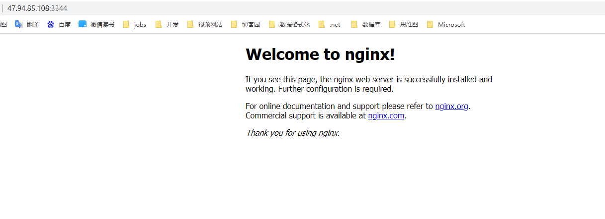


## tomcat 部署

~~~shell
# 官方案例（坑）
[root@iZ2zebquvlfb5cndmb95u5Z /root]
# docker run -it --rm -p 8080:8080 tomcat  # --rm   运行完就删除
Unable to find image 'tomcat:latest' locally
latest: Pulling from library/tomcat
bb7d5a84853b: Pull complete 
f02b617c6a8c: Pull complete 
d32e17419b7e: Pull complete 
c9d2d81226a4: Pull complete 
fab4960f9cd2: Pull complete 
da1c1e7baf6d: Pull complete 
1d2ade66c57e: Pull complete 
ea2ad3f7cb7c: Pull complete 
d75cb8d0a5ae: Pull complete 
76c37a4fffe6: Pull complete 
Digest: sha256:509cf786b26a8bd43e58a90beba60bdfd6927d2ce9c7902cfa675d3ea9f4c631
Status: Downloaded newer image for tomcat:latest
Using CATALINA_BASE:   /usr/local/tomcat
Using CATALINA_HOME:   /usr/local/tomcat
Using CATALINA_TMPDIR: /usr/local/tomcat/temp
Using JRE_HOME:        /usr/local/openjdk-11
Using CLASSPATH:       /usr/local/tomcat/bin/bootstrap.jar:/usr/local/tomcat/bin/tomcat-juli.jar
Using CATALINA_OPTS:   
NOTE: Picked up JDK_JAVA_OPTIONS:  --add-opens=java.base/java.lang=ALL-UNNAMED --add-opens=java.base/java.io=ALL-UNNAMED --add-opens=java.base/java.util=ALL-UNNAMED --add-opens=java.base/java.util.concurrent=ALL-UNNAMED --add-opens=java.rmi/sun.rmi.transport=ALL-UNNAMED
11-Nov-2021 14:00:46.235 INFO [main] org.apache.catalina.startup.VersionLoggerListener.log Server version name:   Apache Tomcat/10.0.12
11-Nov-2021 14:00:46.238 INFO [main] org.apache.catalina.startup.VersionLoggerListener.log Server built:          Sep 28 2021 13:34:21 UTC
11-Nov-2021 14:00:46.238 INFO [main] org.apache.catalina.startup.VersionLoggerListener.log Server version number: 10.0.12.0
11-Nov-2021 14:00:46.238 INFO [main] org.apache.catalina.startup.VersionLoggerListener.log OS Name:               Linux
11-Nov-2021 14:00:46.238 INFO [main] org.apache.catalina.startup.VersionLoggerListener.log OS Version:            3.10.0-957.21.3.el7.x86_64
11-Nov-2021 14:00:46.238 INFO [main] org.apache.catalina.startup.VersionLoggerListener.log Architecture:          amd64
11-Nov-2021 14:00:46.239 INFO [main] org.apache.catalina.startup.VersionLoggerListener.log Java Home:             /usr/local/openjdk-11
11-Nov-2021 14:00:46.239 INFO [main] org.apache.catalina.startup.VersionLoggerListener.log JVM Version:           11.0.13+8
11-Nov-2021 14:00:46.239 INFO [main] org.apache.catalina.startup.VersionLoggerListener.log JVM Vendor:            Oracle Corporation
11-Nov-2021 14:00:46.239 INFO [main] org.apache.catalina.startup.VersionLoggerListener.log CATALINA_BASE:         /usr/local/tomcat
11-Nov-2021 14:00:46.239 INFO [main] org.apache.catalina.startup.VersionLoggerListener.log CATALINA_HOME:         /usr/local/tomcat
11-Nov-2021 14:00:46.259 INFO [main] org.apache.catalina.startup.VersionLoggerListener.log Command line argument: --add-opens=java.base/java.lang=ALL-UNNAMED
11-Nov-2021 14:00:46.259 INFO [main] org.apache.catalina.startup.VersionLoggerListener.log Command line argument: --add-opens=java.base/java.io=ALL-UNNAMED
11-Nov-2021 14:00:46.259 INFO [main] org.apache.catalina.startup.VersionLoggerListener.log Command line argument: --add-opens=java.base/java.util=ALL-UNNAMED
11-Nov-2021 14:00:46.259 INFO [main] org.apache.catalina.startup.VersionLoggerListener.log Command line argument: --add-opens=java.base/java.util.concurrent=ALL-UNNAMED
11-Nov-2021 14:00:46.259 INFO [main] org.apache.catalina.startup.VersionLoggerListener.log Command line argument: --add-opens=java.rmi/sun.rmi.transport=ALL-UNNAMED
11-Nov-2021 14:00:46.259 INFO [main] org.apache.catalina.startup.VersionLoggerListener.log Command line argument: -Djava.util.logging.config.file=/usr/local/tomcat/conf/logging.properties
11-Nov-2021 14:00:46.259 INFO [main] org.apache.catalina.startup.VersionLoggerListener.log Command line argument: -Djava.util.logging.manager=org.apache.juli.ClassLoaderLogManager
11-Nov-2021 14:00:46.259 INFO [main] org.apache.catalina.startup.VersionLoggerListener.log Command line argument: -Djdk.tls.ephemeralDHKeySize=2048
11-Nov-2021 14:00:46.259 INFO [main] org.apache.catalina.startup.VersionLoggerListener.log Command line argument: -Djava.protocol.handler.pkgs=org.apache.catalina.webresources
11-Nov-2021 14:00:46.260 INFO [main] org.apache.catalina.startup.VersionLoggerListener.log Command line argument: -Dorg.apache.catalina.security.SecurityListener.UMASK=0027
11-Nov-2021 14:00:46.260 INFO [main] org.apache.catalina.startup.VersionLoggerListener.log Command line argument: -Dignore.endorsed.dirs=
11-Nov-2021 14:00:46.260 INFO [main] org.apache.catalina.startup.VersionLoggerListener.log Command line argument: -Dcatalina.base=/usr/local/tomcat

# 阉割版的tomcat  打开网站访问不了

# 进入容器将webapps.dist中的内容 拷贝到 webapps
[root@iZ2zebquvlfb5cndmb95u5Z /root]
#docker exec  -it  70ab8a2b07d3  /bin/bash

# 列出文件
root@70ab8a2b07d3:/usr/local/tomcat# ls
BUILDING.txt	 LICENSE  README.md	 RUNNING.txt  conf  logs	    temp     webapps.dist
CONTRIBUTING.md  NOTICE   RELEASE-NOTES  bin	      lib   native-jni-lib  webapps  work

# 拷贝 webapps.dist 中所有文件到 webapps
root@70ab8a2b07d3:/usr/local/tomcat# cp -r webapps.dist/* webapps

# 进入 webapps 查看
root@70ab8a2b07d3:/usr/local/tomcat# cd webapps
root@70ab8a2b07d3:/usr/local/tomcat/webapps# ls
ROOT  docs  examples  host-manager  manager 

~~~

浏览器访问：

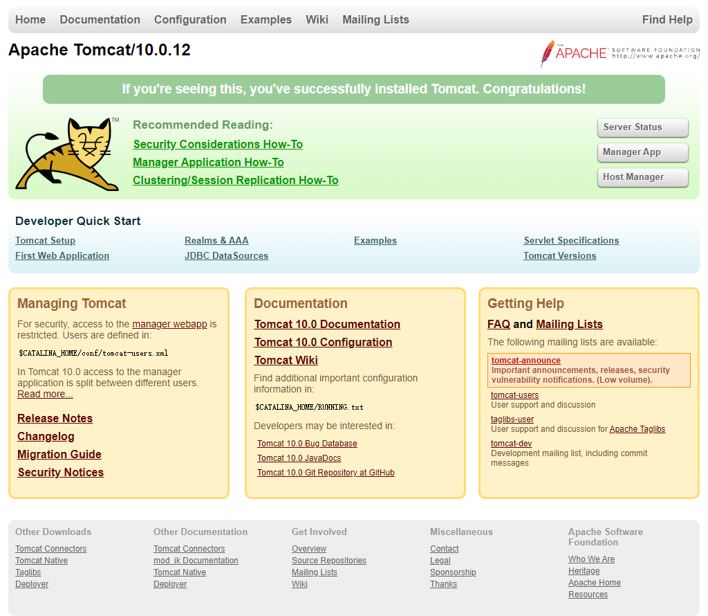


## es 部署

~~~shell
# es 暴露的接口多
# es 消耗内存多
# es 的数据一般需要放到安全目录

# 启动 
docker run -d --name elasticsearch  -p 9200:9200 -p 9300:9300 -e "discovery.type=single-node" elasticsearch

# 查看资源占用  2.205GiB
[root@iZ2zebquvlfb5cndmb95u5Z /root]
#docker stats

CONTAINER ID   NAME            CPU %     MEM USAGE / LIMIT     MEM %     NET I/O           BLOCK I/O    PIDS
3805bf66dd52   elasticsearch   0.17%     2.205GiB / 15.51GiB   14.21%    74B / 0B          0B / 123kB   38
70ab8a2b07d3   tomcato01       0.14%     208.8MiB / 15.51GiB   1.31%     7.56kB / 146kB    0B / 0B      38
01f87b2a9e1c   nginx01         0.00%     3.145MiB / 15.51GiB   0.02%     3.33kB / 4.89kB   0B / 4.1kB   5

# 测试是否成功
[root@iZ2zebquvlfb5cndmb95u5Z /root]
#curl localhost:9200
{
  "name" : "tXYkTlp",
  "cluster_name" : "elasticsearch",
  "cluster_uuid" : "1LnAvBDmSB-yFHFOtPCTpg",
  "version" : {
    "number" : "5.6.12",
    "build_hash" : "cfe3d9f",
    "build_date" : "2018-09-10T20:12:43.732Z",
    "build_snapshot" : false,
    "lucene_version" : "6.6.1"
  },
  "tagline" : "You Know, for Search"
}


# 增加内存限制

[root@iZ2zebquvlfb5cndmb95u5Z /root]
#docker  run -d --name elasticsearch  -p 9200:9200 -p 9300:9300 -e ES_JAVA_OPTS="-Xms64m -Xmx512m"  -e "discovery.type=single-node" elasticsearch

# 再次查看资源占用  249MiB
[root@iZ2zebquvlfb5cndmb95u5Z /root]
#docker stats

CONTAINER ID   NAME            CPU %     MEM USAGE / LIMIT     MEM %     NET I/O          BLOCK I/O    PIDS
c1e4db9e1999   elasticsearch   0.17%     249MiB / 15.51GiB     1.57%     0B / 0B          0B / 123kB   43
70ab8a2b07d3   tomcato01       0.14%     209MiB / 15.51GiB     1.32%     8.43kB / 148kB   0B / 0B      38
01f87b2a9e1c   nginx01         0.00%     3.145MiB / 15.51GiB   0.02%     3.5kB / 4.89kB   0B / 4.1kB   5

~~~


## es+kibana 部署

~~~shell
# 创建网络
[root@iZ2zebquvlfb5cndmb95u5Z /root]
#docker network create elastic				# 超前内容

#运行ES
[root@iZ2zebquvlfb5cndmb95u5Z /root]
#docker run --name es01-test --net elastic -p 9200:9200 -p 9300:9300 -e "discovery.type=single-node" -d  docker.elastic.co/elasticsearch/elasticsearch:7.15.2
Unable to find image 'docker.elastic.co/elasticsearch/elasticsearch:7.15.2' locally
7.15.2: Pulling from elasticsearch/elasticsearch
009c11f4ddee: Pull complete 
8772b99d888d: Pull complete 
bd8b744bf3bf: Pull complete 
2a41be2c565a: Pull complete 
e7e9200dd33e: Pull complete 
Digest: sha256:a1dce08d504b22e87adc849c94dcae53f6a0bd12648a4d99d7f9fc07bb2e8a3e
Status: Downloaded newer image for docker.elastic.co/elasticsearch/elasticsearch:7.15.2
3dc7cec49876f5f99968232e67b82b6548eca50df21daae841a53b8523f9078b

# 运行 Kibana
[root@iZ2zebquvlfb5cndmb95u5Z /root]
#docker run --name kib01-test --net elastic -p 5601:5601 -e "ELASTICSEARCH_HOSTS=http://es01-test:9200" -d  docker.elastic.co/kibana/kibana:7.15.2
Unable to find image 'docker.elastic.co/kibana/kibana:7.15.2' locally
7.15.2: Pulling from kibana/kibana
22f1e563f2e0: Already exists 
cc58250a72f5: Pull complete 
1ee6acff1efd: Pull complete 
3b3a3c5e473e: Pull complete 
e3ca6496e323: Pull complete 
2da4a7335359: Pull complete 
6bbf34c19c99: Pull complete 
71e6d011e4fe: Pull complete 
814854766c1d: Pull complete 
7c51361d0335: Pull complete 
cfd96facf80f: Pull complete 
9097ca3e0245: Pull complete 
ddb37dbc4433: Pull complete 
Digest: sha256:5b4c7c84cdf91dc154131c6d639d9c289a4bb03a2c701bfecea03edbf8e724be
Status: Downloaded newer image for docker.elastic.co/kibana/kibana:7.15.2
cdec924f8a68159b30cf4afa85df98b3449355639c7a701f9d88fa5ba1c0d3e6

# 解释
--net 			# 网络

# 查看容器
[root@iZ2zebquvlfb5cndmb95u5Z /root]
#docker ps
CONTAINER ID   IMAGE                                                  COMMAND                  CREATED              STATUS              PORTS                                            NAMES
cdec924f8a68   docker.elastic.co/kibana/kibana:7.15.2                 "/bin/tini -- /usr/l…"   7 seconds ago        Up 6 seconds        0.0.0.0:5601->5601/tcp                           kib01-test
3dc7cec49876   docker.elastic.co/elasticsearch/elasticsearch:7.15.2   "/bin/tini -- /usr/l…"   About a minute ago   Up About a minute   0.0.0.0:9200->9200/tcp, 0.0.0.0:9300->9300/tcp   es01-test


~~~

访问


## portainer 可视化

~~~shell
[root@iZ2zebquvlfb5cndmb95u5Z /root]
#docker run -d -p 9000:9000 \
> --restart=always -v /var/run/docker.sock:/var/run/docker.sock --privileged=true portainer/portainer 

Unable to find image 'portainer/portainer:latest' locally
latest: Pulling from portainer/portainer
94cfa856b2b1: Pull complete 
49d59ee0881a: Pull complete 
a2300fd28637: Pull complete 
Digest: sha256:fb45b43738646048a0a0cc74fcee2865b69efde857e710126084ee5de9be0f3f
Status: Downloaded newer image for portainer/portainer:latest
12ea28f058493a9c0c91cd140f4c83353a0a560a0c3f9c869c01418e44ce7b7d

~~~


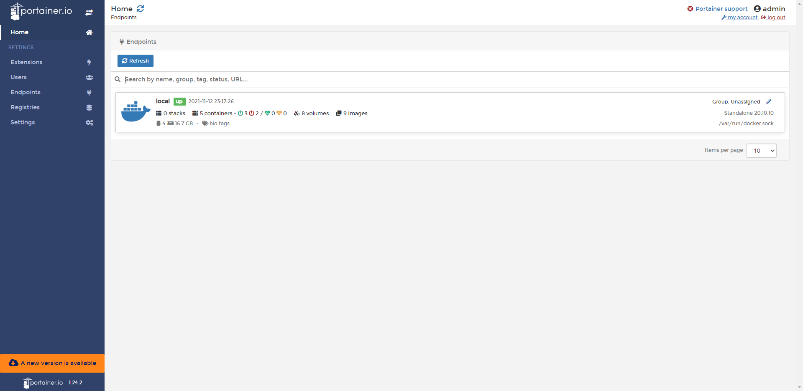


# docker 镜像详解??


## commit  提交一个镜像

帮助文档：https://docs.docker.com/engine/reference/commandline/commit/

准备

~~~shell
# 运行一个官方的tomcat 
[root@iZ2zebquvlfb5cndmb95u5Z /root]
#docker  run -d --name tomcat02 -p 8090:8080 tomcat
675944a1aa13e0db480a3d0b6d6528f9936a7e7d88c6414558468cb77b6947d4

# 查看一下
[root@iZ2zebquvlfb5cndmb95u5Z /root]
#docker ps
CONTAINER ID   IMAGE                                                  COMMAND                  CREATED         STATUS          PORTS                                            NAMES
675944a1aa13   tomcat                                                 "catalina.sh run"        3 seconds ago   Up 2 seconds    0.0.0.0:8090->8080/tcp                           tomcat02

# 进入容器内部
[root@iZ2zebquvlfb5cndmb95u5Z /root]
#docker  exec -it 675944a1aa13 /bin/bash

#列出文件
root@675944a1aa13:/usr/local/tomcat# ls
BUILDING.txt  CONTRIBUTING.md  LICENSE	NOTICE	README.md  RELEASE-NOTES  RUNNING.txt  bin  conf  lib  logs  native-jni-lib  temp  webapps  webapps.dist  work

# 移动 文件
root@675944a1aa13:/usr/local/tomcat# cp -r webapps.dist/* webapps/
root@675944a1aa13:/usr/local/tomcat# cd webapps

# 查看是否移动成功
root@675944a1aa13:/usr/local/tomcat/webapps# ls
ROOT  docs  examples  host-manager  manager


~~~

~~~shell
# docker commit -m="提交信息" -a="作者" 容器id  目标镜像名:[TAG]

# 可选参数
  -a, --author string    作者 (e.g., "John Hannibal Smith <hannibal@a-team.com>")
  -c, --change list      将 Dockerfile 指令应用于创建的镜像
  -m, --message string   提交信息
  -p, --pause            在提交期间暂停容器（默认为 true）

# 制作自己的tomcat
[root@iZ2zebquvlfb5cndmb95u5Z /root]
#docker  commit -a="zxc" -m="my tomcat" 675944a1aa13 mytomcat:1.0
sha256:55e1c9ada80b8202593f5b47aab832efb995a614862751de5928c60efee524af

# 查看镜像
[root@iZ2zebquvlfb5cndmb95u5Z /root]
#docker images
REPOSITORY                                      TAG       IMAGE ID       CREATED          SIZE
mytomcat                                        1.0       55e1c9ada80b   13 seconds ago   684MB
tomcat                                          latest    b0e0b0a92cf9   3 weeks ago      680MB

# 使用
[root@iZ2zebquvlfb5cndmb95u5Z /root]
#docker run -d --name mycomcat01 -p 7890:8080 mytomcat:1.0
6850d3f58aa2873efed5b6a6ebaa00f91fb0f3e440ded610175be3ca6ec64bb8

# 查看镜像
[root@iZ2zebquvlfb5cndmb95u5Z /root]
#docker ps
CONTAINER ID   IMAGE                                                  COMMAND                  CREATED          STATUS             PORTS                                            NAMES
6850d3f58aa2   mytomcat:1.0                                           "catalina.sh run"        3 seconds ago    Up 2 seconds       0.0.0.0:7890->8080/tcp                           mycomcat01

~~~

浏览器访问：

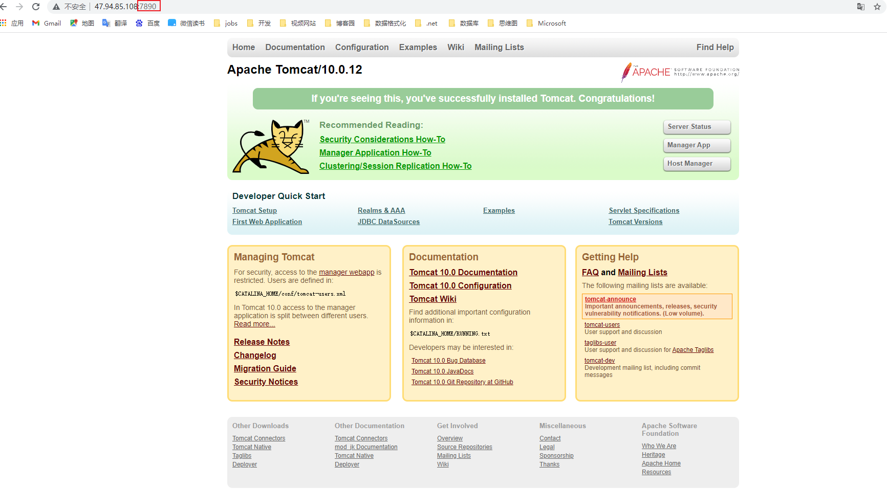


# 容器数据卷（容器=>主机）


##  什么是容器数据卷

```
docker 的理念将应用和环境打包成一个镜像，应用产生的数据在容器中，容器删除数据就会丢失。
这样就有一个需求：数据可以持久化
容器之间可以有一个数据共享的技术：容器中产生的书据同步到本地，这就是数据卷，我们将容器中的目录挂载到主机上面
```

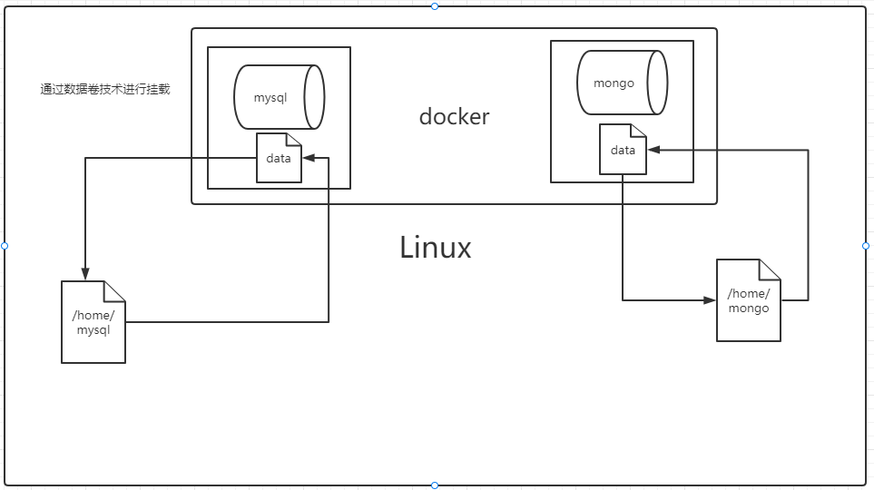


## 数据卷挂载


### centos 目录挂载

~~~shell
# docker run [可选参数] -v 主机目录:容器目录  image [bin/bash]

# 可选参数  

--name 			# 容器名称
-d 				# 后台运行
-it 			# 使用交互方式运行
-p				# 指定容器端口  -p 8080：8080
				# -p ip：主机端口:容器端口
				# -p 主机端口:容器端口
				# -p 容器端口
				# 容器端口
-P				# 随机指定端口

-v 				# 数据卷
				# 主机目录:容器目录

# 将centos 中的home挂载到主机的/home/ceshi

# 启动容器并进入
[root@iZ2zebquvlfb5cndmb95u5Z /home]
#docker run -it -v /home/ceshi:/home --name centos01 centos /bin/bash

# 进入home 目录
[root@4e9d66d5822c /]# cd home

# 创建文件 zxc.txt 
[root@4e9d66d5822c home]# touch  zxc.txt 
[root@4e9d66d5822c home]# ls
zxc.txt

# 在宿主机查看
[root@iZ2zebquvlfb5cndmb95u5Z /home/ceshi]
#ls
zxc.txt

~~~

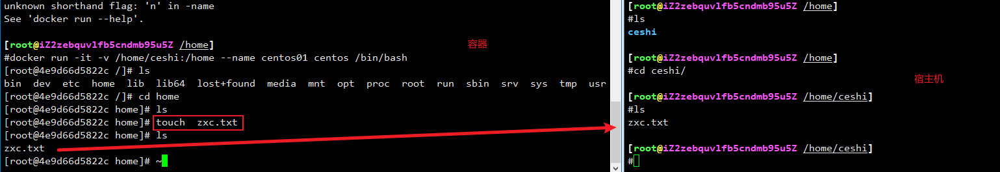

~~~shell
# 在宿主机修改文件 
[root@iZ2zebquvlfb5cndmb95u5Z /home/ceshi]
#vim zxc.txt 

# 容器查看
[root@4e9d66d5822c home]# cat zxc.txt 
my name is zxc

~~~

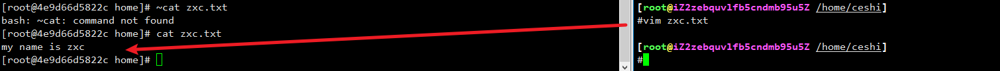


### Mysql 数据持久化

帮助文档：https://registry.hub.docker.com/_/mysql

~~~shell
# 解释
# --name 名称
# -d 后台
# -v 挂载
# -e 配置
# -p 端口映射

# 后台方式启动mysql
[root@iZ2zebquvlfb5cndmb95u5Z /root]
#docker run --name mysql01 -d  -v /home/mysql/data:/var/lib/mysql -v /home/mysql/conf:/etc/mysql/conf.d  -e MYSQL_ROOT_PASSWORD=123456  -p 3306:3306  mysql:5.7
c9b3e74921477f8388ccfd528007f5acb95fe007e679bccb58b9a28f1cf034d6

# 进入容器内
[root@iZ2zebquvlfb5cndmb95u5Z /]
#docker exec -it c9b3e7492147 /bin/bash

# 连接mysql 
root@e5cb7a33eaab:/# mysql -uroot -p123456 

mysql: [Warning] Using a password on the command line interface can be insecure.
Welcome to the MySQL monitor.  Commands end with ; or \g.
Your MySQL connection id is 2
Server version: 5.7.36 MySQL Community Server (GPL)

Copyright (c) 2000, 2021, Oracle and/or its affiliates.

Oracle is a registered trademark of Oracle Corporation and/or its
affiliates. Other names may be trademarks of their respective
owners.

Type 'help;' or '\h' for help. Type '\c' to clear the current input statement.

mysql> show databases;
+--------------------+
| Database           |
+--------------------+
| information_schema |
| mysql              |
| performance_schema |
| sys                |
+--------------------+
6 rows in set (0.00 sec)


# 宿主机进入 /home/mysql/data 查看默认数据是否同步
[root@iZ2zebquvlfb5cndmb95u5Z /home/mysql/data]
#ls

auto.cnf    client-cert.pem  ibdata1      ibtmp1              private_key.pem  server-key.pem
ca-key.pem  client-key.pem   ib_logfile0  mysql               public_key.pem   sys
ca.pem      ib_buffer_pool   ib_logfile1  performance_schema  server-cert.pem

# Navcat 连接 并创建数据库（TestDB 、zxcDB）

# 查看数据是否同步
[root@iZ2zebquvlfb5cndmb95u5Z /home/mysql/data]
#ls

auto.cnf         client-key.pem  ib_logfile1         private_key.pem  sys
ca-key.pem       ib_buffer_pool  ibtmp1              public_key.pem   TestDB
ca.pem           ibdata1         mysql               server-cert.pem  zxcDB
client-cert.pem  ib_logfile0     performance_schema  server-key.pem

~~~

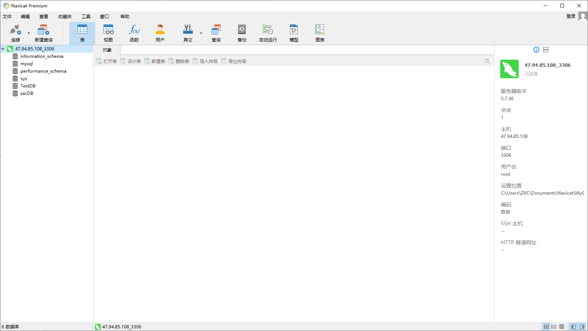

~~~shell
# 删除容器
[root@iZ2zebquvlfb5cndmb95u5Z /root]
#docker rm -f c9b3e7492147
c9b3e7492147

# 查看数据是否会丢失
[root@iZ2zebquvlfb5cndmb95u5Z /home/mysql/data]
#ls

auto.cnf         client-key.pem  ib_logfile1         private_key.pem  sys
ca-key.pem       ib_buffer_pool  ibtmp1              public_key.pem   TestDB
ca.pem           ibdata1         mysql               server-cert.pem  zxcDB
client-cert.pem  ib_logfile0     performance_schema  server-key.pem

# 再次启动一个mysql 容器进行挂载
[root@iZ2zebquvlfb5cndmb95u5Z /root]
#docker run --name mysql01 -d  -v /home/mysql/data:/var/lib/mysql -v /home/mysql/conf:/etc/mysql/conf.d  -e MYSQL_ROOT_PASSWORD=123456  -p 3306:3306  mysql:5.7

# 进入容器内
[root@iZ2zebquvlfb5cndmb95u5Z /]
#docker exec -it e5cb7a33eaab /bin/bash

# 再次连接mysql
root@e5cb7a33eaab:/# mysql -uroot -p123456 

mysql: [Warning] Using a password on the command line interface can be insecure.
Welcome to the MySQL monitor.  Commands end with ; or \g.
Your MySQL connection id is 2
Server version: 5.7.36 MySQL Community Server (GPL)

Copyright (c) 2000, 2021, Oracle and/or its affiliates.

Oracle is a registered trademark of Oracle Corporation and/or its
affiliates. Other names may be trademarks of their respective
owners.

Type 'help;' or '\h' for help. Type '\c' to clear the current input statement.

mysql> show databases;
+--------------------+
| Database           |
+--------------------+
| information_schema |
| TestDB             |
| mysql              |
| performance_schema |
| sys                |
| zxcDB              |
+--------------------+
6 rows in set (0.00 sec)

# 数据还是在的

~~~

```shell
# 查看容器详情中的挂载
[root@iZ2zebquvlfb5cndmb95u5Z /root]
#docker inspect e5cb7a33eaab

```

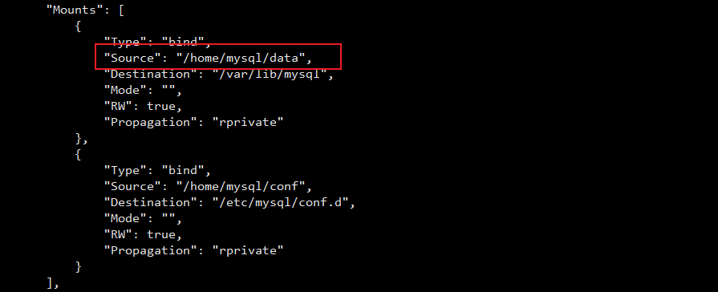


## 具名挂载和匿名挂载

~~~shell
# 匿名挂载
-v 容器内路径

# 匿名挂载nginx
[root@iZ2zebquvlfb5cndmb95u5Z /root]
#docker run -d -P --name nginx01 -v /etc/nginx nginx
53f0f33b3ea185da59d514be32b1b7e6afdfc5355f708689ecff80cd94e5bd70

# 查看数据卷
[root@iZ2zebquvlfb5cndmb95u5Z /root]
#docker volume ls
DRIVER    VOLUME NAME
local     dc30d74bdfd4fecb9f0537484b92d9dd385c1b1fa213adc21649ab4ab7c18fe3


# 具名挂载

-v 卷名：容器内路径

# 剧名挂载nginx
[root@iZ2zebquvlfb5cndmb95u5Z /root]
#docker run -d -P --name nginx02 -v juming-nginx:/etc/nginx nginx
1b68002388ad2d544f3380f39b443730589cc2cb352f01ee17547074295fb3b0		      # nginx01

# 查看数据卷
[root@iZ2zebquvlfb5cndmb95u5Z /root]
#docker volume ls
DRIVER    VOLUME NAME 
local     dc30d74bdfd4fecb9f0537484b92d9dd385c1b1fa213adc21649ab4ab7c18fe3    # nginx01
local     juming-nginx														  # nginx02


# 查看卷详情
[root@iZ2zebquvlfb5cndmb95u5Z /root]
#docker volume  inspect juming-nginx
[
    {
        "CreatedAt": "2021-11-13T23:58:27+08:00",
        "Driver": "local",
        "Labels": null,
        "Mountpoint": "/var/lib/docker/volumes/juming-nginx/_data",
        "Name": "juming-nginx",
        "Options": null,
        "Scope": "local"
    }
]

~~~

```shell
# 所有docker 容器内的卷 没有指定目录的情况下都在/var/lib/docker/volumes/xxx/_data

# 如何确定是具名挂载还是匿名挂载还是指定路径挂载
-v    容器目录					 # 匿名挂载 
-v	  卷名:容器目录		    	# 具名挂载
-v	  /宿主机目录/容器目录		  # 指定目录挂载
```


## 扩展

~~~shell
# 通过 -v  容器内路径： ro / rw 改变读写权限
# ro 	readonly	只读
# rw 	readwrite	只写

# 容器只能读，宿主机可读写
[root@iZ2zebquvlfb5cndmb95u5Z /root]
#docker run -d -P --name nginx03 -v juming-nginx3:/etc/nginx:ro nginx

# 容器可读写，宿主机可读写
[root@iZ2zebquvlfb5cndmb95u5Z /root]
#docker run -d -P --name nginx04 -v juming-nginx4:/etc/nginx:rw nginx
~~~


# 使用 dockerfile 进行挂载


## 什么是 dockerfile

~~~shell
dockerfile 就是用来构建docker 镜像的构建文件 ，通过这个文件可以生成镜像，镜像是一层一层的，每个命令都是一层
~~~


## 使用 dockerfile 创建自己的 centos

~~~shell
# 创建 dockerfile 名字建议使用 Dockerfile
[root@iZ2zebquvlfb5cndmb95u5Z /root]
#vim Dockerfile

# 编写脚本
FROM centos
VOLUME ["volume01","volume02"]  			# 匿名挂载  在外部有目录同步
CMD exho "------end-----"
CMD /bin/bash

# 查看 Dockerfile 文件
[root@iZ2zebquvlfb5cndmb95u5Z /root]
#cat Dockerfile 
FROM centos
VOLUME ["volume01","volume02"]  			# 匿名挂载  在外部有目录同步
CMD exho "------end-----"
CMD /bin/bash

~~~


## docker build 编译Dockerfile

帮助文档：https://docs.docker.com/engine/reference/commandline/build/

~~~shell
# docker build [可选参数]

# 可选参数                       
  -f, --file string              # Dockerfile 路径
  -t, --tag list                 # name:[tag]

# 编译 Dockerfile 
[root@iZ2zebquvlfb5cndmb95u5Z /root]
#docker build -f Dockerfile  -t zxc/centos:1.0 .
Sending build context to Docker daemon  198.1MB
Step 1/4 : FROM centos								# 第一层
 ---> 5d0da3dc9764
Step 2/4 : VOLUME ["volume01","volume02"]			# 第二层
 ---> Running in 06108849774d
Removing intermediate container 06108849774d
 ---> 8706138570ee
Step 3/4 : CMD exho "------end-----"				# 第三层
 ---> Running in df8ac9d2ac7a
Removing intermediate container df8ac9d2ac7a
 ---> e1b668ac0941
Step 4/4 : CMD /bin/bash							# 第四层
 ---> Running in 1e25de30e08f
Removing intermediate container 1e25de30e08f
 ---> 93c8c37092a3
Successfully built 93c8c37092a3
Successfully tagged zxc/centos:1.0 					# 每一个命令都是镜像的一层

# 查看镜像
[root@iZ2zebquvlfb5cndmb95u5Z /root]
#docker images
REPOSITORY                                      TAG       IMAGE ID       CREATED              SIZE
zxc/centos                                      1.0       93c8c37092a3   About a minute ago   231MB


~~~


## 启动生成的容器

~~~shell
# 启动 zxc/centos 镜像
[root@iZ2zebquvlfb5cndmb95u5Z /root]
#docker run --name zxc_centos1 -it zxc/centos:1.0
 
# 查看文件 注意最下方的 volume01  、 volume02 就是匿名挂载的目录
[root@bd1e0f8ba8d9 /]# ls -l
total 56
lrwxrwxrwx   1 root roots    7 Nov  3  2020 bin -> usr/bin
drwxr-xr-x   5 root root  360 Nov 14 11:45 dev
drwxr-xr-x   1 root root 4096 Nov 14 11:45 etc
drwxr-xr-x   2 root root 4096 Nov  3  2020 home
lrwxrwxrwx   1 root root    7 Nov  3  2020 lib -> usr/lib
lrwxrwxrwx   1 root root    9 Nov  3  2020 lib64 -> usr/lib64
drwx------   2 root root 4096 Sep 15 14:17 lost+found
drwxr-xr-x   2 root root 4096 Nov  3  2020 media
drwxr-xr-x   2 root root 4096 Nov  3  2020 mnt
drwxr-xr-x   2 root root 4096 Nov  3  2020 opt
dr-xr-xr-x 148 root root    0 Nov 14 11:45 proc
dr-xr-x---   2 root root 4096 Sep 15 14:17 root
drwxr-xr-x  11 root root 4096 Sep 15 14:17 run
lrwxrwxrwx   1 root root    8 Nov  3  2020 sbin -> usr/sbin
drwxr-xr-x   2 root root 4096 Nov  3  2020 srv
dr-xr-xr-x  13 root root    0 Nov 14 11:45 sys
drwxrwxrwt   7 root root 4096 Sep 15 14:17 tmp
drwxr-xr-x  12 root root 4096 Sep 15 14:17 usr
drwxr-xr-x  20 root root 4096 Sep 15 14:17 var
drwxr-xr-x   2 root root 4096 Nov 14 11:45 volume01
drwxr-xr-x   2 root root 4096 Nov 14 11:45 volume02

# 查看具体挂载的位置
[root@iZ2zebquvlfb5cndmb95u5Z /root]
#docker inspect zxc_centos1
~~~

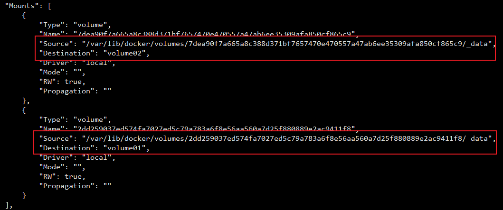


#  容器数据卷（容器=>容器）

~~~shell
# 通过 docker run --name name -d  -v 卷名:容器目录 可以将容器内目录挂载到宿主机上，那么多个容器之间该通过什么技术共享数据呢？
# docker 提供了 --volumes-from 可以指向父类容器，从而实现容器间数据共享
# 父类容器 通过 -v 挂载宿主机从而达到数据持久化
~~~


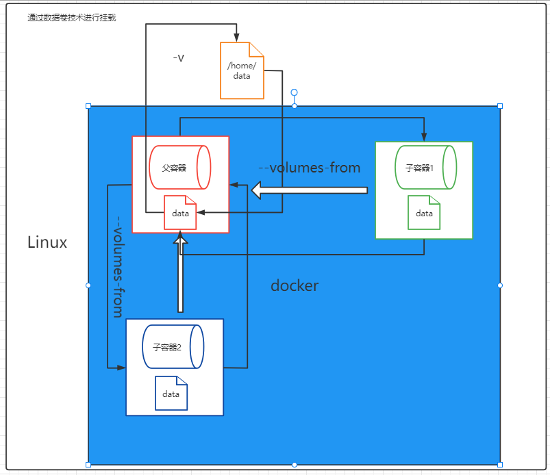

## 多个 MySQL 实现数据共享？？有问题

~~~shell
# 创建三个 mysql 容器 第一个通过 -v 挂载宿主机目录，后两个通过 --volumes-from 继承第一个

# mysql01
[root@iZ2zebquvlfb5cndmb95u5Z /root]
#docker run --name mysql01 -d  -v /home/mysql/data:/var/lib/mysql -v /home/mysql/conf:/etc/mysql/conf.d  -e MYSQL_ROOT_PASSWORD=123456  -p 3306:3306  mysql:5.7
b2bc1224d357456f1e9e74958c85f4a347bc700277ec7698f4d5da845db1838b

# mysql02
[root@iZ2zebquvlfb5cndmb95u5Z /root]
#docker run --name mysql02 -d --volumes-from mysql01   -e MYSQL_ROOT_PASSWORD=123456  -p 3307:3306  mysql:5.7 
d98bffe40d1707763c005f025d0b969b0960f6caca77cbde3799184b51e75650

# mysql03
[root@iZ2zebquvlfb5cndmb95u5Z /root]
#docker run --name mysql03 -d --volumes-from mysql01   -e MYSQL_ROOT_PASSWORD=123456  -p 3308:3306  mysql:5.7 
613619451b5c4dbd362d89963789224020e874cfa8321ab23acd7bd7a85e03eb

# 查看容器
[root@iZ2zebquvlfb5cndmb95u5Z /root]
#docker ps 
CONTAINER ID   IMAGE       COMMAND                  CREATED          STATUS          PORTS                               NAMES
613619451b5c   mysql:5.7   "docker-entrypoint.s…"   12 seconds ago   Up 11 seconds   33060/tcp, 0.0.0.0:3308->3306/tcp   mysql03
d98bffe40d17   mysql:5.7   "docker-entrypoint.s…"   24 seconds ago   Up 23 seconds   33060/tcp, 0.0.0.0:3307->3306/tcp   mysql02
b2bc1224d357   mysql:5.7   "docker-entrypoint.s…"   3 minutes ago    Up 3 minutes    0.0.0.0:3306->3306/tcp, 33060/tcp   mysql01


~~~


# dockerfile

dockerfile 是用来构建镜像的文件，命令参数脚本

构建步骤：

1、编写一个dockerfile文件

2、docker build 构建成为一个镜像

3、docker run 运行镜像

4、docker push 发布镜像


## 基础知识

1、每个保留关键字都必须是大写

2、执行上到下顺序执行

3、# 表示注释

4、每个指令都会创建提交一个新的镜像层，并提交。

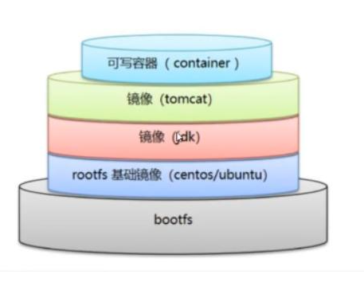


## 常用命令

~~~shell
FROM 			# 基础镜像
MAINTAINER		# 维护者
RUN				# 镜像构建的时候需要运行的命令
ADD				# copy文件 自动解压
WORKDIR			# 工作目录
VOLUME			# 数据卷
EXPOSE			# 保留端口配置
CMD				# 指定容器启动的时候要运行的命令 ，只有最后一个会生效
ENTRYPOINT		# 指定容器启动的时候要运行的命令 ，命令累加
ONBUILD			# 当构建一个被继承dockerfile 这个时候就会运行ONBUILD
COPY			# 类似 ADD 将文件拷贝到镜像中
ENV				# 构建的时候设置环境变量
~~~


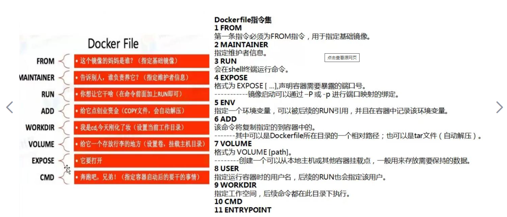


## 使用 dockerfile 构建 centos

```
docker hub 中 99% 的基础镜像是From scratch  然后配置需要的软件和配置来进行构建
```

```shell
# 官方的是没有 vim 和 ifcongfig 的
[root@iZ2zebquvlfb5cndmb95u5Z /root]
#docker exec  -it centos01 /bin/bash
[root@4e9d66d5822c /]# vim
bash: vim: command not found
[root@4e9d66d5822c /]# ifcongfig
bash: ifcongfig: command not found
[root@4e9d66d5822c /]# 
```

```shell
# 通过 vim 编写 dockerfile
[root@iZ2zebquvlfb5cndmb95u5Z /root]
#cat dockerfile-centos 
FROM centos
MAINTAINER ZXC
ENV MYPATH /usr/local
WORKDIR $MYPATH
RUN yum -y install vim
RUN yum -y install net-tools
EXPOSE 80
CMD exho $MYPATH
CMD exho "-----end-----"
CMD /bin/bash
```

```shell
# 编译
[root@iZ2zebquvlfb5cndmb95u5Z /root]
#docker build -f dockerfile-centos  -t mycentos:1.0 .
Sending build context to Docker daemon  198.1MB
Step 1/10 : FROM centos										# 拉取镜像
 ---> 5d0da3dc9764
Step 2/10 : MAINTAINER ZXC									# 维护者
 ---> Running in 252b6007fa35
Removing intermediate container 252b6007fa35
 ---> 243b1ae1f2d1
Step 3/10 : ENV MYPATH /usr/local							# 环境变量目录
 ---> Running in 455fd49fe70d
Removing intermediate container 455fd49fe70d				
 ---> 820299d18636
Step 4/10 : WORKDIR $MYPATH									# 工作目录
 ---> Running in ddd70e843748
Removing intermediate container ddd70e843748
 ---> 1f144d2a674c
Step 5/10 : RUN yum -y install vim							# 安装 vim
 ---> Running in 727191826b58
CentOS Linux 8 - AppStream                      6.8 MB/s | 8.1 MB     00:01    
CentOS Linux 8 - BaseOS                         2.9 MB/s | 3.5 MB     00:01    
CentOS Linux 8 - Extras                         2.7 kB/s |  10 kB     00:03    
Dependencies resolved.
================================================================================
 Package             Arch        Version                   Repository      Size
================================================================================
Installing:
 vim-enhanced        x86_64      2:8.0.1763-16.el8         appstream      1.4 M
Installing dependencies:
 gpm-libs            x86_64      1.20.7-17.el8             appstream       39 k
 vim-common          x86_64      2:8.0.1763-16.el8         appstream      6.3 M
 vim-filesystem      noarch      2:8.0.1763-16.el8         appstream       49 k
 which               x86_64      2.21-16.el8               baseos          49 k

Transaction Summary
================================================================================
Install  5 Packages

Total download size: 7.8 M
Installed size: 30 M
Downloading Packages:
(1/5): gpm-libs-1.20.7-17.el8.x86_64.rpm        2.3 MB/s |  39 kB     00:00    
(2/5): vim-filesystem-8.0.1763-16.el8.noarch.rp 5.5 MB/s |  49 kB     00:00    
(3/5): vim-enhanced-8.0.1763-16.el8.x86_64.rpm   22 MB/s | 1.4 MB     00:00    
(4/5): which-2.21-16.el8.x86_64.rpm             474 kB/s |  49 kB     00:00    
(5/5): vim-common-8.0.1763-16.el8.x86_64.rpm     15 MB/s | 6.3 MB     00:00    
--------------------------------------------------------------------------------
Total                                           2.7 MB/s | 7.8 MB     00:02     
warning: /var/cache/dnf/appstream-02e86d1c976ab532/packages/gpm-libs-1.20.7-17.el8.x86_64.rpm: Header V3 RSA/SHA256 Signature, key ID 8483c65d: NOKEY
CentOS Linux 8 - AppStream                      416 kB/s | 1.6 kB     00:00    
Importing GPG key 0x8483C65D:
 Userid     : "CentOS (CentOS Official Signing Key) <security@centos.org>"
 Fingerprint: 99DB 70FA E1D7 CE22 7FB6 4882 05B5 55B3 8483 C65D
 From       : /etc/pki/rpm-gpg/RPM-GPG-KEY-centosofficial
Key imported successfully
Running transaction check
Transaction check succeeded.
Running transaction test
Transaction test succeeded.
Running transaction
  Preparing        :                                                        1/1 
  Installing       : which-2.21-16.el8.x86_64                               1/5 
  Installing       : vim-filesystem-2:8.0.1763-16.el8.noarch                2/5 
  Installing       : vim-common-2:8.0.1763-16.el8.x86_64                    3/5 
  Installing       : gpm-libs-1.20.7-17.el8.x86_64                          4/5 
  Running scriptlet: gpm-libs-1.20.7-17.el8.x86_64                          4/5 
  Installing       : vim-enhanced-2:8.0.1763-16.el8.x86_64                  5/5 
  Running scriptlet: vim-enhanced-2:8.0.1763-16.el8.x86_64                  5/5 
  Running scriptlet: vim-common-2:8.0.1763-16.el8.x86_64                    5/5 
  Verifying        : gpm-libs-1.20.7-17.el8.x86_64                          1/5 
  Verifying        : vim-common-2:8.0.1763-16.el8.x86_64                    2/5 
  Verifying        : vim-enhanced-2:8.0.1763-16.el8.x86_64                  3/5 
  Verifying        : vim-filesystem-2:8.0.1763-16.el8.noarch                4/5 
  Verifying        : which-2.21-16.el8.x86_64                               5/5 

Installed:
  gpm-libs-1.20.7-17.el8.x86_64         vim-common-2:8.0.1763-16.el8.x86_64    
  vim-enhanced-2:8.0.1763-16.el8.x86_64 vim-filesystem-2:8.0.1763-16.el8.noarch
  which-2.21-16.el8.x86_64             

Complete!
Removing intermediate container 727191826b58
 ---> 2b0bcd85fc5c
Step 6/10 : RUN yum -y install net-tools					# 安装 net-tools
 ---> Running in 1bf9162f88af
Last metadata expiration check: 0:00:14 ago on Thu Nov 18 14:08:58 2021.
Dependencies resolved.
================================================================================
 Package         Architecture Version                        Repository    Size
================================================================================
Installing:
 net-tools       x86_64       2.0-0.52.20160912git.el8       baseos       322 k

Transaction Summary
================================================================================
Install  1 Package

Total download size: 322 k
Installed size: 942 k
Downloading Packages:
net-tools-2.0-0.52.20160912git.el8.x86_64.rpm   1.8 MB/s | 322 kB     00:00    
--------------------------------------------------------------------------------
Total                                           711 kB/s | 322 kB     00:00     
Running transaction check
Transaction check succeeded.
Running transaction test
Transaction test succeeded.
Running transaction
  Preparing        :                                                        1/1 
  Installing       : net-tools-2.0-0.52.20160912git.el8.x86_64              1/1 
  Running scriptlet: net-tools-2.0-0.52.20160912git.el8.x86_64              1/1 
  Verifying        : net-tools-2.0-0.52.20160912git.el8.x86_64              1/1 

Installed:
  net-tools-2.0-0.52.20160912git.el8.x86_64                                     

Complete!
Removing intermediate container 1bf9162f88af
 ---> fb8b17d3dff0
Step 7/10 : EXPOSE 80
 ---> Running in 5226b0528b90
Removing intermediate container 5226b0528b90
 ---> a084b977bb1f
Step 8/10 : CMD exho $MYPATH
 ---> Running in a1c48a212034
Removing intermediate container a1c48a212034
 ---> 9db19b35f20c
Step 9/10 : CMD exho "-----end-----"
 ---> Running in 5b98d572ee0d
Removing intermediate container 5b98d572ee0d
 ---> bed1f547b712
Step 10/10 : CMD /bin/bash
 ---> Running in bf9c57c3c0c9
Removing intermediate container bf9c57c3c0c9
 ---> a19dcae387b3
Successfully built a19dcae387b3
Successfully tagged mycentos:1.0						# 编译成功

```

```shell
# 查看本地镜像
[root@iZ2zebquvlfb5cndmb95u5Z /root]
#docker images
REPOSITORY                                      TAG       IMAGE ID       CREATED         SIZE
mycentos                                        1.0       a19dcae387b3   3 minutes ago   322MB

```

~~~shell
# 运行测试
[root@iZ2zebquvlfb5cndmb95u5Z /root]
#docker run -it mycentos:1.0 /bin/bash
[root@569a18f4cc53 local]# pwd							# 工作目录
/usr/local
[root@569a18f4cc53 local]# ifconfig						# 测试安装的命令
eth0: flags=4163<UP,BROADCAST,RUNNING,MULTICAST>  mtu 1500
        inet 172.17.0.4  netmask 255.255.0.0  broadcast 172.17.255.255
        ether 02:42:ac:11:00:04  txqueuelen 0  (Ethernet)
        RX packets 0  bytes 0 (0.0 B)
        RX errors 0  dropped 0  overruns 0  frame 0
        TX packets 0  bytes 0 (0.0 B)
        TX errors 0  dropped 0 overruns 0  carrier 0  collisions 0

lo: flags=73<UP,LOOPBACK,RUNNING>  mtu 65536
        inet 127.0.0.1  netmask 255.0.0.0
        loop  txqueuelen 1000  (Local Loopback)
        RX packets 0  bytes 0 (0.0 B)
        RX errors 0  dropped 0  overruns 0  frame 0
        TX packets 0  bytes 0 (0.0 B)
        TX errors 0  dropped 0 overruns 0  carrier 0  collisions 0
~~~

## CMD 和 ENTRYPOINT 区别

```shell
# 编写测试 cmd dockerfile 
[root@iZ2zebquvlfb5cndmb95u5Z /root]
#cat dockerfile-cmd-test 
FROM centos
CMD ["ls","-a"]

# 构建镜像
[root@iZ2zebquvlfb5cndmb95u5Z /root]
#docker build -f dockerfile-cmd-test  -t cmdtest .
Sending build context to Docker daemon  198.1MB
Step 1/2 : FROM centos
 ---> 5d0da3dc9764
Step 2/2 : CMD ["ls","-a"]
 ---> Running in 0bc2e81ba58e
Removing intermediate container 0bc2e81ba58e
 ---> 221edbb57660
Successfully built 221edbb57660
Successfully tagged cmdtest:latest

# run 运行
[root@iZ2zebquvlfb5cndmb95u5Z /root]
#docker run -it  --name cmd-test1 cmdtest
.   .dockerenv	dev  home  lib64       media  opt   root  sbin	sys  usr
..  bin		etc  lib   lost+found  mnt    proc  run   srv	tmp  var

# 追加命令 -l 报错 
[root@iZ2zebquvlfb5cndmb95u5Z /root]
#docker run -it   --name cmd-test2  cmdtest -l
docker: Error response from daemon: OCI runtime create failed: container_linux.go:380: starting container process caused: exec: "-l": executable file not found in $PATH: unknown.
ERRO[0000] error waiting for container: context canceled 

# docker：来自守护进程的错误响应：OCI 运行时创建失败：container_linux.go：380：导致启动容器进程：exec：“-l”：在 $PATH 中找不到可执行文件：未知。
```

~~~shell
# 编写测试 ENTRYPOINT dockerfile 
[root@iZ2zebquvlfb5cndmb95u5Z /root]
#cat dockerfile-entrypoint-test 
FROM centos
ENTRYPOINT ["ls","-a"]

# 构建镜像
[root@iZ2zebquvlfb5cndmb95u5Z /root]
#docker build -f dockerfile-entrypoint-test  -t entrypointtest .
Sending build context to Docker daemon  198.1MB
Step 1/2 : FROM centos
 ---> 5d0da3dc9764
Step 2/2 : ENTRYPOINT ["ls","-a"]
 ---> Running in c010162e9f16
Removing intermediate container c010162e9f16
 ---> 0d56ee6a9199
Successfully built 0d56ee6a9199
Successfully tagged entrypointtest:latest

# run 运行
[root@iZ2zebquvlfb5cndmb95u5Z /root]
#docker run -it  --name entrypoint-test1 entrypointtest
.   .dockerenv	dev  home  lib64       media  opt   root  sbin	sys  usr
..  bin		etc  lib   lost+found  mnt    proc  run   srv	tmp  var


# 追加命令 -l 显示详细信息
[root@iZ2zebquvlfb5cndmb95u5Z /root]
#docker run -it  --name entrypoint-test2 entrypointtest -l
total 56
drwxr-xr-x   1 root root 4096 Nov 18 14:51 .
drwxr-xr-x   1 root root 4096 Nov 18 14:51 ..
-rwxr-xr-x   1 root root    0 Nov 18 14:51 .dockerenv
lrwxrwxrwx   1 root root    7 Nov  3  2020 bin -> usr/bin
drwxr-xr-x   5 root root  360 Nov 18 14:51 dev
drwxr-xr-x   1 root root 4096 Nov 18 14:51 etc
drwxr-xr-x   2 root root 4096 Nov  3  2020 home
lrwxrwxrwx   1 root root    7 Nov  3  2020 lib -> usr/lib
lrwxrwxrwx   1 root root    9 Nov  3  2020 lib64 -> usr/lib64
drwx------   2 root root 4096 Sep 15 14:17 lost+found
drwxr-xr-x   2 root root 4096 Nov  3  2020 media
drwxr-xr-x   2 root root 4096 Nov  3  2020 mnt
drwxr-xr-x   2 root root 4096 Nov  3  2020 opt
dr-xr-xr-x 116 root root    0 Nov 18 14:51 proc
dr-xr-x---   2 root root 4096 Sep 15 14:17 root
drwxr-xr-x  11 root root 4096 Sep 15 14:17 run
lrwxrwxrwx   1 root root    8 Nov  3  2020 sbin -> usr/sbin
drwxr-xr-x   2 root root 4096 Nov  3  2020 srv
dr-xr-xr-x  13 root root    0 Nov 14 11:45 sys
drwxrwxrwt   7 root root 4096 Sep 15 14:17 tmp
drwxr-xr-x  12 root root 4096 Sep 15 14:17 usr
drwxr-xr-x  20 root root 4096 Sep 15 14:17 var


~~~

## 构建tomcat? ?


# 发布镜像

## 发布到 dockerhub

```shell
# docker login -u=username -p=password


# 可选参数:
  -p, --password string   Password
      --password-stdin    Take the password from stdin
  -u, --username string   Username

# 登录		
[root@iZ2zebquvlfb5cndmb95u5Z /root]
#docker login  -u365839159 -pzxc123...
WARNING! Using --password via the CLI is insecure. Use --password-stdin.
WARNING! Your password will be stored unencrypted in /root/.docker/config.json.
Configure a credential helper to remove this warning. See
https://docs.docker.com/engine/reference/commandline/login/#credentials-store

Login Succeeded

```

```shell
#docker push [可选参数]名称:版本

Usage:  docker push [OPTIONS] NAME[:TAG]

Push an image or a repository to a registry

参数:
  -a, --all-tags                Push all tagged images in the repository
      --disable-content-trust   Skip image signing (default true)
  -q, --quiet                   Suppress verbose output


# 发布 ？待研究
[root@iZ2zebquvlfb5cndmb95u5Z /root]
#docker push zxc/mycentos:1.0

```

## 发布到阿里？？


# docker 网络

```shell
# 清空环境

# 移除容器
[root@iZ2zebquvlfb5cndmb95u5Z /root]
#docker rm  -f $(docker  ps -aq)

# 移除镜像
[root@iZ2zebquvlfb5cndmb95u5Z /root]
#docker rmi -f $(docker images -aq)

```

 

## 查看网络 ip addr

~~~shell
# ip addr 
# 1 lo：是本机回环地址
# 2 eth0：是服务器内网地址
# 3 docker0： docker地址
[root@iZ2zebquvlfb5cndmb95u5Z /root]
#ip addr
1: lo: <LOOPBACK,UP,LOWER_UP> mtu 65536 qdisc noqueue state UNKNOWN group default qlen 1000
    link/loopback 00:00:00:00:00:00 brd 00:00:00:00:00:00
    inet 127.0.0.1/8 scope host lo
       valid_lft forever preferred_lft forever
2: eth0: <BROADCAST,MULTICAST,UP,LOWER_UP> mtu 1500 qdisc pfifo_fast state UP group default qlen 1000
    link/ether 00:16:3e:03:92:2d brd ff:ff:ff:ff:ff:ff
    inet 172.22.68.89/20 brd 172.22.79.255 scope global dynamic eth0
       valid_lft 314197847sec preferred_lft 314197847sec
3: docker0: <NO-CARRIER,BROADCAST,MULTICAST,UP> mtu 1500 qdisc noqueue state DOWN group default 
    link/ether 02:42:bc:21:28:79 brd ff:ff:ff:ff:ff:ff
    inet 172.17.0.1/16 brd 172.17.255.255 scope global docker0
       valid_lft forever preferred_lft forever
46: br-20e384badcce: <NO-CARRIER,BROADCAST,MULTICAST,UP> mtu 1500 qdisc noqueue state DOWN group default 
    link/ether 02:42:62:08:77:f1 brd ff:ff:ff:ff:ff:ff
    inet 172.18.0.1/16 brd 172.18.255.255 scope global br-20e384badcce
       valid_lft forever preferred_lft forever
60: br-99b9e5e1d1a0: <NO-CARRIER,BROADCAST,MULTICAST,UP> mtu 1500 qdisc noqueue state DOWN group default 
    link/ether 02:42:15:91:64:1a brd ff:ff:ff:ff:ff:ff
    inet 172.20.0.1/16 brd 172.20.255.255 scope global br-99b9e5e1d1a0
       valid_lft forever preferred_lft forever
~~~

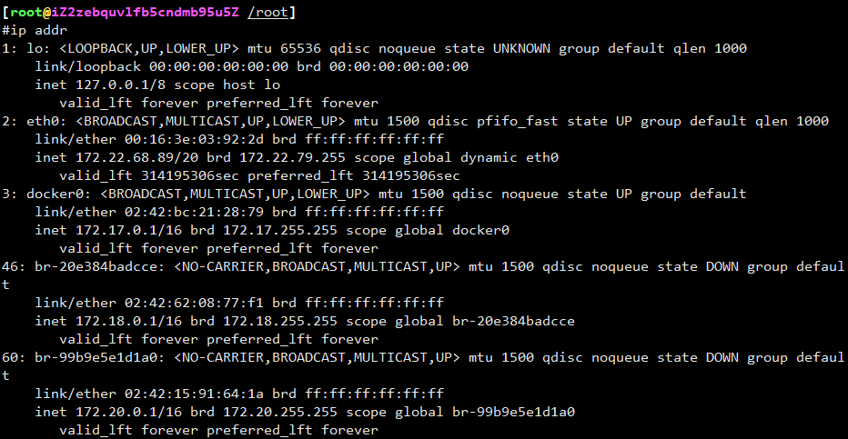

## docker 是如何处理网络的？

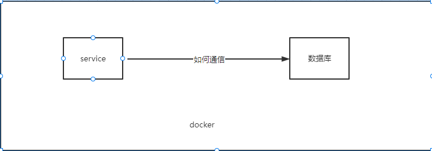

~~~shell
# 运行 tomcat
[root@iZ2zebquvlfb5cndmb95u5Z /root]
#docker run -d -P --name tomcat01 tomcat


# 进入容器
[root@iZ2zebquvlfb5cndmb95u5Z /root]
#docker exec -it  d19f7a81a6a5 /bin/bash

# 安装 iproute2
root@d19f7a81a6a5:/usr/local/tomcat# apt update && apt install -y iproute2
Get:1 http://security.debian.org/debian-security bullseye-security InRelease [44.1 kB]
Get:2 http://deb.debian.org/debian bullseye InRelease [116 kB]                      
Get:3 http://security.debian.org/debian-security bullseye-security/main amd64 Packages [94.0 kB]
Get:4 http://deb.debian.org/debian bullseye-updates InRelease [39.4 kB]
Get:5 http://deb.debian.org/debian bullseye/main amd64 Packages [8180 kB]
Get:6 http://deb.debian.org/debian bullseye-updates/main amd64 Packages [2592 B]

# 查看容器网络
# 1 lo:容器内回环地址
# 2 eth0@if164:容器地址
[root@iZ2zebquvlfb5cndmb95u5Z /root]
#docker exec -it  d19f7a81a6a5 ip addr
1: lo: <LOOPBACK,UP,LOWER_UP> mtu 65536 qdisc noqueue state UNKNOWN group default qlen 1000
    link/loopback 00:00:00:00:00:00 brd 00:00:00:00:00:00
    inet 127.0.0.1/8 scope host lo
       valid_lft forever preferred_lft forever
163: eth0@if164: <BROADCAST,MULTICAST,UP,LOWER_UP> mtu 1500 qdisc noqueue state UP group default 
    link/ether 02:42:ac:11:00:02 brd ff:ff:ff:ff:ff:ff link-netnsid 0
    inet 172.17.0.2/16 brd 172.17.255.255 scope global eth0
       valid_lft forever preferred_lft forever
~~~

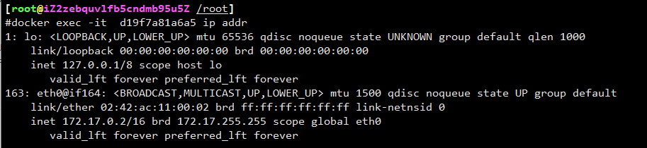

~~~shell
# liunx 是否能 ping 容器？
[root@iZ2zebquvlfb5cndmb95u5Z /root]
#ping 172.17.0.2
PING 172.17.0.2 (172.17.0.2) 56(84) bytes of data.
64 bytes from 172.17.0.2: icmp_seq=1 ttl=64 time=0.064 ms
64 bytes from 172.17.0.2: icmp_seq=2 ttl=64 time=0.063 ms
64 bytes from 172.17.0.2: icmp_seq=3 ttl=64 time=0.085 ms
64 bytes from 172.17.0.2: icmp_seq=4 ttl=64 time=0.061 ms
64 bytes from 172.17.0.2: icmp_seq=5 ttl=64 time=0.073 ms
64 bytes from 172.17.0.2: icmp_seq=6 ttl=64 time=0.065 ms
64 bytes from 172.17.0.2: icmp_seq=7 ttl=64 time=0.063 ms
64 bytes from 172.17.0.2: icmp_seq=8 ttl=64 time=0.069 ms

~~~

```shell
# 容器之间是否能 ping ？ 
#运行另一个容器
[root@iZ2zebquvlfb5cndmb95u5Z /root]
#docker run -d -P --name tomcat02 tomcat
1f767bb386c78f8256b0836eff0a4ccedbe5820f867a7bbe41f33c10e97ac6f6

# 安装 
[root@iZ2zebquvlfb5cndmb95u5Z /root]
#docker exec -it  tomcat02  /bin/bash
root@1f767bb386c7:/usr/local/tomcat# apt update && apt install -y iproute2

# 查看网络信息
[root@iZ2zebquvlfb5cndmb95u5Z /root]
#docker exec -it  tomcat02  ip addr
1: lo: <LOOPBACK,UP,LOWER_UP> mtu 65536 qdisc noqueue state UNKNOWN group default qlen 1000
    link/loopback 00:00:00:00:00:00 brd 00:00:00:00:00:00
    inet 127.0.0.1/8 scope host lo
       valid_lft forever preferred_lft forever
165: eth0@if166: <BROADCAST,MULTICAST,UP,LOWER_UP> mtu 1500 qdisc noqueue state UP group default 
    link/ether 02:42:ac:11:00:03 brd ff:ff:ff:ff:ff:ff link-netnsid 0
    inet 172.17.0.3/16 brd 172.17.255.255 scope global eth0
       valid_lft forever preferred_lft forever

# 进入这个容器
[root@iZ2zebquvlfb5cndmb95u5Z /root]
#docker exec -it tomcat02 /bin/bash
root@1f767bb386c7:/usr/local/tomcat# 


# 安装ping 命令
root@1f767bb386c7:/usr/local/tomcat#  apt update && apt install iputils-ping  
Reading package lists... Done
Building dependency tree... Done
Reading state information... Done

# 使用当前容器 ping 第一个容器
root@1f767bb386c7:/usr/local/tomcat# ping 172.17.0.2
PING 172.17.0.2 (172.17.0.2) 56(84) bytes of data.
64 bytes from 172.17.0.2: icmp_seq=1 ttl=64 time=0.101 ms
64 bytes from 172.17.0.2: icmp_seq=2 ttl=64 time=0.073 ms
64 bytes from 172.17.0.2: icmp_seq=3 ttl=64 time=0.078 ms
64 bytes from 172.17.0.2: icmp_seq=4 ttl=64 time=0.071 ms
```

## 原理

~~~shell
# 我们启动一个容器，docker 就会给容器分配一个ip 
# 上面我们启动了两个容器 就会多两个网卡
# 网卡的地址和容器的地址是对应的
# 桥接模式 使用的技术是evth-pair技术
# evth-pair 就是一对虚拟设备接口 都是成对出现的，一端连着协议 ，一端彼此相连。


~~~

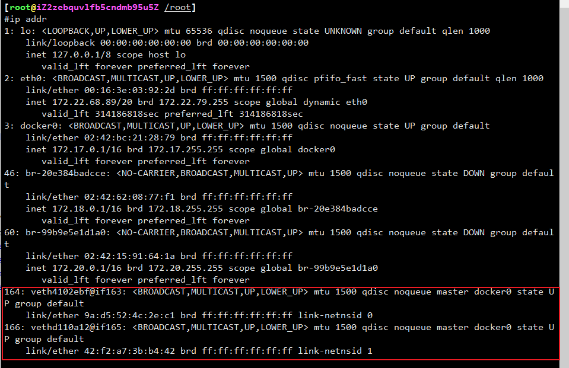

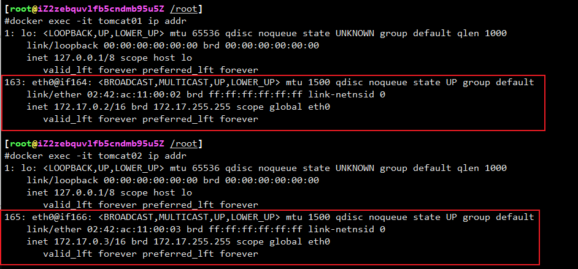


```shell
# ping 网络图
```

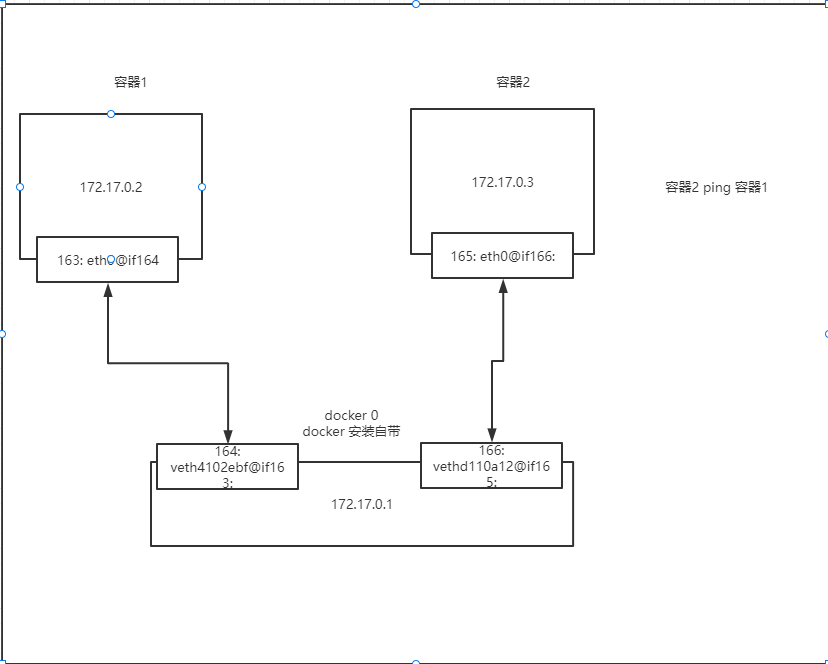

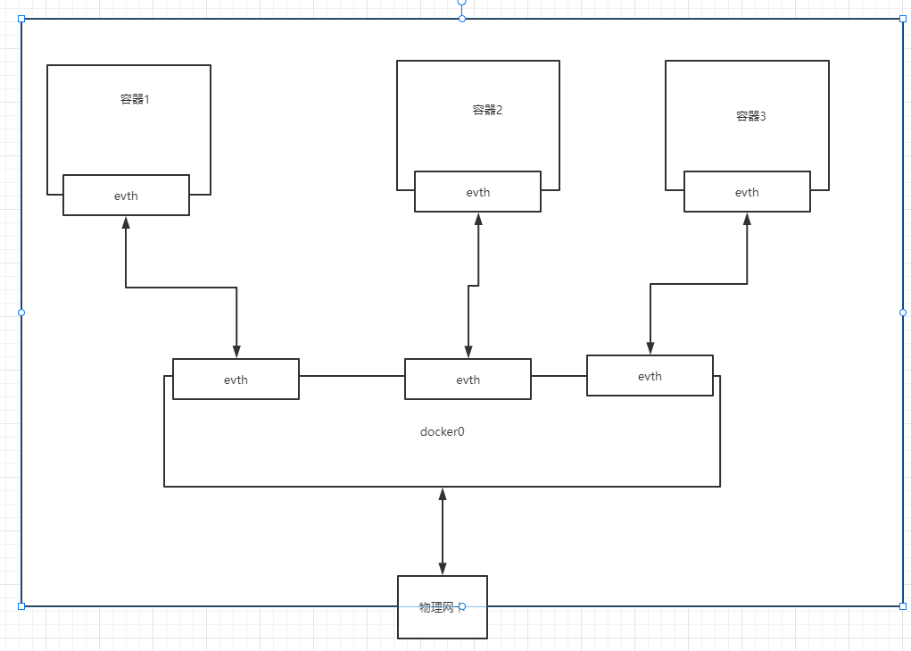

## link

~~~shell
# 问题： 编写一个微服务 项目重启 ip就变了 我们希望可以处理这个问题 ，通过名字访问？

# 使用 容器2 ping 容器1
[root@iZ2zebquvlfb5cndmb95u5Z /root]
#docker exec -it tomcat02 ping tomcat01
ping: tomcat01: Name or service not known

# 使用--link将 tomcat03 连接到 tomcat02 进行配置
[root@iZ2zebquvlfb5cndmb95u5Z /root]
#docker run -d -P --name tomcat03 --link tomcat02 tomcat

# 使用名称就可以ping 通了
[root@iZ2zebquvlfb5cndmb95u5Z /root]
#docker exec -it tomcat03 ping tomcat02
PING tomcat02 (172.17.0.3) 56(84) bytes of data.
64 bytes from tomcat02 (172.17.0.3): icmp_seq=1 ttl=64 time=0.111 ms
64 bytes from tomcat02 (172.17.0.3): icmp_seq=2 ttl=64 time=0.076 ms
64 bytes from tomcat02 (172.17.0.3): icmp_seq=3 ttl=64 time=0.075 ms

# 问题：tomcat02 能 ping tomcat03？ 
# 不能。因为tomcat02 没有配置tomcat03
[root@iZ2zebquvlfb5cndmb95u5Z /root]
#docker exec -it tomcat02 ping tomcat03
ping: tomcat03: Name or service not known

# link 的原理
# 当容器 tomcat03 使用--link 连接到 tomcat02 其实是将 tomcat02 的ip 配置在tomcat03 所以tomcat03 可以ping tomcat02 ，tomcat02 不能ping tomcat03 因为tomcat02 host中没有配置tomcat03的地址。 
[root@iZ2zebquvlfb5cndmb95u5Z /root]
#docker exec -it tomcat03 cat /etc/hosts
127.0.0.1	localhost
::1	localhost ip6-localhost ip6-loopback
fe00::0	ip6-localnet
ff00::0	ip6-mcastprefix
ff02::1	ip6-allnodes
ff02::2	ip6-allrouters
172.17.0.3	tomcat02 1f767bb386c7					# 这里配置了host
172.17.0.4	41b901989d5b


~~~

## 自定义网络

###  network

帮助文档:https://docs.docker.com/engine/reference/commandline/network/

~~~shell
# docker network [可选参数]
[root@iZ2zebquvlfb5cndmb95u5Z /root]

# 可选参数

  connect     # 将容器连接到网络
  create      # 创建网络
  disconnect  Disconnect a container from a network
  inspect     Display detailed information on one or more networks
  ls          # 列出所有的网络
  prune       Remove all unused networks
  rm          # 移除网络
~~~

~~~shell
# 查看所有的网络
[root@iZ2zebquvlfb5cndmb95u5Z /root]
#docker network  ls
NETWORK ID     NAME          DRIVER    SCOPE
d1f8ca3a7c6b   bridge        bridge    local
99b9e5e1d1a0   elastic       bridge    local
79f7dd94e544   host          host      local
1ff328b974ce   none          null      local
20e384badcce   somenetwork   bridge    local

# 网络模式
bridge ：桥接 docker （自己创建也使用桥接模式）
none ：不配置网络
host ：与宿主机共享网络
container：容器网络连通（用的少!局限很大）
~~~

~~~shell
# 我们直接启动的命令 默认是加上 --net bridge 而这个就是我们的docker0
docker run -d -P --name tomcat01 tomcat
等价
docker run -d -P --name tomcat02 --net bridge tomcat

# docker0 特点：默认 域名不能访问 
~~~

### 创建自定义网络

~~~shell
# 自定义一个网络 mynet
[root@iZ2zebquvlfb5cndmb95u5Z /root]
#docker network create --driver bridge --subnet 192.168.0.0/16 --gateway 192.168.0.1 mynet
320d4fb54572e10124878cb98af9c3abd4f6d7df13c0a26e6a553f9d4a89a9db

# 查看
[root@iZ2zebquvlfb5cndmb95u5Z /root]
#docker network ls
NETWORK ID     NAME          DRIVER    SCOPE
d1f8ca3a7c6b   bridge        bridge    local
99b9e5e1d1a0   elastic       bridge    local
79f7dd94e544   host          host      local
320d4fb54572   mynet         bridge    local
1ff328b974ce   none          null      local
20e384badcce   somenetwork   bridge    local


~~~

### 查看自定义详情

~~~shell
# 查看
[root@iZ2zebquvlfb5cndmb95u5Z /root]
#docker network inspect mynet
[
    {
        "Name": "mynet",
        "Id": "320d4fb54572e10124878cb98af9c3abd4f6d7df13c0a26e6a553f9d4a89a9db",
        "Created": "2021-11-20T19:43:27.573418911+08:00",
        "Scope": "local",
        "Driver": "bridge",
        "EnableIPv6": false,
        "IPAM": {
            "Driver": "default",
            "Options": {},
            "Config": [
                {
                    "Subnet": "192.168.0.0/16",
                    "Gateway": "192.168.0.1"
                }
            ]
        },
        "Internal": false,
        "Attachable": false,
        "Ingress": false,
        "ConfigFrom": {
            "Network": ""
        },
        "ConfigOnly": false,
        "Containers": {},
        "Options": {},
        "Labels": {}
    }
]
~~~

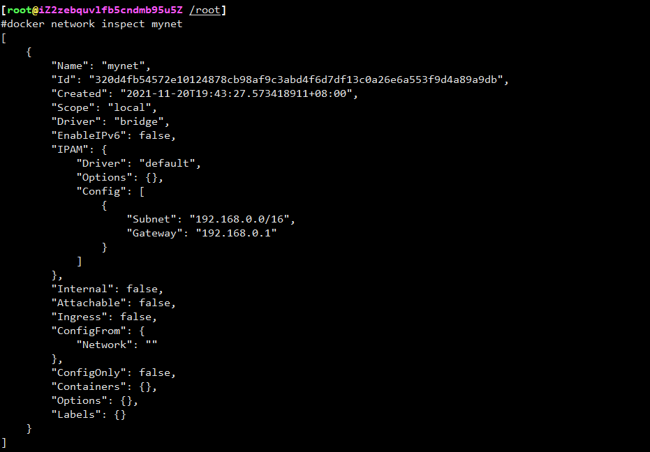

~~~shell
# 再次测试ping

# 创建两个容器
[root@iZ2zebquvlfb5cndmb95u5Z /root]
#docker run -d -P --name tomcat01 --net mynet  tomcat
9c02117609a83ec857fdffff91fd1dd1fccdf00ae8dd42fbe05f1e67c600dc2c

[root@iZ2zebquvlfb5cndmb95u5Z /root]
#docker run -d -P --name tomcat02 --net mynet  tomcat
bf152969ed2dd8211d7d313554e9fe5d54b457bdd028b8130a78082532b5a3c8

# tomcat01 ping tomcat02
[root@iZ2zebquvlfb5cndmb95u5Z /root]
#docker exec -it tomcat01 ping tomcat02
PING tomcat02 (192.168.0.3) 56(84) bytes of data.
64 bytes from tomcat02.mynet (192.168.0.3): icmp_seq=1 ttl=64 time=0.101 ms
64 bytes from tomcat02.mynet (192.168.0.3): icmp_seq=2 ttl=64 time=0.086 ms
64 bytes from tomcat02.mynet (192.168.0.3): icmp_seq=3 ttl=64 time=0.080 ms
64 bytes from tomcat02.mynet (192.168.0.3): icmp_seq=4 ttl=64 time=0.093 ms

# tomcat02 ping tomcat01
[root@iZ2zebquvlfb5cndmb95u5Z /root]
#docker exec -it tomcat02 ping tomcat01
PING tomcat01 (192.168.0.2) 56(84) bytes of data.
64 bytes from tomcat01.mynet (192.168.0.2): icmp_seq=1 ttl=64 time=0.065 ms
64 bytes from tomcat01.mynet (192.168.0.2): icmp_seq=2 ttl=64 time=0.087 ms
64 bytes from tomcat01.mynet (192.168.0.2): icmp_seq=3 ttl=64 time=0.078 ms

~~~

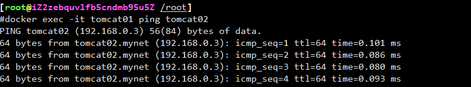

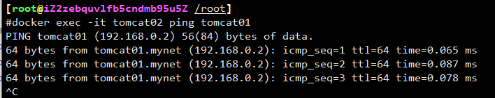

~~~shell
# 自定义网络 docker 已经自动维护好对应的关系 ，平常也是这样使用网络
# 优点：不同的集群使用不同的网络，保证集群是安全和健康的 
~~~

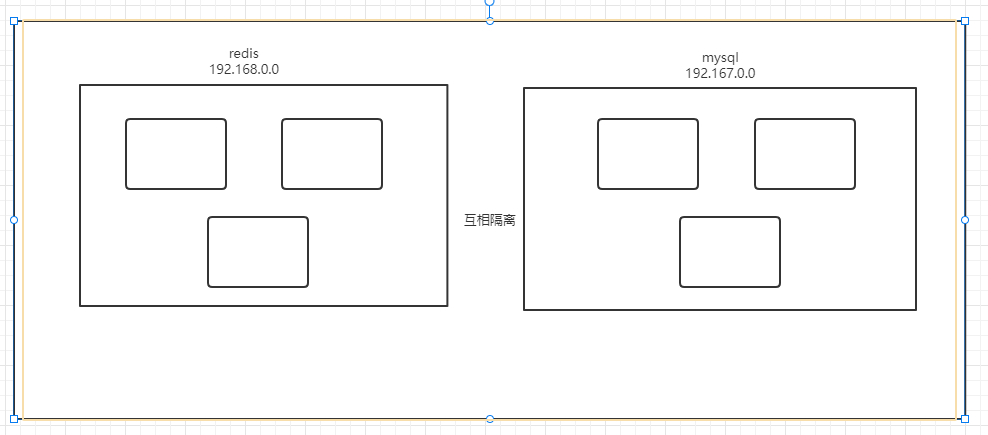

## 网络互通

### docker network connect 

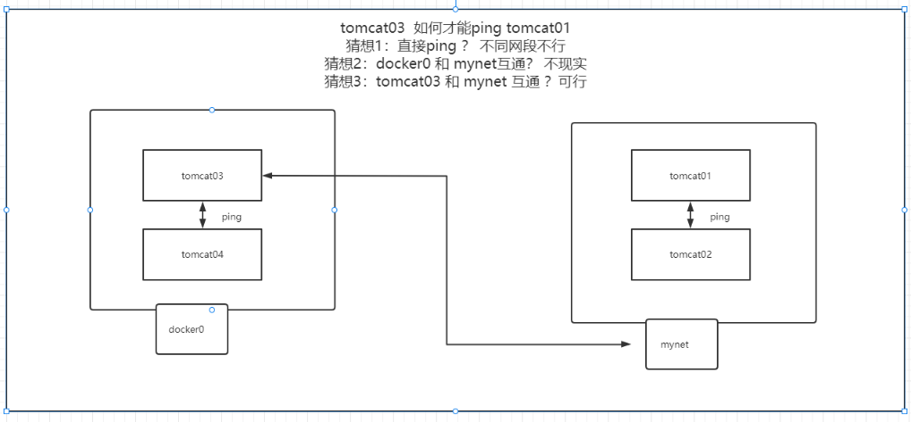


~~~shell
# tomcat01 、 tomcat02 ======> mynet
# tomcat03 、 tomcat04 ======> bridge 
~~~


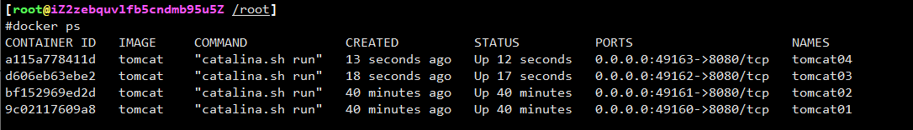

~~~shell
# docker network connect
[root@iZ2zebquvlfb5cndmb95u5Z /root]
#docker network connect --help

Usage:  docker network connect [OPTIONS] NETWORK CONTAINER   # 使用方法

Connect a container to a network

Options:
      --alias strings           Add network-scoped alias for the container
      --driver-opt strings      driver options for the network
      --ip string               IPv4 address (e.g., 172.30.100.104)
      --ip6 string              IPv6 address (e.g., 2001:db8::33)
      --link list               Add link to another container
      --link-local-ip strings   Add a link-local address for the container
      
 

~~~

~~~shell
# 打通 bridge 中 tomcat03 和 mynet 的连接 实现一个容器两个网络
[root@iZ2zebquvlfb5cndmb95u5Z /root]
#docker network connect mynet tomcat03

# 查看 网络
[root@iZ2zebquvlfb5cndmb95u5Z /root]
#docker network  inspect mynet

~~~

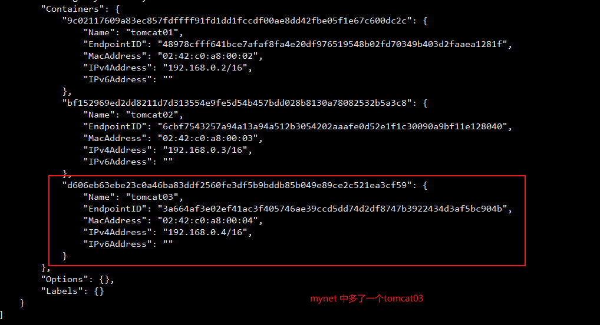

~~~shell
# 既然 tomcat03 加入 mynet 网络中，那么就可以 ping
[root@iZ2zebquvlfb5cndmb95u5Z /root]
#docker exec -it tomcat03 ping tomcat01
PING tomcat01 (192.168.0.2) 56(84) bytes of data.
64 bytes from tomcat01.mynet (192.168.0.2): icmp_seq=1 ttl=64 time=0.086 ms
64 bytes from tomcat01.mynet (192.168.0.2): icmp_seq=2 ttl=64 time=0.071 ms
64 bytes from tomcat01.mynet (192.168.0.2): icmp_seq=3 ttl=64 time=0.084 ms
64 bytes from tomcat01.mynet (192.168.0.2): icmp_seq=4 ttl=64 time=0.084 ms

# tomcat04 没有加入 还是不能 ping
[root@iZ2zebquvlfb5cndmb95u5Z /root]
#docker exec -it tomcat04 ping tomcat01
ping: tomcat01: Name or service not known

~~~

## 实战redis 集群？？

# 服务部署 ？？


# DockerCompose


