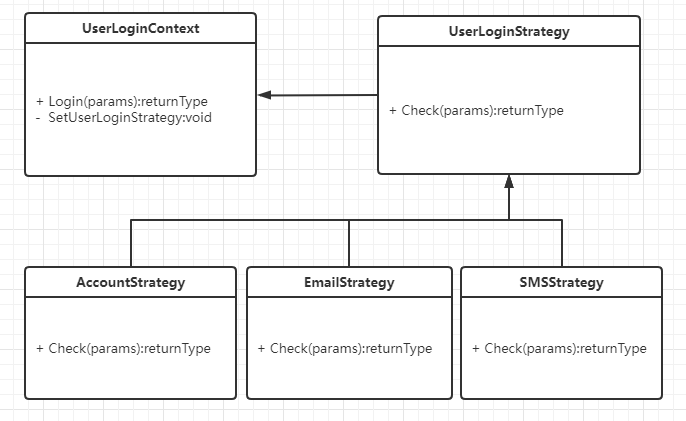
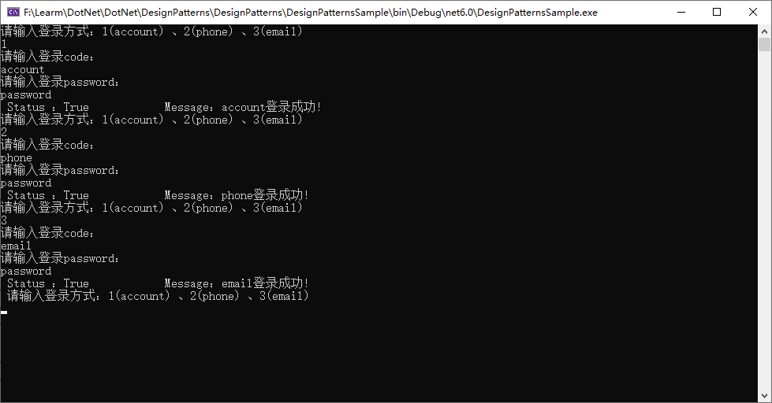

# Strategy（策略模式）

策略模式：定义算法族，封装到独立类中，让他们之间在运行时可以相互替换，此模式让算法的变化独立于使用算法的客户端。

# 多种登录策略

账号、手机号、邮箱 其中一个和密码匹配都可以登录

## 策略接口

策略接口是所有具体策略的通用接口， 它声明了一个上下文用于执行策略的方法

~~~C#
    public interface UserLoginStrategy
    {
        public UserLoginMessage Check(UserLoginParm parm);
    }
~~~

## 具体实现策略类

具体策略 实现了上下文所用算法的各种不同变体。

### 账号策略

~~~C#
    public class AccountStrategy : UserLoginStrategy
    {
        public UserLoginMessage Check(UserLoginParm parm)
        {
            //........业务逻辑
            if (parm.code == "account" && parm.password == "password")
            {
                return new UserLoginMessage(true, $"{parm.code}登录成功!");
            }
            return new UserLoginMessage(false, $"{parm.code} 登录失败！");
        }
    }
~~~

### 手机号策略

~~~C#
    public class PhoneStrategy : UserLoginStrategy
    {
        public UserLoginMessage Check(UserLoginParm parm)
        {
            //........业务逻辑
            if (parm.code == "phone" && parm.password == "password")
            {
                return new UserLoginMessage(true, $"{parm.code}登录成功!");
            }
            return new UserLoginMessage(false, $"{parm.code} 登录失败！");
        }
    }
~~~

### 邮箱策略

~~~C#
    public class EmailStrategy : UserLoginStrategy
    {
        public UserLoginMessage Check(UserLoginParm parm)
        {
            //........业务逻辑
            if (parm.code == "email" && parm.password == "password")
            {
                return new UserLoginMessage(true, $"{parm.code}登录成功!");
            }
            return new UserLoginMessage(false, $"{parm.code} 登录失败！");
        }
    }
~~~

## 上下文

上下文维护指向具体策略的引用， 且仅通过策略接口与该对象进行交流。

~~~C#
    public class UserLoginContext
    {
        private UserLoginStrategy UserLoginStrategy { get; set; }
        public void SetUserLoginStrategy(UserLoginStrategy userLogin)
        {
            UserLoginStrategy = userLogin;
        }
        public UserLoginMessage Login(string code, string password)
        {
            return UserLoginStrategy.Check(new UserLoginParm(code, password));
        }
    }
~~~

## 工厂

负责创建相应的策略

~~~C#
        public static UserLoginStrategy CreateUserLogin(UserLoginMode mode)
        {
            UserLoginStrategy userLoginCheck;
            switch (mode)
            {
                case UserLoginMode.Account:
                    userLoginCheck = new AccountStrategy();
                    break;
                case UserLoginMode.SMS:
                    userLoginCheck = new PhoneStrategy();
                    break;
                case UserLoginMode.Email:
                    userLoginCheck = new EmailStrategy();
                    break;
                default:
                    throw new AggregateException($"{mode}:不存在的登录校验类型！");
            }
            return userLoginCheck;
        }
~~~

## 其他相关

### 枚举

工厂需要通过枚举创建相应的策略

~~~C#
    public enum UserLoginMode
    {
        Account = 1,
        Phone = 2,
        Email = 3
    }
~~~

### message

保存校验的信息

~~~C#
    public class UserLoginMessage
    {
        public UserLoginMessage(bool status, string message)
        {
            Status = status;
            Message = message;
        }
        public bool Status { get; init; }
        public string Message { get; init; }
    }
~~~

### 参数

登录所需要的参数

~~~C#
    public record UserLoginParm(string code, string password);
~~~

### 客户端

多种策略在运行时随意切换。

~~~C#
while (true)
{
    Console.WriteLine("请输入登录方式：1(account) 、2(phone) 、3(email)");
    //Console.WriteLine("请输入登录方式：1(account) 、2(email) 、3(sms)、 4(Other)");
    UserLoginMode userLoginMode = (UserLoginMode)Convert.ToInt32(Console.ReadLine());
    Console.WriteLine("请输入登录code：");
    string code = Console.ReadLine();
    Console.WriteLine("请输入登录password：");
    string password = Console.ReadLine();
    var userLogin = UserLoginCheckFactory.CreateUserLogin(userLoginMode);
    UserLoginContext context = new UserLoginContext();
    context.SetUserLoginStrategy(userLogin);
    var message = context.Login(code, password);
    Console.WriteLine($" Status ：{message.Status}            Message：{message.Message}");
    Console.ReadKey();
}
~~~

